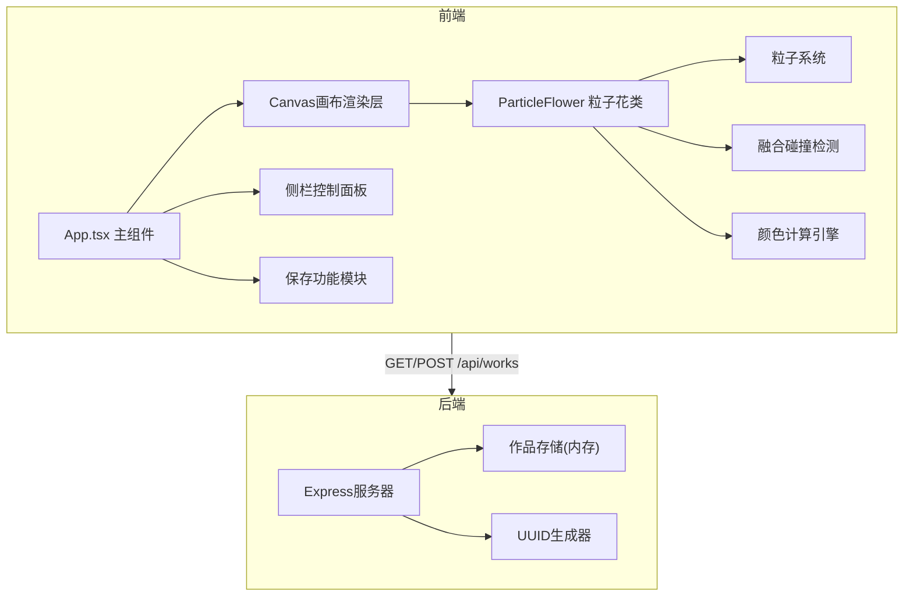

## 1. 架构设计



## 2. 技术栈说明

- **前端框架**：React 18 + TypeScript
- **构建工具**：Vite
- **渲染引擎**：Canvas 2D API + requestAnimationFrame
- **状态管理**：React useState/useRef (轻量场景)
- **后端框架**：Express 4
- **跨域处理**：cors
- **唯一ID**：uuid
- **语言目标**：ES2020
- **类型检查**：TypeScript严格模式

## 3. 项目文件结构

```
├── package.json          # 项目依赖与脚本
├── vite.config.js        # Vite构建配置
├── tsconfig.json         # TypeScript配置
├── index.html            # 入口HTML
├── src/
│   ├── App.tsx           # 主组件
│   ├── ParticleFlower.ts # 粒子花类模块
│   └── server.ts         # Express后端服务
```

## 4. API定义

### 4.1 获取作品列表

- **路径**：`GET /api/works`
- **响应**：
```typescript
interface Work {
  id: string;
  createdAt: number;
  flowers: FlowerData[];
  settings: {
    particleDensity: number;
    fadeDuration: number;
    backgroundColor: string;
  };
}

// 响应格式
{ works: Work[] }
```

### 4.2 保存作品

- **路径**：`POST /api/works`
- **请求体**：
```typescript
interface SaveWorkRequest {
  flowers: FlowerData[];
  settings: {
    particleDensity: number;
    fadeDuration: number;
    backgroundColor: string;
  };
}
```
- **响应**：
```typescript
interface SaveWorkResponse {
  id: string;
  success: boolean;
}
```

## 5. 核心数据模型

### 5.1 粒子花数据结构

```typescript
interface Particle {
  x: number;
  y: number;
  vx: number;
  vy: number;
  radius: number;
  color: string;
  alpha: number;
  life: number;
  maxLife: number;
}

interface FlowerData {
  id: string;
  x: number;
  y: number;
  word: string;
  baseHue: number;
  saturation: number;
  lightness: number;
  particles: Particle[];
  connections: [number, number][]; // 粒子索引对
  birthTime: number;
  maxRadius: number;
  bloomDuration: number; // 0.6秒
  fadeStartTime: number;
  isFading: boolean;
}
```

### 5.2 情感词映射

```typescript
// 简化的情感值计算
// 正面词 → 暖色区间 (HSL 0-60)
// 负面词 → 冷色区间 (HSL 180-240)
// 中性词 → 随机偏移
```

## 6. 性能优化策略

1. **Canvas分层**：背景层 + 粒子层分离，减少重绘区域
2. **对象池**：粒子对象复用，避免频繁创建销毁
3. **空间分区**：网格划分加速碰撞检测
4. **帧率自适应**：动态调整粒子数保持流畅
5. **离屏渲染**：静态背景预渲染
6. **节流处理**：输入事件节流，避免频繁生成花朵
