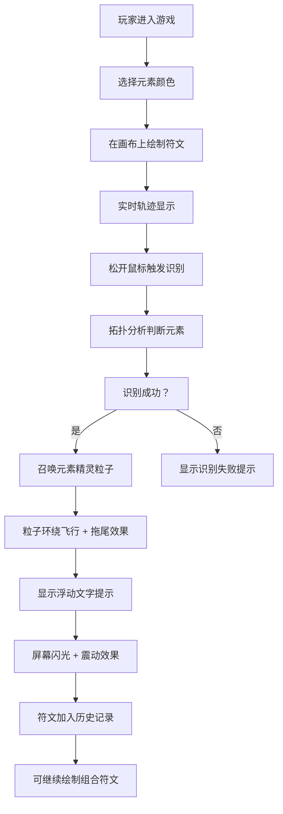

## 1. 产品概述

「符咒工坊」是一款基于浏览器的交互式创意游戏，玩家通过鼠标在画布上绘制自定义符文，系统实时识别符文拓扑结构并召唤对应的元素精灵粒子。游戏融合了符文绘制、元素识别、粒子特效和组合玩法，为玩家带来沉浸式的魔法体验。

## 2. 核心功能

### 2.1 功能模块

1. **符文绘制模块**：画布绘制、实时轨迹显示、绘制状态管理
2. **符文识别模块**：拓扑分析、元素类型判断、置信度计算
3. **粒子精灵系统**：元素粒子生成、螺旋轨迹飞行、拖尾光晕效果
4. **元素组合系统**：多符文组合、混合精灵、利萨如曲线轨迹
5. **UI交互模块**：工具栏、历史记录、浮动提示、闪光震动效果

### 2.2 元素类型

| 元素 | 符文特征 | 粒子颜色 |
|------|----------|----------|
| 火 | 闭合环加直线 | 橙红渐变 #FF4500 → #FFD700 |
| 雷 | 锯齿波浪 | 亮紫 #8A2BE2 → #FF00FF |
| 风 | 螺旋 | 青绿 #00CED1 → #7FFF00 |
| 土 | 多个交叉环 | 赭石 #8B4513 → #DEB887 |

### 2.3 元素组合

| 组合 | 效果 | 粒子特性 |
|------|------|----------|
| 火 + 风 | 爆燃火焰漩涡 | 粒子数量翻倍，融合轨迹 |
| 雷 + 土 | 晶体电网 | 粒子数量翻倍，利萨如曲线 |

## 3. 核心流程

## 4. 用户界面设计

### 4.1 设计风格
- **整体风格**：赛博暗黑风格，深紫黑渐变星空背景
- **主色调**：深紫黑 #0B0014 → #1A0033 渐变
- **霓虹边框**：默认冰蓝 #00BFFF，随选中元素变化
- **按钮风格**：圆角玻璃质感（毛玻璃模糊10px，半透明背景）
- **文字**：等宽字体，微弱文字阴影发光效果
- **动效**：微光脉冲缩放动画（0.3秒 ease-out）

### 4.2 页面布局
- **画布区域**：占屏幕80%宽度，居中显示
- **左侧工具栏**：固定定位，包含元素选择、清除按钮、历史记录
- **右上角**：已绘制符文序列缩略图
- **画布中央下方**：符文识别结果浮空文字
- **屏幕边缘**：元素符文光环标识

### 4.3 交互效果
- **悬停**：按钮微光脉冲缩放动画
- **召唤**：白色闪光（1秒渐隐）+ 画布抖动（3px，0.2秒）
- **清除**：画布逐渐清空动画（1秒）
- **历史面板**：从底部弹出，带缓动效果
- **浮动文字**：持续2秒后渐隐

### 4.4 性能要求
- 绘制和识别响应时间 < 200ms
- 粒子数量最多 500 个时保持 60FPS
