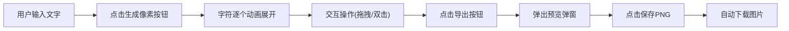

## 1. 产品概述

文字像素画是一款创意像素画生成工具，用户输入任意中文或英文句子，系统自动将每个字符转换为由小色块组成的像素画，支持拖拽调整、粒子动画效果和高清图片导出。

- 核心价值：将文字转化为视觉艺术，提供有趣的像素风格创意体验
- 目标用户：设计爱好者、创意工作者、普通用户

## 2. 核心功能

### 2.1 功能模块

1. **画布区域**：展示像素文字，支持交互操作
2. **文字输入**：底部输入框，支持中英文输入，上限20字符
3. **像素生成**：点击按钮将文字转换为像素画，带动画效果
4. **调色盘**：12种预设色块，全局切换字符主色
5. **拖拽交互**：拖拽调整字符位置，带蓝色光圈反馈
6. **粒子动画**：双击字符触发粒子飞散效果
7. **图片导出**：导出为高清PNG图片

### 2.2 功能详情

| 功能名称 | 模块名称 | 功能描述 |
|---------|---------|---------|
| 全屏渐变背景 | 视觉呈现 | 从浅灰蓝(#E8EDF2)到云雾白(#F5F7FA)的全屏渐变 |
| 标题栏 | 视觉呈现 | 毛玻璃效果，背景模糊10px，金色(#C5A55A)描边和阴影 |
| 画布区域 | 画布 | 宽1100px高600px，5px间距浅灰网格线(#D0D5DD)，圆角8px细黑边框 |
| 调色盘 | 交互 | 左下角悬浮，12种预设色块，点击全局生效，0.3秒平滑过渡 |
| 文字输入 | 输入 | 底部居中，width: 60%，高44px，圆角6px，内阴影，placeholder淡灰，上限20字符 |
| 生成按钮 | 交互 | 渐变灰蓝(#4A6FA5)到靛蓝(#2C3E6B)，悬停亮度+15%，点击凹陷0.1s |
| 生成动画 | 动画 | 按钮文字变"生成中..."，旋转300ms加载图标，字符从下往上逐个出现(间隔80ms，总1.6s) |
| 像素块 | 画布 | 5px×5px色块，10×16网格，1px深色间隙(#8B9DC3) |
| 拖拽交互 | 交互 | 拖动字符出现蓝色光圈(rgba(74,111,165,0.3)，1.2秒)，松开淡出 |
| 粒子爆炸 | 动画 | 双击字符碎成30个3-8px小粒，速度60px/s，持续0.8s，缩放脉冲(0.95->1.05, 0.3s) |
| 导出按钮 | 交互 | 画布右上角圆形，直径40px，向下箭头图标，悬停背景加深20% |
| 导出弹窗 | 导出 | 半透明遮罩毛玻璃(模糊5px)，预览图白色边框8px圆角，保存/取消按钮 |
| 响应式布局 | 适配 | 宽度<1200px时画布缩为1000px宽，调色盘移到右下角 |

## 3. 核心流程

用户输入文字 → 点击生成按钮 → 字符逐个动画出现 → 拖拽调整位置/双击看粒子效果 → 点击导出 → 预览确认 → 下载PNG图片

## 4. 用户界面设计

### 4.1 设计风格

- 主色调：灰蓝(#4A6FA5)、靛蓝(#2C3E6B)、金色(#C5A55A)
- 背景色：浅灰蓝(#E8EDF2)到云雾白(#F5F7FA)渐变
- 中性色：浅灰网格(#D0D5DD)、深色间隙(#8B9DC3)、灰色按钮(#A0A0A0)
- 按钮风格：渐变填充，圆角6px，悬停亮度提升，点击凹陷
- 字体：现代无衬线字体，清晰易读
- 布局：居中画布，顶部标题，底部输入，悬浮调色盘
- 动效：平滑过渡，弹性动画，粒子效果

### 4.2 页面设计

| 区域 | 模块 | UI元素 |
|-----|------|--------|
| 顶部 | 标题栏 | 毛玻璃背景、金色细边、标题文字、阴影 |
| 中央 | 画布区 | 网格背景、像素字符、圆角边框、导出按钮 |
| 左下角 | 调色盘 | 12色圆形色块、横向排列、悬浮固定 |
| 底部 | 输入区 | 输入框、生成按钮、居中布局 |
| 弹窗 | 导出层 | 半透明遮罩、预览图、操作按钮 |

### 4.3 响应式设计

- 桌面端优先（1366px以上）
- 宽度1200px以下：画布宽度1000px，保持比例
- 宽度1200px以下：调色盘从左下角移到右下角
- 画布不允许滚动，所有交互在当前视口完成

### 4.4 性能要求

- 拖拽保持60fps，响应时间不超过16ms
- 粒子动画流畅，使用requestAnimationFrame
- Canvas渲染优化，避免不必要的重绘
