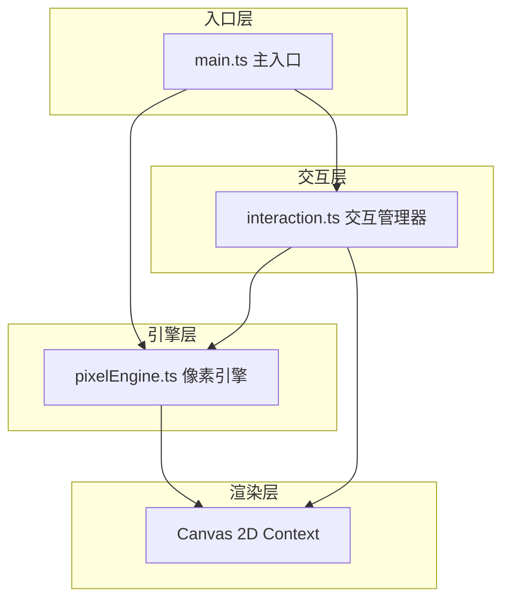

## 1. 架构设计

纯前端Canvas应用，采用模块化架构，分为引擎层、渲染层和交互层。



## 2. 技术描述

- **前端框架**：原生 TypeScript + Vite
- **渲染技术**：HTML5 Canvas 2D
- **构建工具**：Vite 5.x（支持HMR，build target es2020）
- **开发语言**：TypeScript（严格模式，target ES2020，module ESNext）
- **包管理器**：npm
- **后端**：无（纯前端应用）
- **数据库**：无

## 3. 项目文件结构

| 文件 | 作用 |
|------|------|
| package.json | 项目依赖和脚本配置 |
| vite.config.js | Vite构建配置 |
| tsconfig.json | TypeScript编译配置 |
| index.html | 入口HTML文件 |
| src/main.ts | 主入口，初始化和事件绑定 |
| src/pixelEngine.ts | 核心引擎，字符到像素映射 |
| src/interaction.ts | 交互逻辑，拖拽、粒子、导出 |

## 4. 核心模块说明

### 4.1 PixelEngine（像素引擎）

- 36个预设像素模板（覆盖常用汉字、字母、数字）
- 模板为10行×16列的0/1矩阵
- 根据Unicode码点映射到对应模板
- 提供 `getPixelMap(charCode): number[]` 方法
- 生成ImageData用于Canvas渲染

### 4.2 Interaction（交互管理器）

- 拖拽：mousedown/mousemove/mouseup事件处理
- 粒子爆炸：双击生成30个粒子，requestAnimationFrame驱动
- 导出：canvas.toBlob生成PNG，触发下载
- 光圈效果：拖拽时蓝色光圈，1.2秒淡出

### 4.3 main.ts（主入口）

- Canvas初始化
- 响应式布局处理
- 输入框和按钮事件绑定
- 调色盘交互
- 生成动画控制

## 5. 数据模型

### 5.1 像素块数据

```typescript
interface PixelChar {
  char: string;
  charCode: number;
  x: number;
  y: number;
  pixelMap: number[]; // 长度160的0/1数组 (10列×16行)
  color: string;
  isDragging?: boolean;
  glowTime?: number;
}
```

### 5.2 粒子数据

```typescript
interface Particle {
  x: number;
  y: number;
  vx: number;
  vy: number;
  size: number;
  color: string;
  life: number;
  maxLife: number;
}
```

### 5.3 预设模板

```typescript
const PIXEL_TEMPLATES: Record<number, number[]> = {
  // 36个预设模板，key为Unicode码点
  // value为160长度的0/1数组(10×16)
};
```

## 6. 性能优化策略

1. **离屏Canvas**：字符像素图预渲染为离屏Canvas，避免每帧重绘矩阵
2. **脏矩形渲染**：只重绘变化区域
3. **requestAnimationFrame**：统一动画循环
4. **事件节流**：mousemove事件适当节流
5. **ImageData缓存**：像素模板缓存，重复使用
