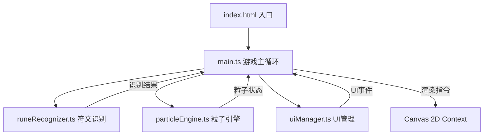

## 1. 架构设计



## 2. 技术选型

- **构建工具**：Vite 5.x
- **开发语言**：TypeScript 5.x（严格模式，目标 ES2020）
- **渲染引擎**：HTML5 Canvas 2D API
- **无第三方UI库**：原生CSS实现玻璃质感和霓虹效果

## 3. 文件结构

```
.
├── package.json          # 项目配置与依赖
├── vite.config.js        # Vite 构建配置
├── tsconfig.json         # TypeScript 配置
├── index.html            # 入口页面
└── src/
    ├── main.ts           # 游戏主循环：画布事件、符文绘制、粒子系统、UI更新、帧动画
    ├── runeRecognizer.ts # 符文识别模块：拓扑分析、模式匹配
    ├── particleEngine.ts # 粒子引擎模块：粒子生成、更新、渲染
    └── uiManager.ts      # UI管理模块：工具栏、历史记录、浮动提示、特效
```

## 4. 核心模块设计

### 4.1 runeRecognizer.ts

**核心功能**：接收鼠标轨迹点坐标数组，通过拓扑分析识别符文类型。

**识别算法**：
1. **轨迹预处理**：点采样、平滑、归一化
2. **特征提取**：
   - 闭合度检测（起点终点距离）
   - 直线度检测（总路径长度/直线距离）
   - 波浪检测（方向变化次数）
   - 螺旋检测（旋转圈数 + 半径变化）
   - 交叉检测（线段相交次数）
3. **模式匹配**：基于特征值的加权评分，返回最匹配元素及置信度

**数据结构**：
```typescript
type ElementType = 'fire' | 'thunder' | 'wind' | 'earth';
type RuneResult = {
  element: ElementType | null;
  confidence: number;
  features: RuneFeatures;
};
```

### 4.2 particleEngine.ts

**核心功能**：管理精灵粒子群的生成、运动更新和渲染。

**粒子属性**：
- 位置、速度、加速度
- 颜色、大小、透明度
- 生命周期、年龄
- 轨迹类型（螺旋、利萨如曲线）
- 拖尾历史点

**运动模式**：
- 基础模式：螺旋轨迹环绕焦点
- 组合模式：利萨如曲线（参数方程控制）
- 生成效果：从中心向外炸裂扩散

**渲染特性**：
- 径向渐变粒子
- 拖尾光晕（历史点连线 + 透明度衰减）
- 加法混合模式增强发光效果

### 4.3 uiManager.ts

**核心功能**：处理所有UI交互和视觉特效。

**UI组件**：
- 左侧工具栏（元素选择、清除、历史记录按钮）
- 历史记录面板（底部弹出，最近5条记录）
- 浮动文字提示（识别结果显示）
- 闪光效果（召唤时白色闪屏）
- 震动效果（画布抖动）
- 右上角符文序列缩略图
- 屏幕边缘元素光环

**动画系统**：
- CSS transitions 用于按钮悬停
- requestAnimationFrame 用于 Canvas 特效
- 缓动函数：ease-out, ease-in-out

### 4.4 main.ts

**核心功能**：游戏主循环，协调各模块工作。

**游戏循环**：
```
requestAnimationFrame → 更新粒子 → 绘制背景 → 绘制粒子 → 绘制符文轨迹 → 更新UI
```

**事件处理**：
- 鼠标按下：开始绘制
- 鼠标移动：更新轨迹点
- 鼠标松开：触发识别 + 召唤精灵
- 画布尺寸变化：自适应调整

**状态管理**：
- 当前选中元素
- 绘制状态（isDrawing）
- 轨迹点数组
- 当前活动粒子列表
- 历史符文记录
- UI状态（面板展开/收起等）

## 5. 性能优化策略

1. **粒子池化**：复用粒子对象，减少GC
2. **离屏画布**：背景星空预渲染
3. **帧率控制**：粒子更新逻辑与渲染解耦
4. **轨迹降采样**：识别前对轨迹点进行降采样
5. **requestAnimationFrame**：使用浏览器原生动画帧
