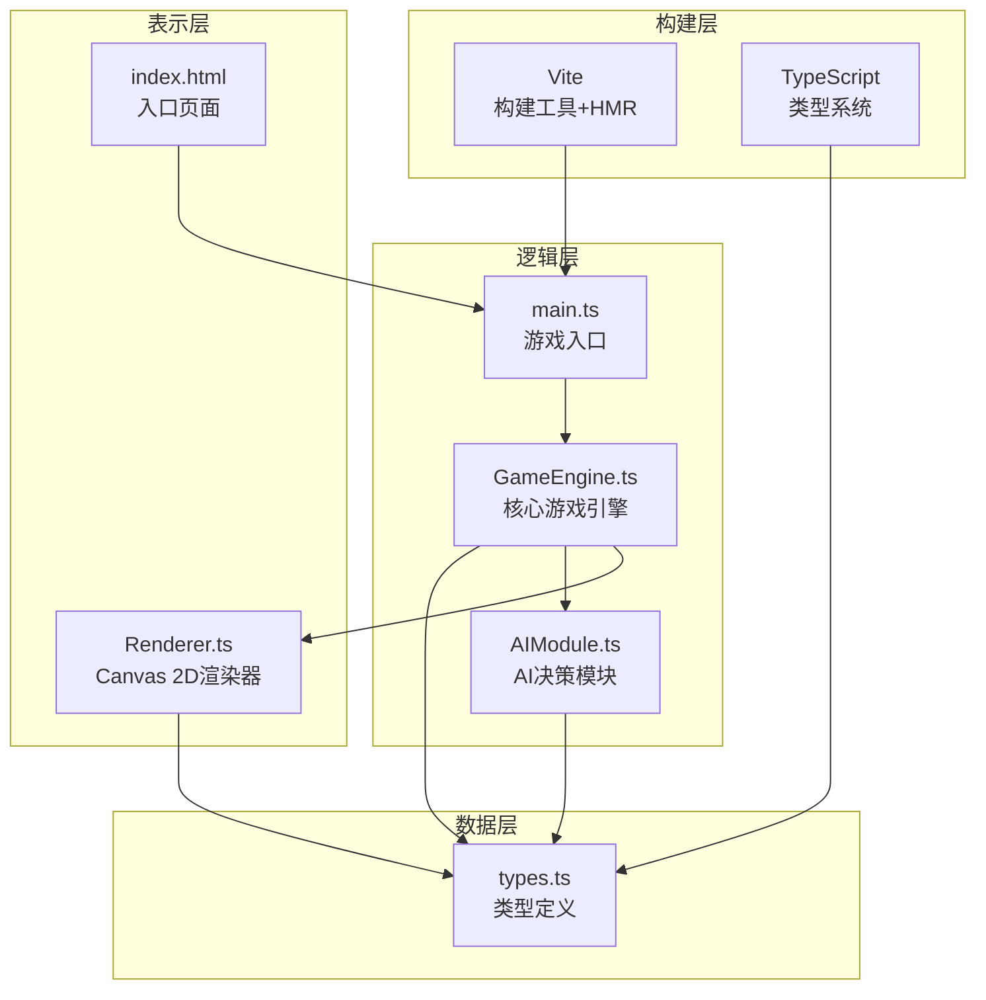

## 1. 架构设计



## 2. 技术说明
- **前端框架**：纯原生 TypeScript（无React/Vue，按用户指定）
- **渲染技术**：Canvas 2D API，requestAnimationFrame驱动
- **构建工具**：Vite 5.x，支持HMR热更新
- **类型系统**：TypeScript 5.x，strict严格模式，target ES2020
- **项目初始化**：手动创建（用户指定明确文件结构，不使用脚手架模板）

## 3. 文件结构定义
| 文件路径 | 职责说明 |
|----------|----------|
| `package.json` | 依赖声明（typescript、vite），启动脚本 `npm run dev` |
| `vite.config.js` | Vite基础配置，启用HMR |
| `tsconfig.json` | strict严格模式，target ES2020，moduleResolution node |
| `index.html` | 入口页面，深空渐变背景，canvas#gameCanvas容器，标题"镜影战场" |
| `src/types.ts` | 所有核心接口：GridCoord、Piece、Afterimage、Fragment、GameState、TurnPhase等 |
| `src/main.ts` | 入口脚本：DOM加载、Canvas初始化、GameEngine实例化、启动主循环 |
| `src/GameEngine.ts` | 核心引擎：棋盘管理、棋子部署、回合逻辑、碰撞检测、残影系统、动作编排 |
| `src/Renderer.ts` | 渲染器：菱形网格透视绘制、八面体棋子、残影粒子、碎片系统、UI面板、动画帧 |
| `src/AIModule.ts` | 简易AI：三级优先级决策、残影范围计算、中心占领、最弱目标攻击 |

## 4. 核心数据模型

### 4.1 GridCoord（菱形坐标）
```typescript
interface GridCoord {
  q: number;  // 菱格列（轴向坐标）
  r: number;  // 菱形行（轴向坐标）
}
```

### 4.2 Piece（棋子）
```typescript
interface Piece {
  id: string;
  faction: 'blue' | 'red';
  position: GridCoord;
  hp: number;
  maxHp: number;
  attack: number;
  defense: number;
  moveRange: number;
  attackRange: number;
  skillCooldown: number;
  isMoving: boolean;
  movePath: GridCoord[];
  moveProgress: number;
  attackTargetId: string | null;
  attackPulsePhase: number;
}
```

### 4.3 Afterimage（残影）
```typescript
interface Afterimage {
  id: string;
  faction: 'blue' | 'red';
  worldX: number;    // 世界坐标（像素）
  worldY: number;
  targetPieceId: string | null;
  velocityX: number;
  velocityY: number;
  lifetime: number;  // 剩余寿命（秒，初始2）
  bouncesLeft: number;
  opacity: number;
}
```

### 4.4 Fragment（碎片粒子）
```typescript
interface Fragment {
  id: string;
  color: string;     // 阵营色值
  x: number;
  y: number;
  vx: number;
  vy: number;
  size: number;      // 2-6px
  rotation: number;
  rotationSpeed: number;
  lifetime: number;  // 1秒
  opacity: number;
  lastHitTime: number;  // 溅射冷却
}
```

### 4.5 GameState（游戏状态）
```typescript
interface GameState {
  turnNumber: number;
  currentFaction: 'blue' | 'red';
  phase: 'select' | 'move' | 'attack' | 'ai_thinking' | 'resolving';
  selectedPieceId: string | null;
  pieces: Piece[];
  afterimages: Afterimage[];
  fragments: Fragment[];
  validMoves: GridCoord[];
  validAttacks: string[];
  winner: 'blue' | 'red' | null;
  showSurrenderModal: boolean;
  modalShakePhase: number;
}
```

## 5. 坐标系统与核心算法

### 5.1 菱形网格坐标转换
采用轴向坐标（q, r）转屏幕像素：
```
size = 32px（菱形边长）
spacing = 4px
step = size + spacing
screenX = centerX + step * (cos(30°) * q + cos(30°)/2 * r)
screenY = centerY + step * (sin(30°) * r)
再应用 X轴15°、Y轴5° 的等距透视投影矩阵
```

### 5.2 移动范围算法（BFS广度优先搜索）
- 从选中棋子出发，6方向菱形邻接遍历
- 深度限制 = moveRange
- 跳过被占据格，保留可攻击目标判定

### 5.3 最短路径（A*寻路）
- 启发函数：菱形网格距离 = max(|Δq|, |Δr|, |Δq+Δr|)
- 每步移动代价 = 1

### 5.4 残影系统更新
- 每帧：寻找最近棋子 → 计算方向向量 → 80px/s移动
- 碰撞判定：AABB vs 棋子热区（30px圆形）
- 15%反弹概率：随机选择6邻格方向

### 5.5 碎裂生成算法
- 80个碎片：位置 = 棋子中心 + 高斯偏移
- 方向：60°锥形随机，速度 150-300px/s
- 大小：2-6px均匀分布，旋转速度 -360~360°/s

## 6. 性能优化策略
1. **渲染分脏**：每帧仅重绘变化区域（棋盘静态层缓存离屏canvas）
2. **粒子池**：Fragment和Afterimage使用对象池复用，峰值上限强制（300/60）
3. **空间哈希**：碰撞检测用32px网格分区，仅检测相邻格子
4. **离屏缓存**：棋盘网格线预渲染至offscreen canvas，每帧直接drawImage
5. **降采样**：移动端DPR自动降至1.5，降低像素填充压力
6. **动画插值**：状态更新逻辑60Hz固定步长，渲染插值跟随
