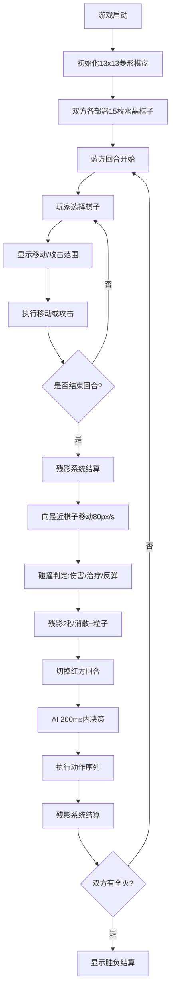

## 1. 产品概述

「镜影战场」是一款基于浏览器的回合制策略对战游戏，玩家在菱形网格镜面棋盘上操控透明水晶棋子进行战斗，通过独特的光影残影系统和碎裂溅射机制创造丰富的战术可能性。

- 解决传统策略游戏缺乏实时视觉反馈和地形交互变化的核心痛点
- 面向喜欢策略对战、视觉特效和创新战斗机制的休闲/核心玩家群体

## 2. 核心特性

### 2.1 用户角色
| 角色 | 注册方式 | 核心权限 |
|------|----------|----------|
| 玩家1（蓝方） | 进入游戏自动分配 | 操控蓝色15枚水晶棋子，进行移动、攻击、结束回合 |
| 玩家2（红方/AI） | 进入游戏自动分配 | 操控红色15枚水晶棋子，支持玩家或AI控制 |

### 2.2 功能模块
1. **棋盘渲染模块**：13x13菱形网格、立体透视倾斜、自发光效果、菱形坐标系统
2. **棋子系统**：八面体水晶棋子、血量显示、悬浮投影、阵营颜色、流光边缘
3. **移动攻击系统**：最短路径滑动、残影拖尾、攻击脉冲圈、高亮可移动区域
4. **残影系统**：光影残像生成、朝向棋子移动、碰撞伤害/治疗、反弹机制、消散粒子
5. **碎裂溅射系统**：棋子死亡碎裂、80个不规则碎片、弹射溅射伤害、淡出动画
6. **回合系统**：回合数管理、结束回合、胜负判定、AI决策
7. **UI状态面板**：回合信息、存活统计、棋子属性、结束回合按钮、投降弹窗
8. **AI模块**：优先级策略（残影攻击 > 占领中心 > 攻击弱敌）、决策时限

### 2.3 页面详情
| 页面名称 | 模块名称 | 功能描述 |
|----------|----------|----------|
| 主游戏页面 | 棋盘渲染 | 13x13菱形网格，倾斜透视，自发光网格线，边缘辉光 |
| 主游戏页面 | 棋子渲染 | 八面体水晶，半透明，阵营色彩，血量数字，底部投影，动态流光 |
| 主游戏页面 | 交互控制 | 点击选中棋子，高亮可移动区域，滑动移动，攻击脉冲圈 |
| 主游戏页面 | 残影特效 | 2秒消散，朝向棋子移动，碰撞伤害/治疗，反弹，消散粒子 |
| 主游戏页面 | 碎裂特效 | 80碎片弹射，溅射伤害，1秒淡出，旋转动画 |
| 主游戏页面 | 状态面板 | 磨砂玻璃效果，回合数，存活数，属性详情，操作按钮 |
| 主游戏页面 | 响应式适配 | <768px时棋盘70%缩放，面板移至底部横条 |

## 3. 核心流程

游戏开始 → 初始化棋盘（13x13菱形）和双方各15枚棋子 → 蓝方先手回合

蓝方回合流程：
- 选择己方棋子 → 显示可移动菱形高亮区域 → 选择移动目标格或攻击范围内敌方棋子
- 移动：棋子沿最短路径滑动（0.3秒+残影拖尾）→ 在起点生成光影残像
- 攻击：目标显示红色脉冲圈 → 计算伤害 → 扣减血量 → 若死亡触发碎裂溅射
- 点击「结束回合」→ 所有残影向最近棋子移动（80px/s）→ 碰撞判定（伤害/治疗/反弹）→ 2秒后残影消散 → 切换到红方回合

红方回合流程（AI控制）：
- AI在200ms内按优先级决策：残影范围攻击 > 占领中心 > 攻击最弱敌人
- 执行动作序列 → 结束回合 → 残影移动判定 → 切换蓝方回合

胜负判定：一方棋子全灭 → 显示胜利界面

## 4. 用户界面设计

### 4.1 设计风格
- **主色调**：深空紫 #1B0A2E、镜面银 #2A2D34、科技蓝 #4A90D9
- **辅助色**：警示红 #D94A4A、能量绿 #00FF88
- **背景**：全屏深空紫→镜面银线性渐变
- **棋子**：八面体水晶，70%透明度，边缘2px实色描边，自底向上动态流光（0.5Hz循环）
- **按钮**：深蓝→亮蓝线性渐变，圆角8px，悬停亮度+20%
- **状态面板**：半透明白色磨砂玻璃（blur 8px），圆角12px，边框#FFFFFF30
- **字体**：白色14px血量数字带黑色描边；整体采用无衬线现代字体

### 4.2 页面设计概览
| 页面名称 | 模块名称 | UI元素 |
|----------|----------|--------|
| 主游戏页 | 棋盘区域 | 13x13菱形网格，X轴15°/Y轴5°倾斜，半透明白网格线，边缘微弱辉光，自发光 |
| 主游戏页 | 棋子元素 | 八面体悬浮20px高，底部30px直径30%透明度投影，上方血量数字 |
| 主游戏页 | 选中状态 | 周围亮绿色#00FF8840菱形高亮区域 |
| 主游戏页 | 攻击反馈 | 红色脉冲圈半径35px，1Hz脉动 |
| 主游戏页 | 残影元素 | 半透明棋子形状，朝向棋子移动，碰撞粒子特效 |
| 主游戏页 | 碎片元素 | 2-6px不规则碎片，随机旋转，锥形弹射，渐变淡出 |
| 主游戏页 | 状态面板 | 宽220px，右对齐，回合/存活/属性/按钮分区 |
| 主游戏页 | 投降弹窗 | 半透明黑色蒙版，中间圆角16px弹窗，震动动画 |

### 4.3 响应式
- **桌面端（≥768px）**：棋盘居中，状态面板右侧220px宽，与棋盘高度对齐
- **移动端（<768px）**：棋盘整体缩放至70%，状态面板移至底部固定横条，横向排列信息
- **触控优化**：棋子点击热区扩大至40x40px，滑动手势支持

### 4.4 性能指标
- 帧率：稳定60fps
- 棋盘渲染延迟：≤16ms/帧
- 碎片粒子峰值：≤300个
- 残影数量上限：≤60个
- AI决策时间：≤200ms/回合
