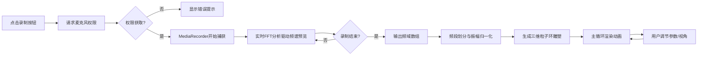

## 1. 产品概述
将用户实时录制的简短音频（最长5秒）转化为动态三维声纹雕塑的Web应用，解决声音痕迹缺乏空间可视化表达的问题。
- 核心功能：音频录制 → FFT频谱分析 → 三维粒子环渲染 → 交互式观察
- 目标用户：音乐爱好者、视觉艺术家、声音设计师以及对声纹可视化感兴趣的普通用户
- 产品价值：将抽象的声音频率转化为可交互、可观察的三维视觉形态，创造沉浸式的声音可视化体验

## 2. 核心功能

### 2.1 用户角色
| 角色 | 注册方式 | 核心权限 |
|------|----------|----------|
| 普通用户 | 无需注册，直接使用 | 音频录制、声纹生成、参数调节、视角控制 |

### 2.2 功能模块
1. **主视口**：Three.js三维场景渲染，展示动态粒子环声纹雕塑
2. **音频录制模块**：麦克风权限请求、MediaRecorder音频捕获、最长5秒限制
3. **频谱分析模块**：Web Audio API AnalyserNode FFT分析（size=256），输出频域数组
4. **粒子环渲染模块**：基于频域数据生成3-8圈动态粒子环，支持实时参数调整
5. **控制面板模块**：粒子密度滑块、环数滑块、录制按钮、视角重置按钮
6. **实时预览模块**：录制过程中环形频谱预览条

### 2.3 页面详情
| 页面名称 | 模块名称 | 功能描述 |
|----------|----------|----------|
| 主页面 | 三维视口 | 80%屏宽，100%屏高，深空黑背景，展示粒子环雕塑，支持鼠标拖动观察 |
| 主页面 | 侧边控制面板 | 200px宽，半透明毛玻璃效果，暗色背景，包含所有控制元素 |
| 主页面 | 环形频谱预览 | 录制时环绕画布边缘显示，高度对应实时振幅 |
| 主页面 | 响应式布局 | <768px时控制面板移至底部，横向布局，高度120px |

## 3. 核心流程

用户点击录制按钮 → 浏览器请求麦克风权限 → MediaRecorder开始捕获音频（44100Hz、单声道、最长5秒）→ 实时FFT分析驱动环形频谱预览 → 录制完成（手动停止或5秒自动停止）→ AnalyserNode输出频域数组 → 频域数据分为N个频段（N=3-8，由用户控制）→ 每个频段振幅归一化为0-1 → 创建三维粒子环组（内环低频蓝→外环高频金渐变）→ 每帧更新：半径=基础半径+振幅×扩展幅度，高度=振幅×高度因子，旋转角速度=振幅×2 rad/s → 用户拖动滑块即时更新粒子系统参数 → 用户点击视角重置按钮，相机0.5秒平滑过渡回初始位置

## 4. 用户界面设计

### 4.1 设计风格
- **主色调**：深空黑背景 `#0A0A1A`，控制面板暗色背景 `#1A1A2E`
- **强调色渐变**：低频内环 深蓝`#00008B` → 亮蓝`#00BFFF`；高频外环 橙红`#FF4500` → 金黄`#FFD700`
- **按钮样式**：圆角8px，柔和阴影，三态视觉区分（待录灰色圆形/停止红色方块/重录绿色循环箭头）
- **字体**：白色文字，现代无衬线字体
- **布局风格**：主视口80% + 右侧控制面板200px，响应式切换
- **视觉效果**：粒子半透明发光（透明度0.6-0.8），毛玻璃面板（backdrop-filter: blur），面板hover从不透明0.7→1.0过渡0.2s

### 4.2 页面设计概述
| 页面名称 | 模块名称 | UI元素 |
|----------|----------|--------|
| 主页面 | 三维视口 | 全屏深空黑背景，居中悬浮粒子环雕塑，鼠标拖拽旋转视角，粒子蓝-金渐变发光 |
| 主页面 | 控制面板 | 半透明毛玻璃卡片，圆角8px，间距12px，滑块自定义样式，按钮图标区分三态 |
| 主页面 | 环形频谱预览 | 画布边缘环形条，高度随振幅变化，录制期间显示 |

### 4.3 响应式
- **桌面端（>768px）**：主视口占据80%宽/100%高，控制面板固定右侧200px宽，纵向布局
- **移动端（≤768px）**：主视口占据100%宽/(100%-120px)高，控制面板移至底部，100%宽/120px高，横向布局

### 4.4 3D场景指导
- **环境/氛围**：纯深空黑背景 `#0A0A1A`，无环境贴图，营造深邃太空感
- **光照设置**：粒子自发光（PointsMaterial），无需额外光照
- **相机设置**：PerspectiveCamera，初始位置(0, 50, 200)，lookAt(0, 0, 0)，支持OrbitControls鼠标交互
- **构图与焦点**：粒子环组居中，整体形成垂直方向的圆柱形雕塑形态
- **交互与动画**：每帧更新粒子位置、大小、旋转；视角重置使用easeOutCubic缓动0.5秒
- **后处理效果**：粒子透明度0.6-0.8，形成自然发光叠加效果
- **性能预算**：粒子数上限500，帧率≥30FPS，场景生成≤1秒

