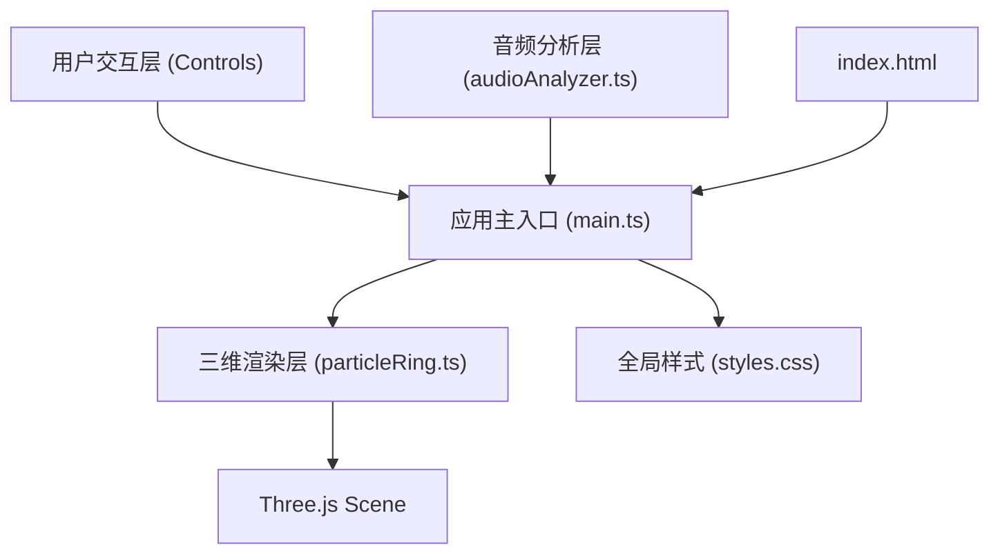

## 1. 架构设计



## 2. 技术描述
- **前端框架**：TypeScript + Three.js + Vite
- **构建工具**：Vite（支持HMR热更新）
- **三维渲染**：Three.js（Points + PointsMaterial）
- **音频处理**：Web Audio API（MediaRecorder + AnalyserNode + getUserMedia）
- **样式方案**：原生CSS（全局样式，响应式布局）
- **无后端**：纯前端应用，所有计算在浏览器本地完成

## 3. 项目文件结构
| 文件路径 | 作用 |
|----------|------|
| `/package.json` | 项目依赖与脚本配置（three、typescript、vite、@types/three） |
| `/vite.config.js` | Vite构建配置，支持HMR |
| `/tsconfig.json` | TypeScript严格模式，目标ES2020 |
| `/index.html` | 入口HTML页面，深色主题、布局容器、图标 |
| `/src/main.ts` | 应用主入口，场景/相机/渲染器初始化，事件管理，主循环 |
| `/src/audioAnalyzer.ts` | 音频录制与FFT分析模块（MediaRecorder + AnalyserNode） |
| `/src/particleRing.ts` | 粒子环生成与更新模块，支持动态参数调整 |
| `/src/controls.ts` | 控制面板UI模块，滑块/按钮事件绑定，参数传递 |
| `/src/styles.css` | 全局样式，毛玻璃面板，响应式布局 |

## 4. 核心模块API定义

### 4.1 audioAnalyzer.ts
```typescript
type RecordingState = 'idle' | 'recording' | 'done';

interface AudioAnalysisResult {
  frequencyData: Uint8Array;
  normalizedAmplitudes: number[];
  ringCount: number;
}

class AudioAnalyzer {
  constructor(ringCount: number);
  async startRecording(maxDuration: number): Promise<void>;
  stopRecording(): Promise<AudioAnalysisResult>;
  getRealtimeSpectrum(): { bars: number[]; amplitude: number };
  getState(): RecordingState;
  onSpectrumUpdate(callback: (data: { bars: number[]; amplitude: number }) => void): void;
  dispose(): void;
}
```

### 4.2 particleRing.ts
```typescript
interface RingParams {
  ringCount: number;
  particlesPerRing: number;
  baseRadius: number;
  radiusAmplitude: number;
  heightAmplitude: number;
}

class ParticleRingSystem {
  constructor(scene: THREE.Scene);
  build(params: RingParams, amplitudes: number[]): void;
  update(amplitudes: number[], deltaTime: number): void;
  setParticlesPerRing(count: number): void;
  setRingCount(count: number, amplitudes: number[]): void;
  dispose(): void;
}
```

### 4.3 controls.ts
```typescript
interface ControlParams {
  particleCount: number;
  ringCount: number;
}

type RecordingButtonState = 'idle' | 'recording' | 'done';

class ControlPanel {
  constructor(rootElement: HTMLElement);
  getParams(): ControlParams;
  onParamsChange(callback: (params: ControlParams) => void): void;
  onRecordClick(callback: () => void): void;
  onResetView(callback: () => void): void;
  setRecordingState(state: RecordingButtonState): void;
  setSpectrumPreview(amplitude: number, bars: number[]): void;
  hideSpectrumPreview(): void;
}
```

### 4.4 main.ts - 主循环与缓动函数
```typescript
function easeOutCubic(t: number): number;
function animateCameraTo(
  camera: THREE.PerspectiveCamera,
  targetPos: THREE.Vector3,
  targetLookAt: THREE.Vector3,
  duration: number
): void;
```

## 5. 性能指标与技术约束
- **帧率**：粒子数500时≥30FPS（使用requestAnimationFrame + Three.js Points批量渲染）
- **音频延迟**：录制与分析总延迟≤200ms（使用AnalyserNode实时获取频域数据）
- **场景生成**：从音频分析完成到粒子系统渲染≤1秒（预分配缓冲区，避免频繁GC）
- **内存管理**：录制/重建粒子系统时正确dispose旧Geometry与Material，避免内存泄漏
- **浏览器兼容**：需支持Web Audio API、MediaRecorder API、WebGL2

