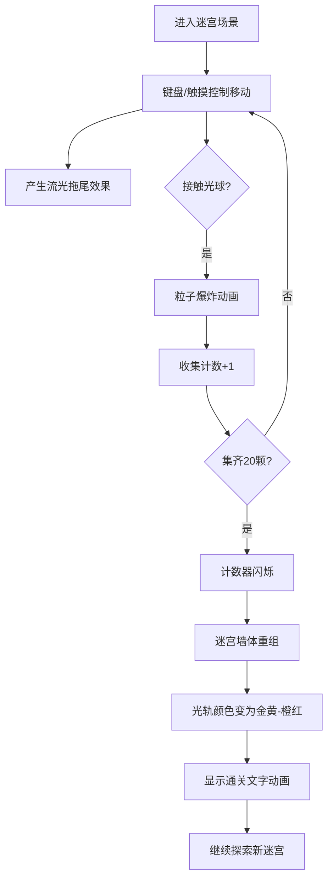

## 1. 产品概述

「光轨迷宫」是一款基于WebGL的交互式三维沉浸式探索应用，用户在由流动光轨构成的动态迷宫中穿行，收集隐藏光球并触发迷宫路径重组，带来视觉与探索的双重乐趣。

- **核心价值**：通过精致的光影效果和流畅的交互体验，打造一个治愈系的沉浸式三维探索空间
- **目标用户**：喜欢视觉艺术、迷宫探索、休闲游戏的浏览器用户
- **使用场景**：桌面端（键盘方向键控制）与移动端（触摸滑动手势）均可体验

## 2. 核心功能

### 2.1 用户角色
无角色区分，所有用户均以第一人称视角进入迷宫进行探索。

### 2.2 功能模块
1. **三维迷宫场景**：20x20格迷宫生成与渲染，半透明磨砂墙体，发光条带
2. **玩家视角控制**：键盘方向键/触摸滑动控制移动，碰撞检测，流光拖尾
3. **光球收集系统**：20颗浮动发光球，收集触发粒子爆炸，进度计数
4. **通关与重组**：收集所有光球后迷宫墙体重新排列，通关文字动画
5. **UI界面**：左上角收集进度计数，全屏渐变背景

### 2.3 页面详情
| 页面名称 | 模块名称 | 功能描述 |
|----------|----------|----------|
| 主场景 | 三维迷宫渲染 | 20x20格迷宫，墙体带靛蓝到品红发光条带，半透明磨砂质感 |
| 主场景 | 玩家控制器 | 键盘/触摸控制移动，碰撞检测，流光拖尾效果（8单位，透明度渐变） |
| 主场景 | 光球收集 | 20颗发光球缓慢浮动，收集迸发50粒子，1.5秒消散 |
| 主场景 | 通关系统 | 集齐20球后迷宫重组，金黄到橙红渐变，"通关"文字动画 |
| 主场景 | UI界面 | 左上角计数（白色24px，金色描边），满20时闪烁 |

## 3. 核心流程

用户打开应用 → 进入三维迷宫场景（初始视角在入口上方）→ 通过方向键或滑动控制移动 → 沿路径产生流光拖尾 → 接触光球触发粒子爆炸并计数+1 → 收集全部20颗光球 → 计数器闪烁 → 迷宫墙体重新排列，颜色变为金黄到橙红 → 显示"通关"文字动画 → 继续在新迷宫中探索。

## 4. 用户界面设计

### 4.1 设计风格
- **主色调**：深空蓝#0A1128 → 暗紫#1B0A2E（背景渐变），靛蓝#4A00E0 → 品红#8E2DE2（墙体发光带），金黄#FFD700 → 橙红#FF4500（通关后）
- **视觉风格**：赛博朋克、霓虹发光、沉浸深邃、磨砂半透明
- **字体**：无衬线现代字体，24px计数器，白色字体配金色细描边
- **布局**：全屏三维渲染，左上角固定UI计数器，通关时居中显示放大淡入文字
- **动效**：墙体发光带30秒周期变色，光球2秒周期浮动，粒子1.5秒消散，通关文字2秒淡入放大

### 4.2 页面设计概述
| 页面名称 | 模块名称 | UI元素 |
|----------|----------|--------|
| 主场景 | 背景 | 深空蓝到暗紫全屏径向渐变 |
| 主场景 | 迷宫墙体 | 半透明磨砂材质，顶部/底部发光条带（靛蓝→品红渐变） |
| 主场景 | 玩家拖尾 | 8单位长光点序列，透明度从1渐变到0 |
| 主场景 | 光球 | 直径0.4发光球体，自发光强度1.5，上下浮动 |
| 主场景 | 收集粒子 | 50个0.05单位粒子，向四周飞散，1.5秒后消失 |
| 主场景 | 计数器UI | 左上角，白色24px，金色细描边，满20闪烁 |
| 主场景 | 通关文字 | 屏幕中心，从中心放大淡入，持续2秒 |

### 4.3 响应式设计
- 桌面优先，移动端自适应全屏
- 桌面端：键盘方向键（↑↓←→ 或 WASD）控制移动
- 移动端：全屏触摸区域，滑动方向对应移动方向
- 渲染器自动适配窗口大小，维持视口中央渲染

### 4.4 3D场景指引
- **环境与氛围**：深空渐变背景，霓虹发光迷宫，神秘探索氛围
- **光照设置**：环境光（强度0.3）+ 方向光（右上角，强度0.8）
- **相机设置**：初始位置(x=0, y=8, z=10)，朝向迷宫中心，第一人称视角高度1.6单位，PerspectiveCamera
- **构图与焦点**：迷宫居中，玩家位置为视觉中心，发光条带引导视线
- **交互与动画**：移动时拖尾跟随，光球缓慢浮动，收集粒子爆发，墙体发光带呼吸变色
- **后处理与性能**：维持60FPS，单帧粒子≤200，迷宫生成≤500ms
