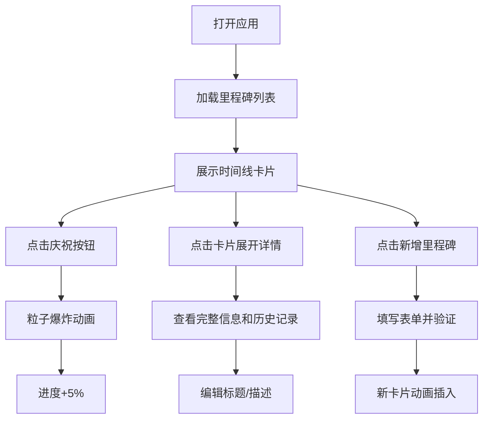

## 1. 产品概述

「动态里程碑」是一款团队协作工具，帮助项目团队在项目进行中创建、追踪和庆祝阶段性成果。通过可视化的时间线展示、交互式的进度追踪和庆祝动画，提升团队士气和项目透明度。

- 主要用途：项目里程碑管理、进度追踪、团队庆祝
- 目标用户：项目团队、产品经理、开发团队
- 产品价值：通过游戏化的庆祝机制提升团队动力，可视化管理项目进度

## 2. 核心功能

### 2.1 功能模块

1. **里程碑列表页**：时间线布局展示所有里程碑、进度可视化、庆祝交互
2. **里程碑详情**：展开查看完整信息、历史庆祝记录、编辑功能
3. **新增里程碑**：表单弹窗、输入验证、动画插入

### 2.2 页面详情

| 页面名称 | 模块名称 | 功能描述 |
|-----------|-------------|---------------------|
| 里程碑列表页 | 时间线列表 | 按截止日期排序展示里程碑卡片，支持滚动渐入动画 |
| 里程碑列表页 | 里程碑卡片 | 展示标题、描述、截止日期、进度条、庆祝按钮 |
| 里程碑列表页 | 庆祝效果 | 点击庆祝按钮触发粒子爆炸动画，进度+5% |
| 里程碑详情 | 展开视图 | 点击卡片展开完整信息，显示庆祝历史，支持编辑 |
| 新增里程碑 | 表单弹窗 | 底部按钮弹出表单，验证后添加新里程碑 |

## 3. 核心流程

用户打开应用 → 查看里程碑时间线列表 → 点击卡片查看详情/编辑 → 点击庆祝按钮触发动画和进度更新 → 点击新增按钮创建新里程碑 → 新卡片以动画形式插入列表顶部

## 4. 用户界面设计

### 4.1 设计风格

- 主色调：深色主题，背景#1a1a2e，卡片背景#16213e
- 强调色：#E94560（红色），用于按钮和进度条终点
- 辅助色：#0f3460（深蓝色），用于进度条起点
- 按钮样式：圆角按钮，悬停缩放1.05倍，颜色加深
- 字体：现代无衬线字体，标题加粗，正文清晰可读
- 布局风格：卡片式时间线布局，垂直排列
- 特殊效果：卡片发光边框、网格点阵背景、粒子爆炸动画

### 4.2 页面设计概述

| 页面名称 | 模块名称 | UI Elements |
|-----------|-------------|-------------|
| 里程碑列表页 | 时间线列表 | 深色背景、网格点阵纹理、卡片从右滑入动画、滚动渐入效果 |
| 里程碑列表页 | 里程碑卡片 | 发光边框、渐变进度条、庆祝按钮、悬停效果 |
| 里程碑列表页 | 庆祝效果 | 200-300个彩色粒子、3秒消散动画、数字跳动效果 |
| 里程碑详情 | 展开视图 | 300ms高度过渡动画、历史记录列表、编辑弹窗 |
| 新增里程碑 | 表单弹窗 | 红色错误边框提示、表单验证、提交反馈 |

### 4.3 响应式

- 桌面端优先设计，自适应宽度
- 移动端优化触摸交互，卡片宽度适配屏幕
- 滚动区域性能优化，保持50fps以上帧率

### 4.4 动效设计

- 新卡片添加：从右侧滑入（最新）或顶部滑入（新增）
- 卡片展开/收起：300ms ease-out高度过渡
- 庆祝按钮：粒子爆炸效果（30fps+），持续3秒
- 进度更新：数字跳动动画
- 滚动效果：卡片透明度从0.4过渡到1，Y轴偏移0-10px
- 按钮悬停：缩放1.05倍，背景色加深
