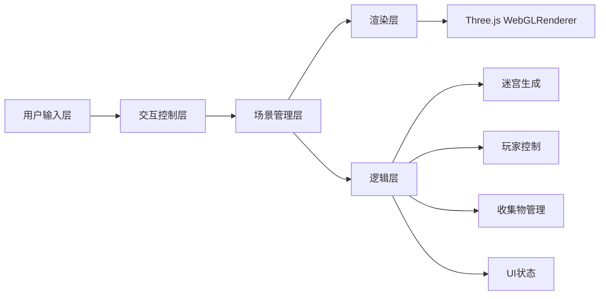
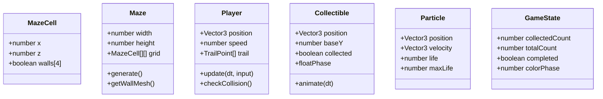

## 1. 架构设计



本项目为纯前端三维可视化应用，采用模块化分层架构：
- **交互控制层**：监听键盘/触摸事件，转换为移动指令
- **场景管理层**：统一管理Three.js场景、相机、渲染器生命周期
- **逻辑层**：迷宫生成算法、玩家碰撞、收集物检测、UI状态
- **渲染层**：Three.js材质、几何体、光照、粒子系统

## 2. 技术描述

- **前端框架**：原生 TypeScript（无React/Vue，用户明确指定文件结构）
- **三维引擎**：Three.js @latest + @types/three
- **构建工具**：Vite @latest（支持HMR热更新）
- **语言目标**：ES2020，严格模式（strict: true）
- **包管理器**：npm
- **后端**：无（纯前端应用）
- **数据库**：无

## 3. 路由定义

无路由，单页应用（SPA），入口 index.html 直接加载。

| 路由 | 用途 |
|------|------|
| / | 主场景，加载并渲染三维迷宫 |

## 4. API定义（无后端）

不适用。

## 5. 服务器架构图（无后端）

不适用。

## 6. 数据模型

### 6.1 数据模型定义



### 6.2 核心类型定义

```typescript
// 迷宫单元格
interface MazeCell {
  x: number;
  z: number;
  walls: { top: boolean; right: boolean; bottom: boolean; left: boolean };
  visited: boolean;
}

// 玩家输入状态
interface PlayerInput {
  forward: boolean;
  backward: boolean;
  left: boolean;
  right: boolean;
}

// 拖尾点
interface TrailPoint {
  position: Vector3;
  alpha: number;
  createdAt: number;
}

// 粒子
interface ParticleData {
  mesh: THREE.Mesh;
  velocity: THREE.Vector3;
  life: number;
  maxLife: number;
}
```

## 7. 项目文件结构

```
.
├── package.json           # 依赖与脚本（three, typescript, vite, @types/three）
├── vite.config.js         # Vite HMR配置
├── tsconfig.json          # TS严格模式，ES2020目标
├── index.html             # 入口页面（渐变背景，标题"光轨迷宫"）
└── src/
    ├── main.ts            # 应用入口，场景/相机/渲染器初始化，模块装配
    ├── maze.ts            # 迷宫生成（DFS算法），墙体几何与材质，发光条带
    ├── player.ts          # 玩家位置/速度/碰撞，流光拖尾管理
    └── collectibles.ts    # 光球分布，浮动动画，收集触发粒子
```

## 8. 性能优化策略

- **迷宫生成**：使用深度优先搜索（DFS）生成迷宫，时间复杂度O(n)，确保≤500ms
- **材质复用**：墙体材质、发光条带材质、光球材质、粒子材质均单例复用
- **几何体合并**：墙体使用BufferGeometry + InstancedMesh减少Draw Call
- **粒子池**：粒子对象复用池，限制单帧活跃粒子≤200
- **帧率控制**：requestAnimationFrame + deltaTime物理更新，维持60FPS
- **碰撞检测优化**：网格AABB碰撞，仅检测玩家周围4格墙体
