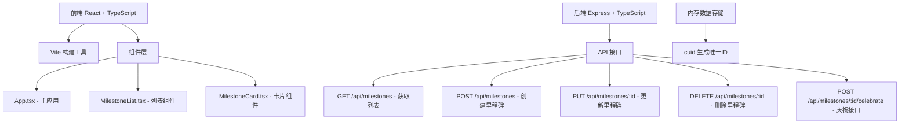
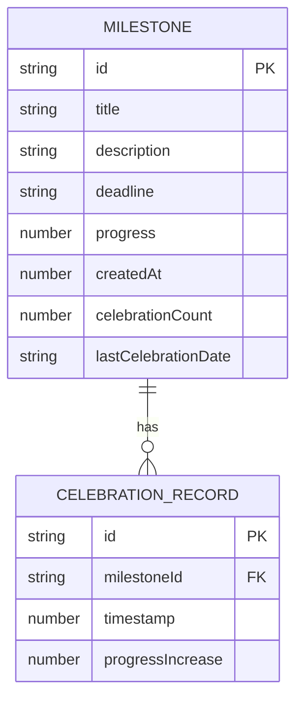

## 1. 架构设计



## 2. 技术描述

- 前端：React 18 + TypeScript + Vite
- 后端：Express 4 + TypeScript
- 构建工具：Vite 5
- 状态管理：React useState/useEffect
- ID生成：cuid
- 跨域处理：cors
- 数据存储：内存存储（开发环境）

## 3. 项目文件结构

```
.
├── package.json
├── vite.config.js
├── tsconfig.json
├── index.html
├── src/
│   ├── App.tsx
│   ├── components/
│   │   ├── MilestoneList.tsx
│   │   └── MilestoneCard.tsx
│   └── types.ts
└── server/
    └── server.ts
```

## 4. 路由定义

| 路由 | 用途 |
|-------|---------|
| / | 首页，展示里程碑列表 |
| GET /api/milestones | 获取所有里程碑 |
| POST /api/milestones | 创建新里程碑 |
| PUT /api/milestones/:id | 更新里程碑信息 |
| DELETE /api/milestones/:id | 删除里程碑 |
| POST /api/milestones/:id/celebrate | 庆祝里程碑，增加进度 |

## 5. API 定义

### 5.1 数据类型定义

```typescript
interface CelebrationRecord {
  id: string;
  timestamp: number;
  progressIncrease: number;
}

interface Milestone {
  id: string;
  title: string;
  description: string;
  deadline: string;
  progress: number;
  createdAt: number;
  celebrations: CelebrationRecord[];
  celebrationCount: number;
  lastCelebrationDate: string | null;
}

interface CreateMilestoneRequest {
  title: string;
  description?: string;
  deadline: string;
}

interface UpdateMilestoneRequest {
  title?: string;
  description?: string;
  deadline?: string;
  progress?: number;
}

interface CelebrateResponse {
  success: boolean;
  newProgress: number;
  message?: string;
}
```

### 5.2 接口说明

- **GET /api/milestones**：返回里程碑数组，按截止日期排序
- **POST /api/milestones**：验证标题（必填，≤50字符）、描述（≤200字符）、截止日期（未来日期）
- **PUT /api/milestones/:id**：更新里程碑标题和描述
- **POST /api/milestones/:id/celebrate**：检查每日庆祝次数（≤5次），进度+5%（最多100%），记录庆祝历史

## 6. 数据模型

### 6.1 数据模型定义



### 6.2 性能优化

- 前端滚动使用 IntersectionObserver 实现懒加载动画
- 粒子动画使用 requestAnimationFrame 保证30fps+
- 列表渲染使用 React.memo 优化重渲染
- 后端接口使用内存缓存，响应时间<200ms
- 滚动事件使用 requestAnimationFrame 节流
