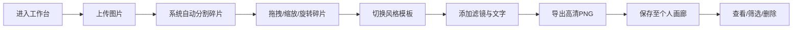

## 1. 产品概述

「印记工坊」是一款在线数字拼贴艺术创作工具，用户上传图片后系统自动将其分割为多个风格化碎片，通过自由拖拽、缩放旋转、风格切换和滤镜叠加等操作，创作出独特的数字拼贴作品，并保存到个人画廊。

- 核心价值：将普通照片转化为具有艺术质感的拼贴作品，降低创意门槛
- 目标用户：艺术爱好者、设计师、社交媒体内容创作者

## 2. 核心功能

### 2.1 功能模块

1. **创作工作台**：图片上传区、中央画布工作区、顶部工具栏、右侧属性面板、底部风格切换栏
2. **碎片交互系统**：拖拽移动、缩放旋转、碰撞检测、多选操作
3. **风格渲染引擎**：5种预设风格（手绘线稿、水彩晕染、像素风、拼贴感、复古油画）、6种滤镜
4. **导出与画廊**：高清导出PNG、云端保存、卡片展示、日期/风格筛选

### 2.2 页面详情

| 页面名称 | 模块名称 | 功能描述 |
|-----------|-------------|---------------------|
| 创作工作台 | 图片上传区 | 左侧拖拽/点击上传，支持PNG/JPG/WebP，最大5MB |
| 创作工作台 | 中央画布 | 1200x800px，浅米色渐变背景，8px圆角木纹边框 |
| 创作工作台 | 顶部工具栏 | 毛玻璃效果，操作工具图标，悬停变橙色，进度条显示 |
| 创作工作台 | 右侧属性面板 | 半透明白色磨砂玻璃，缩放滑块/旋转旋钮/滤镜选择/文本叠加 |
| 创作工作台 | 底部风格切换栏 | 深石墨色背景，5种风格模板，0.6秒切换动画 |
| 个人画廊 | 作品卡片 | 220x160px卡片，悬浮阴影，删除按钮 |
| 个人画廊 | 筛选功能 | 按日期、风格标签筛选作品 |

## 3. 核心流程

用户进入创作工作台 → 上传图片 → 系统自动分割为12-16块不规则碎片 → 用户拖拽/缩放/旋转碎片调整位置 → 选择风格模板整体切换 → 为单个碎片添加滤镜和文字 → 点击导出生成1920x1080高清PNG → 自动保存到个人画廊 → 画廊中查看/筛选/删除作品

## 4. 用户界面设计

### 4.1 设计风格

- **主色调**：暖米色渐变背景（#F5F0E8 → #E8DDD0），深石墨色底部栏（#2B2B2B），暖橙点缀色（#D48B60），金色选中态（#C5A55A）
- **按钮风格**：导出按钮为靛蓝到薰衣草紫渐变，6px圆角，2px金色边框，悬停阴影扩大上浮2px
- **字体**：衬线/无衬线可选，标题用衬线体增强艺术感，正文用无衬线体保证可读性
- **布局风格**：工作区居中，左右面板浮于两侧，毛玻璃半透明效果贯穿全局
- **动效**：所有过渡统一0.3秒ease-in-out，风格切换0.6秒淡出淡入，碰撞时碎片变红并震动0.2秒

### 4.2 页面设计概述

| 页面名称 | 模块名称 | UI元素 |
|-----------|-------------|-------------|
| 创作工作台 | 整体布局 | 三栏式布局，左上传区+中央画布+右属性面板，底部风格栏，顶部工具栏悬浮 |
| 创作工作台 | 画布碎片 | 不规则形状，选中时金色虚线边框（间距4px），拖动时实时跟随 |
| 创作工作台 | 属性面板 | 标题+关闭按钮，滑块/旋钮/下拉/输入框控件有序排列 |
| 个人画廊 | 卡片网格 | 响应式网格布局，卡片悬浮阴影加深，删除按钮右上角浮现 |

### 4.3 响应式设计

- **桌面端**（>1024px）：完整三栏布局，工作区1200x800px
- **平板端**（768-1024px）：工具栏折叠为汉堡菜单，属性面板移至底部，工作区宽度为视口80%，字号缩小
- **移动端**（<768px）：单列布局，简化交互

### 4.4 性能要求

- 碎片拖动帧率 ≥ 50fps
- 风格切换渲染时间 ≤ 1.2秒
- 画廊加载50张卡片 ≤ 2秒
