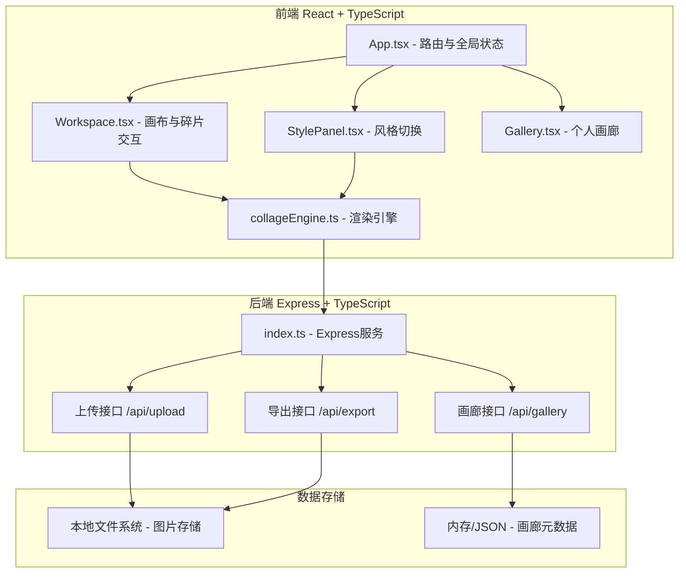

## 1. 架构设计



## 2. 技术说明

- **前端**：React 18 + TypeScript + Vite，状态管理用 Zustand
- **样式**：原生CSS + CSS Modules，使用CSS变量定义设计系统
- **图片处理**：Canvas API + Sharp（后端），风格化滤镜用Canvas像素操作
- **后端**：Express 4 + TypeScript，Multer处理文件上传
- **构建工具**：Vite，支持HMR热更新
- **图标**：lucide-react

## 3. 路由定义

| 路由 | 用途 |
|-------|---------|
| / | 创作工作台，主编辑界面 |
| /gallery | 个人画廊，展示与管理作品 |

## 4. API 定义

```typescript
// 上传图片
POST /api/upload
Request: multipart/form-data { file: File }
Response: { id: string; url: string; width: number; height: number }

// 保存作品
POST /api/gallery
Request: { id: string; title: string; style: string; dataUrl: string; createdAt: number }
Response: { success: boolean; id: string }

// 获取画廊列表
GET /api/gallery
Response: Array<{
  id: string;
  title: string;
  style: string;
  thumbnail: string;
  createdAt: number;
}>

// 删除作品
DELETE /api/gallery/:id
Response: { success: boolean }
```

## 5. 数据模型

### 5.1 数据定义

```typescript
interface Fragment {
  id: string;
  x: number;
  y: number;
  scale: number;
  rotation: number;
  clipPath: string;
  filter: string;
  textOverlay?: {
    content: string;
    fontFamily: 'serif' | 'sans-serif';
    fontSize: number;
  };
  sourceX: number;
  sourceY: number;
  sourceWidth: number;
  sourceHeight: number;
}

interface CollageWork {
  id: string;
  sourceImage: string;
  fragments: Fragment[];
  style: StyleType;
  width: number;
  height: number;
  createdAt: number;
}

type StyleType = 'sketch' | 'watercolor' | 'pixel' | 'collage' | 'oil';
type FilterType = 'vintage' | 'faded' | 'warm' | 'cool' | 'mono' | 'pencil';
```

## 6. 核心模块说明

### 6.1 collageEngine.ts 拼贴渲染引擎
- `splitImage(image, count)`：将图片分割为12-16块不规则碎片，生成Voronoi或随机多边形裁剪路径
- `applyStyle(canvas, style)`：对Canvas应用5种预设风格渲染
- `applyFilter(ctx, filter)`：应用单个滤镜（复古/褪色/暖阳/冷蓝/单色/素描）
- `renderText(ctx, text, options)`：在碎片上叠加文字

### 6.2 Workspace.tsx 工作区组件
- 碎片拖拽（mousedown/mousemove/mouseup）
- 碰撞检测（AABB算法，碰撞时边缘变红+震动）
- 多选操作（Shift+点击）
- 属性面板联动

### 6.3 StylePanel.tsx 风格切换组件
- 5个风格按钮，点击触发整体重新渲染
- 切换动画：先淡出（0.3s）→ 重新渲染 → 淡入（0.3s）
- 顶部工具栏进度条

### 6.4 Gallery.tsx 画廊组件
- 作品卡片网格（220x160px）
- 日期/风格筛选器
- 删除功能
