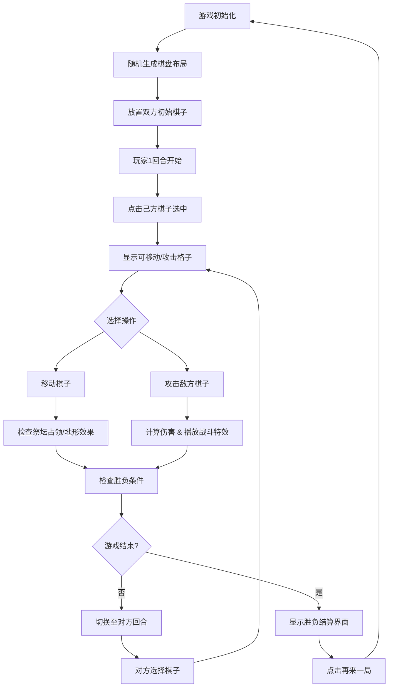

## 1. 产品概述

「刃语棋局」是一款基于六边形网格的中世纪暗黑幻想风格回合制对战游戏，两位玩家在随机生成的地形棋盘上操控由剑兵和盾兵组成的军队进行策略博弈，解决传统战棋游戏地形单调、交互反馈缺乏戏剧性的问题。

## 2. 核心功能

### 2.1 用户角色

| 角色 | 注册方式 | 核心权限 |
|------|----------|----------|
| 玩家1（左方） | 本地对战直接进入 | 操控左侧阵营棋子，查看己方状态面板 |
| 玩家2（右方） | 本地对战直接进入 | 操控右侧阵营棋子，查看己方状态面板 |

### 2.2 功能模块

1. **游戏主界面**：六边形棋盘渲染、玩家状态面板、背景与光环装饰
2. **棋子系统**：剑兵/盾兵属性、选中高亮、移动路径动画、攻击碎片特效
3. **地形系统**：高地/沼泽/祭坛随机生成、地形特效（气泡、光晕、抬升阴影）
4. **回合管理**：行动力分配、回合切换、祭坛占领与召唤机制
5. **战斗系统**：随机因子伤害计算、浮动伤害数字、死亡碎裂与冲击波特效
6. **胜负判定**：全灭判定、祭坛占领判定、胜利/失败结算界面

### 2.3 页面详情

| 页面名称 | 模块名称 | 功能描述 |
|----------|----------|----------|
| 游戏主界面 | 渐变背景层 | 铁灰蓝(#2C3E50)到暗血红(#8B0000)全屏渐变 |
| 游戏主界面 | 六边形棋盘 | 8x8六边形网格，对边距52px，间隔2px，半透明白色边框 |
| 游戏主界面 | 旋转光环 | 棋盘外圈缓慢旋转的暗金色光环 |
| 游戏主界面 | 玩家状态面板 | 左右两侧磨砂玻璃面板，显示棋子总数、行动力、祭坛数量 |
| 游戏主界面 | 棋子交互 | 点击选中辉光、可移动/攻击格子标记、弯曲光轨移动动画 |
| 游戏主界面 | 战斗特效 | 攻击碎片飞溅、屏幕震动、伤害数字弹出、死亡碎裂冲击波 |
| 结算界面 | 胜负展示 | 金色渐变文字、缩放动画、再来一局按钮 |

## 3. 核心流程

游戏开始 → 随机棋盘布局与地形生成 → 玩家1回合 → 选择棋子 → 移动/攻击 → 触发地形特效 → 检查胜负 → 切换玩家2回合 → 循环直至游戏结束 → 显示结算界面 → 再来一局

## 4. 用户界面设计

### 4.1 设计风格

- **主色调**：铁灰蓝(#2C3E50)、暗血红(#8B0000)、暗金色、渐变金(#FFD700→#FF4500)
- **强调色**：绿辉光(#00FF88)、蓝辉光(#0088FF)、淡青色脉冲、红色闪烁
- **按钮样式**：6px圆角、四角铆钉装饰(直径6px，#8B7355)、深蓝→紫罗兰渐变背景、悬停反转渐变
- **字体**：Georgia 衬线字体，体现中世纪手稿风格
- **面板效果**：半透明深色磨砂玻璃(backdrop-filter: blur(8px))，6px圆角
- **特殊效果**：羊皮纸纹理(CSS filter: contrast(1.1) brightness(0.9))、粒子气泡、碎片飞溅、光轨移动、冲击波

### 4.2 页面设计概览

| 页面名称 | 模块名称 | UI元素 |
|----------|----------|--------|
| 游戏主界面 | 背景层 | 全屏线性渐变，铁灰蓝到暗血红 |
| 游戏主界面 | 棋盘区 | 六边形网格，羊皮纸纹理，半透明白色边框，外圈旋转暗金光晕 |
| 游戏主界面 | 地形装饰 | 高地抬升10px带阴影、沼泽暗色+气泡粒子、祭坛紫色旋转光晕 |
| 游戏主界面 | 棋子 | 剑兵/盾兵图形，选中时渐变辉光边框 |
| 游戏主界面 | 状态面板 | 左右悬浮磨砂玻璃面板，数字打字机动画，四角铆钉 |
| 游戏主界面 | 交互标记 | 可移动格子淡青色脉冲呼吸(1.2s)、可攻击格子红色闪烁 |
| 游戏主界面 | 战斗动画 | 弯曲光轨移动(0.6s缓入缓出)、碎片飞溅(30-50方块0.3s)、屏幕震动(2px 0.2s)、伤害数字弹出(24→36px 0.8s)、死亡碎裂(8-12三角形0.4s)、冲击波(10→40px 1s) |
| 结算界面 | 蒙版层 | 半透明黑色全屏覆盖 |
| 结算界面 | 胜负文字 | 金色渐变64px，投影，0.8→1倍缩放1.5s |
| 结算界面 | 再来一局按钮 | 160×50px，圆角25px，深蓝→紫罗兰渐变，悬停反转 |

### 4.3 响应式

桌面端优先设计，以1920×1080分辨率为基准，Canvas自适应居中渲染，UI面板使用固定像素值保证视觉精度。

### 4.4 性能要求

- 单次回合操作总响应时间（含动画）≤ 1.2秒
- Chrome 110+、1920×1080、60Hz下稳定60FPS
- 棋盘外两圈不可见区域不绘制
