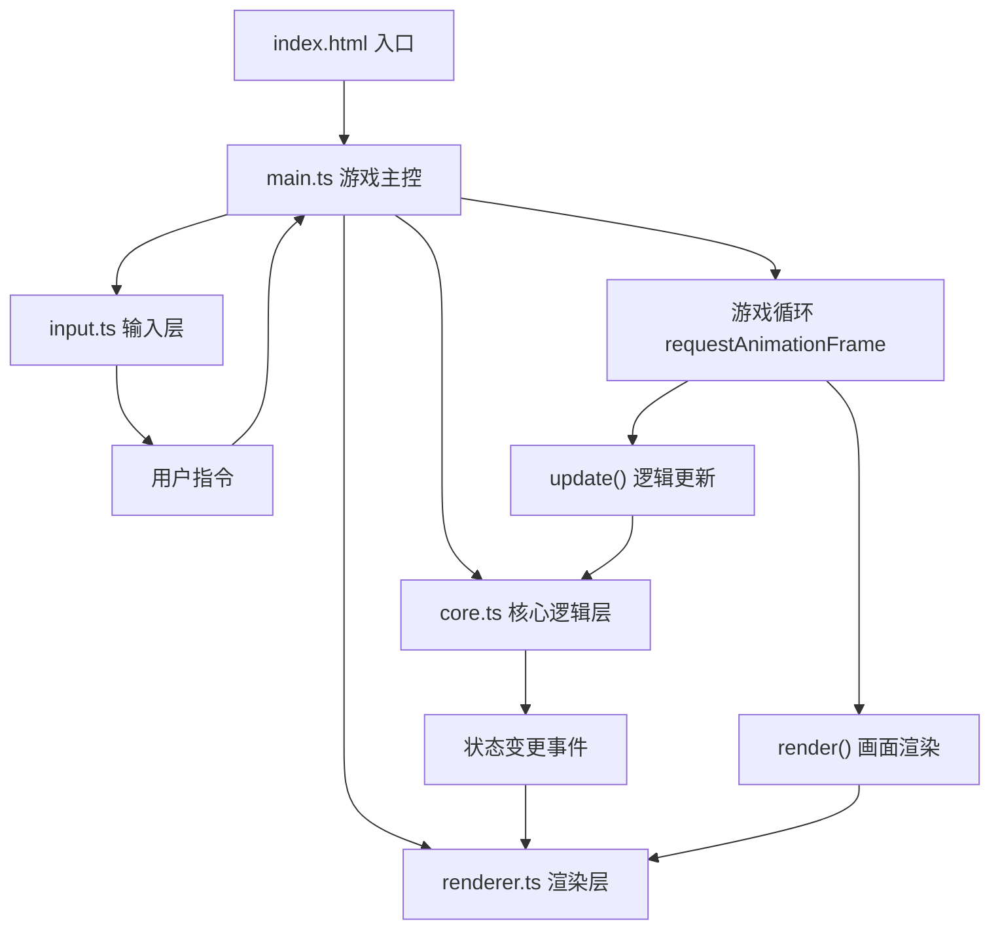

## 1. 架构设计



## 2. 技术描述

- **前端框架**：原生 TypeScript + Canvas 2D API（无 React/Vue，按用户指定）
- **构建工具**：Vite（支持 HMR、TypeScript、ES2020）
- **样式方案**：原生 CSS（内联 + reset.css），Georgia 系统字体
- **状态管理**：核心状态由 core.ts 集中管理，renderer.ts 独立维护渲染状态
- **渲染优化**：仅绘制棋盘可见区域，粒子系统对象池复用，requestAnimationFrame 驱动

## 3. 模块定义

| 模块文件 | 职责 | 核心导出 |
|----------|------|----------|
| src/main.ts | 游戏入口，初始化各模块，驱动主循环，协调整体状态机 | Game 类、start() |
| src/core.ts | 六边形网格数据结构、棋子类、回合管理、战斗计算、胜负判定 | HexGrid、Piece、TurnManager、CombatSystem |
| src/renderer.ts | Canvas 绘制：棋盘、棋子、地形、所有动画特效、UI面板 | Renderer 类 |
| src/input.ts | 鼠标事件监听、屏幕坐标↔六边形坐标转换、指令分发 | InputHandler 类 |

## 4. 核心数据模型

### 4.1 六边形网格坐标系统
```
axial coordinates (q, r)
像素坐标与六边形坐标双向转换公式
对边距 size = 52px，间隔 gap = 2px
```

### 4.2 棋子类
| 属性 | 类型 | 说明 |
|------|------|------|
| faction | 'player1' \| 'player2' | 所属阵营 |
| type | 'sword' \| 'shield' | 棋子类型 |
| hp | number | 生命值（剑兵20，盾兵30） |
| attack | number | 基础攻击力（剑10，盾5） |
| defense | number | 基础防御力（剑5，盾10） |
| position | HexCoord | 当前六边形坐标 |
| hasMoved | boolean | 本回合是否已移动 |
| hasAttacked | boolean | 本回合是否已攻击 |
| altarTurns | number | 在祭坛停留回合数 |

### 4.3 地形类型
| 类型 | 效果 |
|------|------|
| normal | 普通平地 |
| highland | 高地：抬高10px，防御+2 |
| swamp | 沼泽：移动消耗×2，攻击-2 |
| altar | 祭坛：停留2回合可占领，召唤盾兵，消耗召唤者5HP |

## 5. 动画与粒子系统

### 5.1 动画管理器
- 统一管理所有时间轴动画：移动光轨、碎片、冲击波、伤害数字、屏幕震动
- 每帧 update(dt) 推进动画状态，完成后自动回收
- 粒子对象池：碎片、气泡、冲击波粒子复用，避免频繁 GC

### 5.2 渲染分层（从下到上）
1. 全屏渐变背景
2. 棋盘外圈旋转光环
3. 六边形格子（含地形修饰）
4. 可移动/攻击格子标记
5. 棋子（含选中辉光）
6. 移动光轨 & 粒子特效
7. 伤害数字弹出
8. 玩家状态面板（DOM overlay）
9. 结算界面（DOM overlay）

## 6. 性能优化策略

- **视口裁剪**：仅绘制棋盘范围内的格子，超出两圈外不计算
- **脏矩形渲染**：静态格子离屏缓存，仅重绘动态变化区域
- **对象池**：粒子、动画节点复用，减少内存分配
- **requestAnimationFrame**：与浏览器刷新率同步，60FPS 稳定
- **Canvas 状态最小化**：批量相同样式绘制，减少 save/restore 调用
