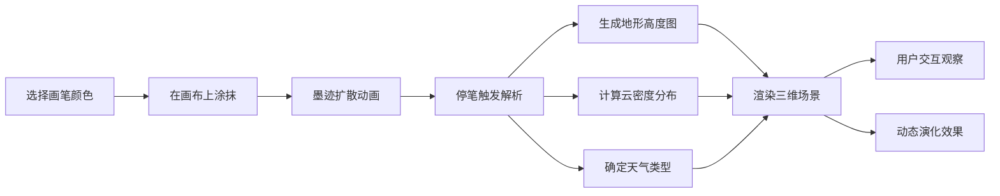

## 1. 产品概述

「墨迹气候」是一款创意交互艺术应用，用户通过在画布上涂抹墨迹，实时生成动态的三维气候环境。墨迹的浓淡、颜色和形状分别决定云层厚度、天气类型和地形起伏，打造属于用户的微型天气世界。

## 2. 核心功能

### 2.1 功能模块

1. **墨迹绘画系统**：支持五种天气颜色画笔，实时墨迹扩散动画
2. **三维气候场景**：基于墨迹参数生成地形、云层和粒子效果
3. **视角交互**：支持鼠标拖拽旋转、滚轮缩放观察3D场景
4. **动态演化**：墨迹随时间扩散、蒸发或沉降，呈现生命感

### 2.3 页面详情

| 页面名称 | 模块名称 | 功能描述 |
|-----------|-------------|---------------------|
| 主页面 | 背景层 | 古纸黄到宣纸白的全屏渐变背景 |
| 主页面 | 画布区域 | 800×600px 宣纸质感画布，带颗粒噪点和细边框 |
| 主页面 | 调色盘 | 左侧毛玻璃效果调色盘，五种天气颜色切换 |
| 主页面 | 三维视口 | 右侧 Three.js 渲染的动态气候场景 |

## 3. 核心流程

用户选择画笔颜色 → 在画布上涂抹墨迹 → 墨迹实时扩散动画 → 停笔后系统解析墨迹参数 → 生成三维地形/云层/粒子 → 用户旋转缩放观察场景 → 墨迹自然演化

## 4. 用户界面设计

### 4.1 设计风格

- **整体风格**：东方水墨意境，宣纸质感，禅意留白
- **主色调**：古纸黄(#ECD6B6)、宣纸白(#F5F0E8)、深棕(#4A3525)
- **天气色**：雨青(#4A90D9)、热浪红(#D94A4A)、雷电紫(#8E44AD)、沙尘黄(#D4A017)、墨黑(#2C2C2C)
- **视觉元素**：颗粒噪点纹理、毛玻璃效果、淡墨晕染

### 4.2 页面设计概述

| 页面名称 | 模块名称 | UI元素 |
|-----------|-------------|-------------|
| 主页面 | 背景 | 竖向渐变、宣纸纹理、颗粒噪点 |
| 主页面 | 画布 | 圆角细框、半透明墨迹、扩散动画 |
| 主页面 | 调色盘 | 毛玻璃背板、圆形色点、选中高亮 |
| 主页面 | 3D视口 | 深色场景背景、OrbitControls交互、动态粒子 |

### 4.3 响应性

桌面端优先，画布尺寸固定为800×600px，3D视口自适应剩余空间。

### 4.4 3D场景指引

- **环境**：深色雾效背景，模拟深邃空间感
- **光照**：环境光 + 方向光，柔和阴影
- **相机**：初始俯视45度，PerspectiveCamera，fov=60
- **交互**：OrbitControls，阻尼效果，限制俯仰角
- **地形**：根据墨迹生成高度图，使用PlaneGeometry + vertex displacement
- **云层**：Sprite/Points系统，半透明纹理，根据密度分布
- **粒子**：雨滴、热浪波纹、闪电、沙砾，根据天气类型切换
