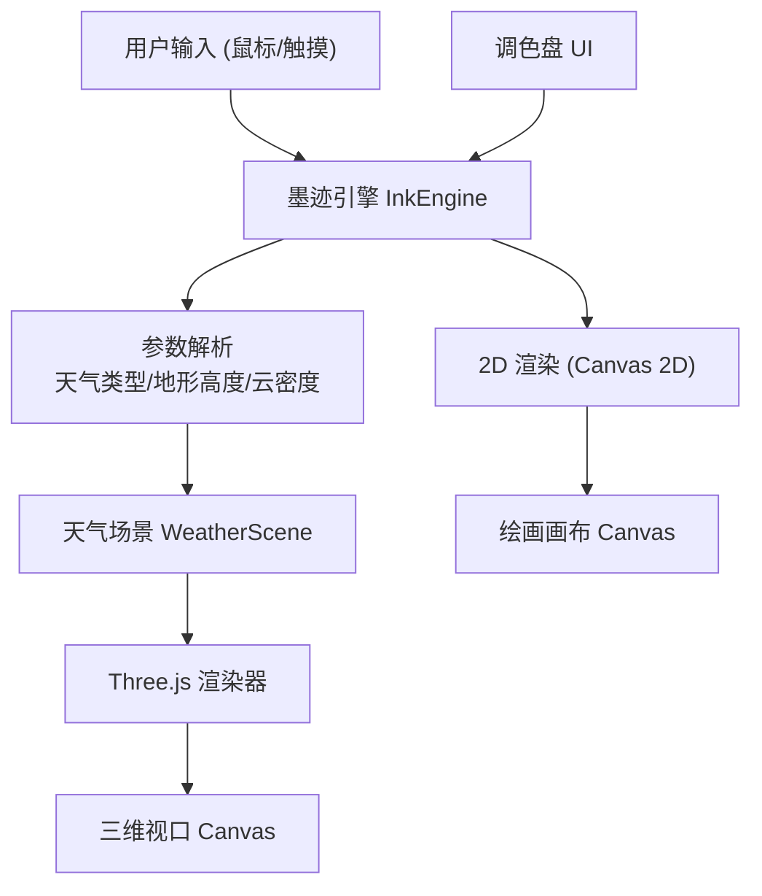

## 1. 架构设计



## 2. 技术描述

- **前端框架**：原生 TypeScript，无框架依赖
- **构建工具**：Vite 5.x，支持 HMR
- **3D 引擎**：Three.js 0.160+
- **2D 绘制**：HTML5 Canvas 2D API
- **类型定义**：@types/three

## 3. 文件结构

```
/
├── index.html              # 入口页面，包含布局和引用
├── package.json            # 项目依赖和脚本
├── vite.config.js          # Vite 配置
├── tsconfig.json           # TypeScript 配置
└── src/
    ├── main.ts             # 入口初始化，画布和场景创建，交互逻辑
    ├── ink-engine.ts       # 墨迹输入、扩散动画、参数解析
    └── weather-scene.ts    # 三维场景生成、地形/云层/粒子管理
```

## 4. 核心模块说明

### 4.1 InkEngine (墨迹引擎)

**职责**：
- 处理鼠标/触摸绘画输入
- 管理墨迹扩散动画（1.5秒晕染效果）
- 解析墨迹参数：天气类型、地形高度图、云密度分布
- 输出结构化数据给 WeatherScene

**关键数据结构**：
```typescript
type WeatherType = 'rain' | 'heat' | 'thunder' | 'sand' | 'ink'

interface InkAnalysis {
  weatherType: WeatherType
  terrainHeightMap: Float32Array  // 归一化高度 0~1
  cloudDensityMap: Float32Array   // 归一化密度 0~1
  dominantColor: string
}
```

### 4.2 WeatherScene (天气场景)

**职责**：
- 创建 Three.js 场景、相机、渲染器
- 根据 InkAnalysis 生成地形（PlaneGeometry + displacement）
- 创建云层粒子系统（Points + ShaderMaterial）
- 管理天气粒子效果（雨滴/热浪/闪电/沙砾）
- 提供更新方法，响应墨迹参数变化
- 渲染循环和性能优化

**性能策略**：
- 粒子池复用，避免频繁创建销毁
- 粒子数量上限 3000，超过时降采样
- 地形分辨率自适应
- 使用 BufferGeometry 减少 draw call

## 5. 交互设计

### 5.1 绘画交互
- 鼠标左键按下开始绘画
- 移动时连续绘制笔触
- 松开停止绘画，触发场景更新
- 节流控制绘画频率，平衡流畅度和性能

### 5.2 3D 场景交互
- 鼠标左键拖拽：旋转视角
- 鼠标滚轮：缩放
- 右键拖拽：平移
- OrbitControls 提供阻尼效果

## 6. 性能指标

- 目标帧率：≥ 30 FPS
- 粒子上限：3000 个无明显卡顿
- 场景更新响应：停笔后 ≤ 2 秒完成更新
- 墨迹扩散动画：60 FPS 流畅
