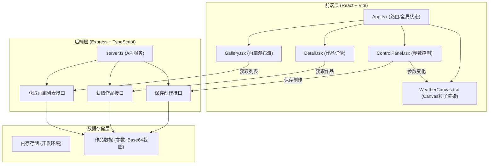
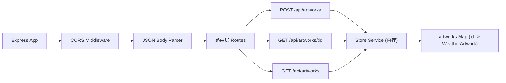
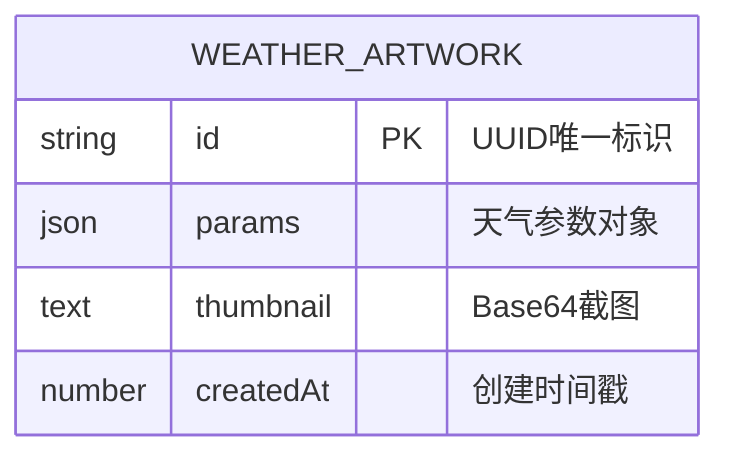
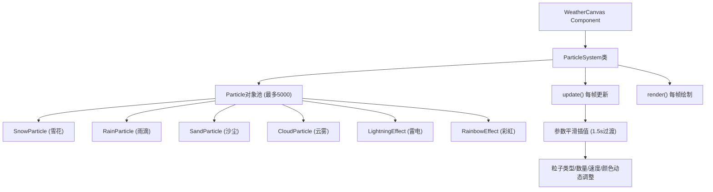

## 1. 架构设计



## 2. 技术说明

- **前端框架**：React@18 + TypeScript
- **构建工具**：Vite（支持HMR）
- **路由管理**：React Router DOM@6
- **状态管理**：React Hooks (useState/useReducer/useRef)
- **动画渲染**：Canvas 2D API，requestAnimationFrame
- **后端框架**：Express@4 + TypeScript
- **跨域支持**：cors中间件
- **ID生成**：uuid库
- **运行脚本**：npm run dev（同时启动前端Vite开发服务器和后端Express服务）

## 3. 路由定义

| 路由 | 页面 | 说明 |
|-------|------|------|
| `/` | 主创作页 | Canvas画布 + 控制面板 + 预设模式 |
| `/gallery` | 公共画廊页 | 瀑布流缩略图网格，懒加载 |
| `/detail/:id` | 作品详情页 | 重现动画 + 参数展示 + 分享链接 |

## 4. API定义

### 4.1 TypeScript 类型定义

```typescript
interface WeatherParams {
  temperature: number;  // -10 ~ 40 (°C)
  humidity: number;     // 0 ~ 100 (%)
  windSpeed: number;    // 0 ~ 20 (级)
  lightLevel: number;   // 0 ~ 100 (%)
  preset?: string;      // 可选预设名称
}

interface WeatherArtwork {
  id: string;           // uuid v4
  params: WeatherParams;
  thumbnail: string;    // base64 PNG
  createdAt: number;    // timestamp
}

interface SaveRequest {
  params: WeatherParams;
  thumbnail: string;
}

interface SaveResponse {
  id: string;
  shareUrl: string;
}

interface GalleryListResponse {
  artworks: WeatherArtwork[];
  total: number;
}
```

### 4.2 API 端点

| 方法 | 路径 | 请求体 | 响应 | 说明 |
|------|------|--------|------|------|
| POST | `/api/artworks` | `{ params, thumbnail }` | `{ id, shareUrl }` | 保存用户创作 |
| GET | `/api/artworks/:id` | - | `WeatherArtwork` | 获取单个作品详情 |
| GET | `/api/artworks` | - | `{ artworks, total }` | 获取画廊列表（按时间倒序） |

## 5. 服务器架构



## 6. 数据模型

### 6.1 数据模型定义



### 6.2 存储说明

- 开发环境使用内存存储（JavaScript Map对象）
- `artworks` Map: key = 作品ID (uuid), value = WeatherArtwork对象
- 初始种子数据：预置5-6个示例作品供画廊展示
- 画廊列表按 `createdAt` 降序排列

## 7. 粒子系统架构



### 7.1 性能优化策略

- **粒子对象池**：预先分配最大粒子数，避免频繁GC
- **requestAnimationFrame**：与显示器刷新同步，节能流畅
- **DPR适配**：根据设备像素比调整Canvas分辨率
- **参数平滑插值**：使用目标值+当前值插值，避免突变
- **懒加载**：画廊图片使用IntersectionObserver
- **节流/防抖**：滑块变化使用requestAnimationFrame合并渲染
