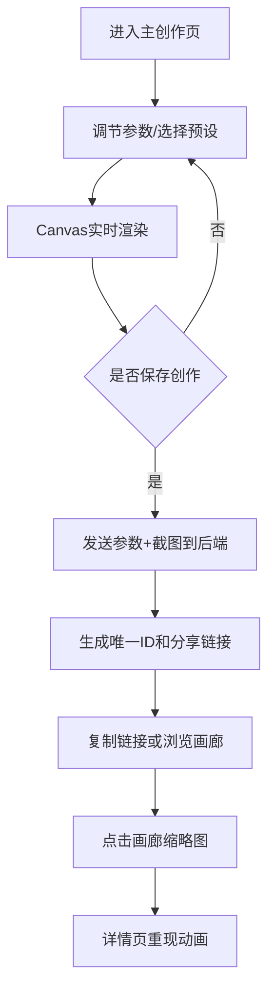

## 1. 产品概述

「气象织梦」是一款创意天气可视化Web应用，用户通过调节温度、湿度、风速、光照等参数，实时生成并播放由粒子系统驱动的动态天气视觉动画。支持预设模式切换、创作保存分享和公共画廊浏览。

- **目标用户**：创意爱好者、设计师、气象爱好者
- **核心价值**：将抽象的气象参数转化为沉浸式视觉艺术，创造独特的天气美学作品

## 2. 核心功能

### 2.1 用户角色

| 角色 | 注册方式 | 核心权限 |
|------|----------|----------|
| 普通用户 | 无需注册 | 调节参数、切换预设、保存创作、浏览画廊、查看详情 |

### 2.2 功能模块

1. **主创作页**：Canvas天气动画画布、参数控制面板、预设模式选择
2. **公共画廊页**：瀑布流缩略图网格、懒加载、作品筛选
3. **作品详情页**：重现动画、参数展示、分享链接复制

### 2.3 页面详情

| 页面名称 | 模块名称 | 功能描述 |
|-----------|-------------|---------------------|
| 主创作页 | Canvas画布 | 60%视口高度，实时渲染粒子动画，支持背景渐变和多种天气效果 |
| 主创作页 | 控制面板 | 毛玻璃效果，4个滑块（温度/湿度/风速/光照），6个预设按钮，保存创作按钮 |
| 主创作页 | 导航栏 | 标题、画廊入口链接、主题切换 |
| 公共画廊页 | 瀑布流网格 | 200px宽缩略图，等比例裁剪，淡入加载动画，懒加载 |
| 公共画廊页 | 缩略图卡片 | 显示预览图，点击跳转详情页 |
| 作品详情页 | 动画重现 | 根据保存的参数重现完整天气动画 |
| 作品详情页 | 参数信息 | 展示所有参数值，分享链接复制功能 |

## 3. 核心流程

用户进入主创作页 → 调节参数或选择预设模式 → Canvas实时渲染动画 → 点击保存创作 → 后端生成唯一ID和分享链接 → 用户复制链接或进入画廊 → 点击缩略图查看详情 → 详情页重现动画

## 4. 用户界面设计

### 4.1 设计风格

- **主色调**：深色主题，主背景#121212，卡片背景#1E1E1E
- **强调色**：#64B5F6（链接/按钮高亮），#3A7BD5→#F39C12（滑块渐变）
- **文字颜色**：#E0E0E0
- **毛玻璃效果**：控制面板背景模糊15px
- **按钮风格**：圆角12px，悬停缩放scale 1.05
- **滑块风格**：渐变填充轨道
- **字体方向**：使用现代无衬线字体，标题加粗，正文清晰可读

### 4.2 页面设计概述

| 页面名称 | 模块名称 | UI元素 |
|-----------|-------------|-------------|
| 主创作页 | Canvas画布 | 全屏宽度，60vh高度，自适应尺寸 |
| 主创作页 | 控制面板 | 底部固定，毛玻璃半透明，桌面水平排列，移动垂直叠放 |
| 主创作页 | 滑块组 | 温度(-10~40°C)、湿度(0~100%)、风速(0~20级)、光照(0~100%) |
| 主创作页 | 预设按钮 | 雷暴/暴雪/晴空/薄雾/夕阳/彩虹，1.5秒平滑过渡 |
| 公共画廊页 | 瀑布流网格 | CSS columns布局，200px列宽，间距16px |
| 公共画廊页 | 缩略图 | 淡入动画0.5秒，懒加载，悬停浮起效果 |
| 作品详情页 | 动画区 | 同主创作页Canvas尺寸和效果 |
| 作品详情页 | 参数面板 | 卡片式布局，参数标签+数值展示 |

### 4.3 响应式设计

- **桌面端**（≥768px）：控制面板水平排列，滑块并排，预设按钮两排三列
- **移动端**（<768px）：控制面板垂直叠放，滑块纵向排列，预设按钮单列，所有触控区域≥44px

### 4.4 天气动画设计

- **雪花粒子**：低温（<0°C）+ 低湿（<50%），白色六边形，缓慢下落
- **雨滴粒子**：中温（10~25°C）+ 高湿（>70%），蓝色线条，快速下落
- **沙尘粒子**：高温（>30°C）+ 干燥（<30%），黄褐色圆形，水平飘散
- **云雾效果**：中等温度+中等湿度，半透明白色团状漂浮
- **霞光渐变**：温度映射背景色，从深蓝(#0A1628)到橙红(#FF6B35)
- **雷电效果**：雷暴预设，随机白色闪光
- **彩虹效果**：彩虹预设，弧形七色渐变叠加

