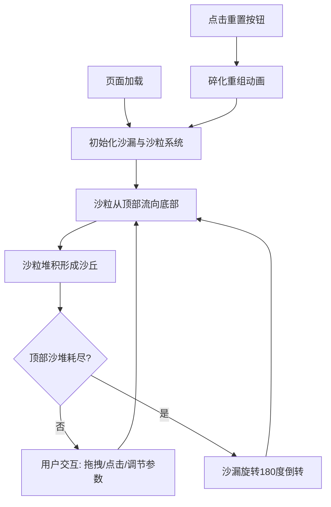

## 1. 产品概述

沙影时钟是一款在浏览器中运行的交互式数字艺术应用，通过数千颗动态沙粒组成的虚拟沙漏，将时间流逝转化为可感知、可操控的视觉艺术体验。

- 解决传统时钟界面缺乏艺术性和交互性的问题，为用户提供沉浸式的数字艺术观赏与创作体验
- 面向数字艺术爱好者、设计从业者以及追求独特桌面体验的普通用户

## 2. 核心功能

### 2.1 功能模块

1. **主沙漏展示区**：动态沙粒物理模拟、锥形沙堆渲染、沙柱流动效果、自动倒转循环
2. **参数控制面板**：沙粒流速调节、颜色色相调节、沙堆形状调节
3. **交互系统**：沙粒悬停高亮、鼠标拖拽推力、点击沙粒喷射、重置碎化重组动画

### 2.2 功能详情

| 页面名称 | 模块名称 | 功能描述 |
|-----------|-------------|---------------------|
| 主页面 | 沙漏容器 | 占视口50%宽、70%高，黄铜色边框3px，圆角8px，玻璃磨砂噪点内壁 |
| 主页面 | 沙粒系统 | 约3000颗沙粒，重力、碰撞、堆积物理模拟，半透明渐变渲染 |
| 主页面 | 沙堆渲染 | 顶部尖锥沙堆、底部沙丘，随沙粒流动实时变形 |
| 主页面 | 自动倒转 | 顶部沙堆耗尽后，沙漏旋转180度（2秒缓动），沙粒反向流动无限循环 |
| 主页面 | 控制面板 | 毛玻璃悬浮面板，3个滑块控件：流速(0.5-5.0)、色相(0-360)、形状(0-100) |
| 主页面 | 悬停交互 | 鼠标悬停沙粒时白色发光高亮（6px扩散，0.3秒） |
| 主页面 | 拖拽交互 | 按住左键拖拽对沙堆施加推力（40px半径），沙粒随机飞散后回落 |
| 主页面 | 点击交互 | 点击触发沙粒喷射（30px半径，0.8秒动画，彩色拖尾） |
| 主页面 | 重置按钮 | 右下角50px圆形金色按钮，点击触发碎化重组（1秒粒子动画） |

## 3. 核心流程

用户打开页面后，沙漏自动开始运行，沙粒从顶部缓慢流下堆积成沙丘。用户可通过左侧面板调节参数改变视觉效果，通过鼠标拖拽、点击与沙粒互动。当顶部沙堆耗尽，沙漏自动倒转循环。点击重置按钮可恢复初始状态。

## 4. 用户界面设计

### 4.1 设计风格

- **主色调**：暖沙色(#ECCDA6)到驼色(#C7A078)渐变背景，黄铜色(#B8860B/#D4AF37)作为控件和边框色
- **控件风格**：毛玻璃半透明白色面板(#FFFFFFB0，12px模糊)，滑块轨道半透明金色，磨砂金属圆点拖动按钮
- **字体**：选用优雅的衬线字体展示标题，无衬线字体用于参数标签，营造复古与现代融合的质感
- **布局**：居中对称布局，沙漏占主视觉空间，控制面板悬浮左侧，重置按钮固定右下角
- **动效**：所有过渡使用cubic-bezier(.4,0,.2,1)缓动函数，动画时长0.2-2秒

### 4.2 页面设计概览

| 页面名称 | 模块名称 | UI元素 |
|-----------|-------------|-------------|
| 主页面 | 背景 | 暖沙色到驼色全屏线性渐变 |
| 主页面 | 沙漏容器 | 黄铜色边框，圆角矩形，内部磨砂玻璃噪点纹理 |
| 主页面 | 沙粒 | 半透明渐变粒子，随色相滑块变色，悬停白色发光 |
| 主页面 | 控制面板 | 左侧悬浮毛玻璃卡片，三个垂直排列的滑块控件 |
| 主页面 | 重置按钮 | 右下角圆形渐变金色按钮，按压缩放反馈 |

### 4.3 响应式

桌面端优先设计，沙漏容器基于视口百分比自适应。触控设备上支持触摸拖拽和点击操作。
