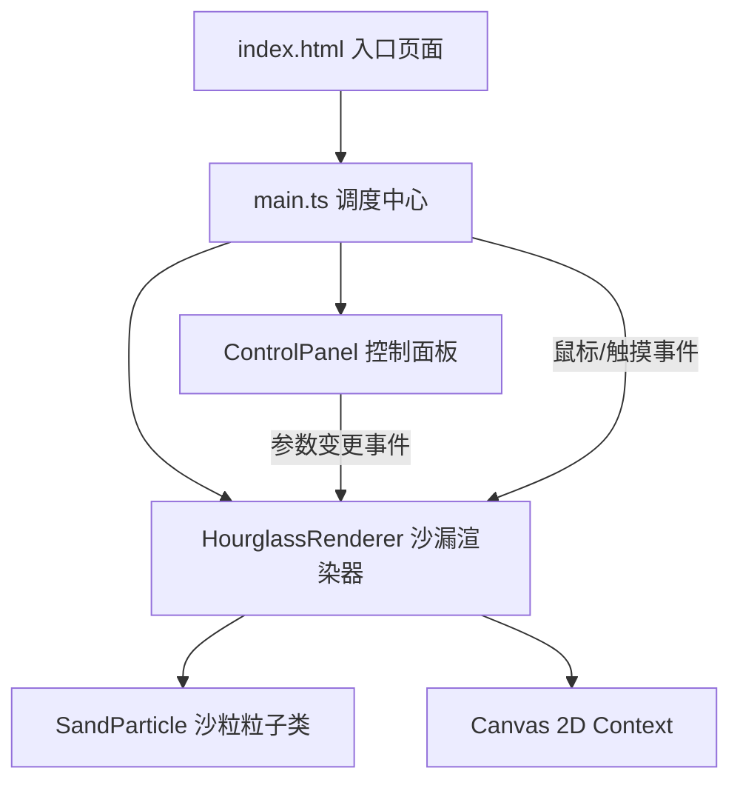

## 1. 架构设计

## 2. 技术说明

- **前端技术栈**：TypeScript 5.x + Canvas 2D API + Vite 5.x
- **构建工具**：Vite 5.x，支持 HMR 热更新
- **无后端**：纯前端运行，无需服务端支持
- **无第三方库**：所有物理模拟和渲染均为原生实现，保证轻量与性能

## 3. 文件结构

| 文件路径 | 用途 |
|----------|------|
| `package.json` | 项目依赖与脚本配置 (typescript, vite) |
| `vite.config.js` | Vite 基础构建配置，启用 HMR |
| `tsconfig.json` | TypeScript 严格模式配置，目标 ES2020 |
| `index.html` | 入口页面，包含 meta 标签与样式 |
| `src/main.ts` | 入口文件，Canvas初始化、事件绑定、调度中心 |
| `src/sandParticle.ts` | SandParticle 沙粒粒子类 |
| `src/hourglassRenderer.ts` | HourglassRenderer 沙漏渲染器 |
| `src/controlPanel.ts` | ControlPanel 控制面板 UI 组件 |

## 4. 核心类设计

### SandParticle（沙粒粒子类）
属性：x, y, vx, vy, radius, color, life, isHighlighted, highlightTime, trail
方法：update(gravity, friction) / render(ctx) / applyForce(fx, fy) / highlight() / getBounds()

### HourglassRenderer（沙漏渲染器）
属性：canvas, ctx, particles[], containerBounds, topPileHeight, bottomPileShape, flowRate, hue, shapeFactor, rotation, isFlipping, mouseState
方法：init(particlesCount) / update() / render() / setFlowRate(v) / setHue(v) / setShapeFactor(v) / handleMouseMove(x,y) / handleMouseDown(x,y) / handleMouseUp(x,y) / handleClick(x,y) / reset() / flip()

### ControlPanel（控制面板）
属性：containerEl, flowRateSlider, hueSlider, shapeSlider, resetBtn
方法：mount(parentEl) / onFlowRateChange(cb) / onHueChange(cb) / onShapeChange(cb) / onReset(cb)

## 5. 性能优化策略

- **对象池模式**：沙粒对象复用，避免频繁 GC
- **空间分区**：沙粒碰撞检测使用网格空间划分，降低 O(n²) 复杂度
- **帧率控制**：使用 requestAnimationFrame，目标 60fps，保底 30fps
- **批量渲染**：相同颜色沙粒批量绘制路径，减少状态切换
- **降采样**：设备像素比限制在 2 以内，平衡清晰度与性能
