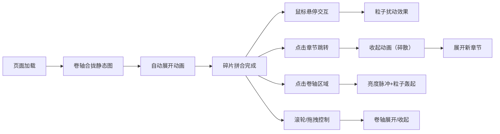

## 1. 产品概述

「残章卷轴」是一款面向数字艺术策展的交互式浏览工具，让观众以翻阅古籍卷轴的方式沉浸式浏览动态插画作品。作品通过碎片拼合动画与尘埃粒子扰动效果，营造历史文物在光线下徐徐展开的古典美学体验。

- **目标用户**：数字艺术策展人、线上艺术展览观众、文化遗产数字化爱好者
- **核心价值**：将静态数字艺术转化为具有仪式感和沉浸感的交互式观赏体验

## 2. 核心功能

### 2.1 功能模块

1. **卷轴主展示区**：卷轴展开/收起动画、碎片拼合效果、木质卷轴杆旋转动画
2. **粒子扰动系统**：鼠标悬停生成尘埃粒子、鼠标运动引导粒子偏移、点击触发粒子轰起效果
3. **多章节导航**：底部仿卷轴杆进度条、章节圆点跳转、收起/展开过渡动画
4. **交互反馈系统**：点击卷轴区域触发亮度脉冲、粒子抖动回收效果

### 2.2 页面详情

| 页面名称 | 模块名称 | 功能描述 |
|---------|---------|---------|
| 主展示页 | 顶部标题区 | 显示卷轴名称，衬线字体，淡金色阴影 |
| 主展示页 | 卷轴主展示区 | Canvas渲染卷轴内容，支持碎片拼合动画，占视口70%高度 |
| 主展示页 | 粒子层 | 覆盖在卷轴内容上的尘埃粒子系统，响应鼠标交互 |
| 主展示页 | 章节导航条 | 底部半透明木纹进度条，4个章节圆点，支持点击跳转 |

## 3. 核心流程

### 3.1 主要用户流程

用户打开页面 → 卷轴合拢静态图展示 → 自动展开动画（碎片拼合）→ 鼠标悬停触发粒子扰动 → 点击章节圆点 → 卷轴收起（画面碎散）→ 展开新章节 → 点击卷轴区域 → 亮度脉冲+粒子轰起 → 鼠标滚轮/拖拽 → 卷轴展开/收起

## 4. 用户界面设计

### 4.1 设计风格

**色彩系统**：
- 主背景：古纸色 `#F5E6C8` → 旧绢色 `#E8D5B7` 全屏渐变
- 卷轴底色：老纸泛黄 `#2A1F10`
- 装饰边框：深褐色 `#4A3520`（6px）+ 金色描边（0.5px）
- 木质色：`#8B6E4E` → `#6B4F30` 渐变（卷轴杆、导航条）
- 粒子色：暖金色 `#D4AF37` → 琥珀色 `#C58B3C` 渐变
- 文字色：深棕 `#3D2910`

**字体**：
- 标题：Noto Serif SC（衬线），24px，`#3D2910`，淡金色阴影
- 响应式：<768px 时字号缩小至18px

**布局**：
- 顶部10%视口：标题区
- 中间70%视口：卷轴主展示区（宽度最大80%，<768px时95%）
- 底部区域：章节导航条
- 卷轴两侧：木质圆柱形卷轴杆，带旋转动画

**动效**：
- 可交互元素悬停：透明度0.7→1.0，0.3s过渡
- 卷轴展开：2秒水平展开（左→右）
- 碎片拼合：50片碎片，速度与展开同步
- 粒子生命周期：5-8秒
- 亮度脉冲：1.2倍亮度，500ms

### 4.2 页面设计概览

| 页面名称 | 模块名称 | UI元素 |
|---------|---------|-------|
| 主展示页 | 顶部标题区 | 衬线字体标题、居中、淡金色文字阴影 |
| 主展示页 | 卷轴主展示区 | Canvas画布、深褐边框+金色描边、两侧卷轴杆、内部内容碎片拼合动画 |
| 主展示页 | 章节导航条 | 仿卷轴杆长条、木纹色渐变、4个圆形章节指示器、当前高亮 |
| 主展示页 | 粒子效果层 | 暖金色尘埃粒子、鼠标响应偏移、点击轰起动画 |

### 4.3 响应式设计

- 桌面端优先，视口宽度≥768px
- 移动端（<768px）：卷轴最大宽度95%，标题字号18px，底部导航条横向可滑动

## 5. 性能约束

- 卷轴展开动画（含碎片拼合）：稳定60FPS，无卡顿掉帧
- 粒子系统（50个同时活动）：Canvas帧率≥50FPS
