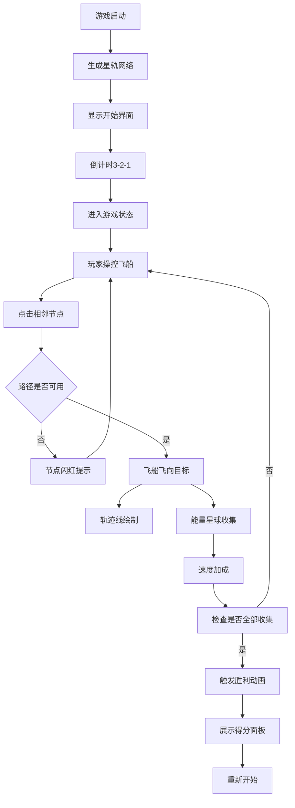

## 1. 产品概述

「星轨舞者」是一款在浏览器中运行的交互式太空舞蹈游戏，玩家操控带有拖尾光晕的微型飞船，在动态生成的星轨网络中穿梭并收集能量星球，飞行路径实时形成抽象的星轨画。

- **核心玩法**：通过键盘和鼠标操控飞船沿星轨网络飞行，收集所有节点的能量星球
- **目标用户**：喜欢休闲艺术游戏、视觉体验类游戏的玩家
- **产品价值**：融合策略路径选择与艺术创作，提供沉浸式太空视觉体验

## 2. 核心特性

### 2.1 功能模块

| 模块 | 核心功能 |
|------|----------|
| 星轨网络系统 | 动态生成12-18个节点，随机连接形成无向图 |
| 飞船操控系统 | 键盘方向选择、鼠标点击飞行、呼吸缩放动画 |
| 粒子特效系统 | 尾迹粒子、能量星球、扩散光波、星点粒子、金色粒子雨 |
| 能量收集系统 | 抛物线轨迹收集、速度加成、光波反馈 |
| 星轨画生成 | 轨迹线渐变加粗、星点环绕、呼吸脉动效果 |
| 游戏状态管理 | 开始倒计时、进行中计分、胜利动画、进度条 |
| UI交互系统 | 毛玻璃界面、悬停动画、点击反馈、错误提示 |

### 2.2 页面详情

| 页面名称 | 模块名称 | 功能描述 |
|-----------|-------------|---------------------|
| 游戏画布 | 主场景 | 全屏Canvas渲染，包含星轨网络、飞船、粒子、星轨画 |
| 开始界面 | 标题与倒计时 | 展示游戏标题，3-2-1倒计时动画 |
| 进行中界面 | HUD信息面板 | 左上角显示能量收集数、用时、速度倍率，顶部进度条 |
| 胜利界面 | 得分面板 | 飞船环绕动画、金色粒子雨、最终得分展示 |

## 3. 核心流程

## 4. 用户界面设计

### 4.1 设计风格

- **视觉主题**：深邃太空艺术风
- **主色调**：深紫 `#0B0B2A` → 暗蓝 `#1B1B4A` 渐变背景
- **星轨色**：暖橙 `#FF8C00` → 亮紫 `#8A2BE2` 渐变
- **节点色**：淡蓝 `#87CEEB`，激活时亮金 `#FFD700`
- **能量色**：暖色系三选一 `#FF4500` / `#FFD700` / `#FF1493`
- **UI样式**：半透明毛玻璃效果 `rgba(10,10,30,0.7)` + `backdrop-filter: blur(8px)`
- **字体**：无衬线浅色 `#E0E0E0`
- **按钮动效**：悬停放大 `scale(1.05)`，点击缩放 `scale(0.95)`

### 4.2 页面设计

| 页面 | 模块 | UI元素 |
|------|------|--------|
| 开始界面 | 标题区 | 游戏名称大号字体，副标题说明玩法，开始按钮 |
| 开始界面 | 倒计时 | 居中大号数字3-2-1，渐入渐出动画 |
| 进行中 | HUD面板 | 左上角毛玻璃卡片，三行信息：能量数/总数、用时、速度倍率 |
| 进行中 | 进度条 | 顶部细条，渐变填充，百分比显示 |
| 进行中 | 交互反馈 | 节点激活金色高亮2秒，错误点击红色闪烁0.2秒 |
| 胜利界面 | 动画区 | 飞船绕画布一周，金色粒子雨洒落4秒 |
| 胜利界面 | 得分面板 | 毛玻璃卡片，显示最终得分、用时、收集率 |

### 4.3 响应式

- 画布自适应浏览器窗口，最小尺寸 `800x600`
- UI元素使用相对定位，窗口缩放时自动调整位置
- 节点网络根据画布尺寸重新计算分布

### 4.4 性能要求

- 帧率不低于 `55FPS`
- 粒子数控制在 `200个` 以内
- 使用 `requestAnimationFrame` 驱动渲染循环
- 粒子对象池复用，避免频繁GC
