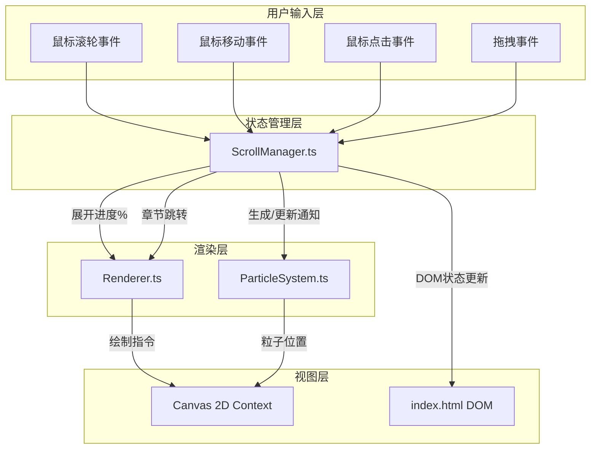

## 1. 架构设计



## 2. 技术描述

- **前端框架**：原生 TypeScript（无额外UI框架）
- **构建工具**：Vite（支持HMR热更新）
- **渲染技术**：HTML5 Canvas 2D API
- **动画方案**：requestAnimationFrame 主循环 + 时间增量插值
- **类型系统**：TypeScript strict 严格模式，目标 ES2020

### 文件职责与调用关系

| 文件 | 职责 | 输入 | 输出 | 被调用/调用 |
|-----|-----|------|------|-----------|
| `src/ScrollManager.ts` | 卷轴状态管理、用户输入处理、章节调度 | 鼠标滚轮/拖拽/点击事件 | 展开进度百分比、粒子系统通知、章节切换指令 | 调用 Renderer、ParticleSystem |
| `src/Renderer.ts` | Canvas绘制、碎片拼合动画、卷轴内容渲染 | 展开进度、章节数据、亮度脉冲参数 | Canvas 2D 绘制指令 | 被 ScrollManager 调用 |
| `src/ParticleSystem.ts` | 尘埃粒子生命周期管理、鼠标扰动计算 | 鼠标坐标、卷轴边界、触发事件 | 粒子位置/透明度更新 | 被 ScrollManager 调用 |
| `src/main.ts` | 应用入口，初始化各模块 | DOM Ready | 各模块实例 | 调用 ScrollManager |

### 数据流向

1. **展开动画流**：用户滚轮 → ScrollManager（计算进度0-1）→ Renderer（根据进度绘制碎片拼合）→ Canvas
2. **粒子扰动流**：鼠标移动 → ScrollManager（转发坐标）→ ParticleSystem（计算偏移）→ Canvas
3. **章节跳转流**：点击导航 → ScrollManager（触发收起动画）→ Renderer（反向碎散）→ ScrollManager（切换章节）→ Renderer（展开新章节）→ Canvas
4. **点击反馈流**：点击卷轴 → ScrollManager（触发脉冲）→ Renderer（亮度1.2x）+ ParticleSystem（粒子轰起）→ Canvas

## 3. 数据模型

### 3.1 核心接口定义

```typescript
// 卷轴状态
interface ScrollState {
  progress: number;           // 0-1，展开进度
  targetProgress: number;     // 目标进度
  isAnimating: boolean;       // 是否动画中
  currentChapter: number;     // 当前章节索引
  chapters: ChapterData[];    // 章节数据
}

// 章节数据
interface ChapterData {
  id: number;
  title: string;
  fragments: FragmentData[];  // 50片碎片
}

// 碎片数据
interface FragmentData {
  id: number;
  originalX: number;          // 目标位置
  originalY: number;
  scatterX: number;           // 散开位置（随机）
  scatterY: number;
  width: number;
  height: number;
  rotation: number;           // 散开时旋转角度
  content: string;            // 内容类型：'text' | 'shape' | 'mountain'
  text?: string;              // 文字内容
  shapePath?: Path2D;         // 图形路径
}

// 粒子数据
interface Particle {
  id: number;
  x: number;
  y: number;
  baseX: number;              // 基准位置（归位用）
  baseY: number;
  vx: number;                 // 速度
  vy: number;
  size: number;               // 1-3px
  life: number;               // 0-1，剩余生命周期
  maxLife: number;            // 5-8秒
  color: string;              // #D4AF37 到 #C58B3C
  opacity: number;
}

// 鼠标状态
interface MouseState {
  x: number;
  y: number;
  prevX: number;
  prevY: number;
  isInScroll: boolean;
  velocity: number;           // 鼠标移动速度
}
```

## 4. 性能优化策略

1. **requestAnimationFrame 单循环**：所有动画共用一个 RAF 循环，避免多重调度开销
2. **对象池**：Particle 和 Fragment 对象复用，避免频繁 GC
3. **脏矩形渲染**：仅重绘变化区域（卷轴展开区 + 粒子活动区）
4. **离屏 Canvas**：章节内容预渲染至离屏 Canvas，展开时直接 drawImage
5. **帧率自适应**：粒子数根据当前帧率动态调整（50FPS以下减少粒子）
6. **CSS 硬件加速**：卷轴杆旋转使用 transform，触发 GPU 合成

## 5. 初始化流程

1. 加载 index.html → 显示静态合拢卷轴（Renderer.initialRender）
2. main.ts DOMContentLoaded → 创建 Renderer、ParticleSystem 实例
3. 创建 ScrollManager 实例，注册事件监听
4. 所有模块就绪 → ScrollManager.triggerAutoExpand() 触发自动展开
5. 进入 RAF 主循环
