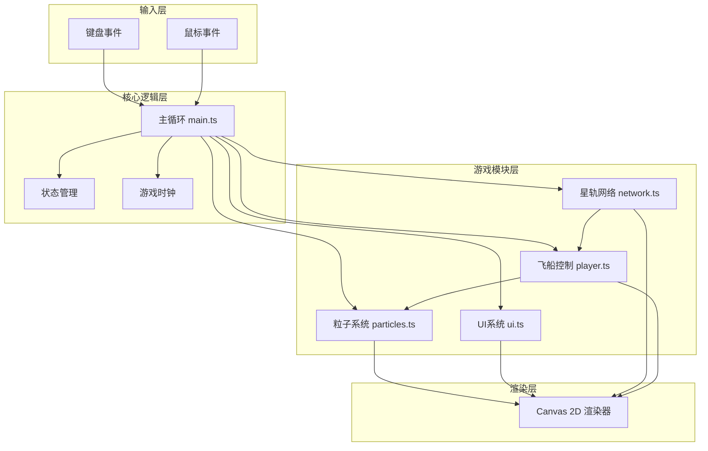

## 1. 架构设计



## 2. 技术描述

- **前端框架**：原生 TypeScript + Canvas 2D API
- **构建工具**：Vite 5.x（支持HMR热更新）
- **语言版本**：TypeScript 5.x，目标 ES2020
- **无外部依赖**：纯原生实现，无需额外游戏引擎

## 3. 项目结构

```
├── package.json          # 项目配置与依赖
├── vite.config.js        # Vite构建配置
├── tsconfig.json         # TypeScript配置
├── index.html            # 入口HTML
└── src/
    ├── main.ts           # 游戏主循环与状态管理
    ├── network.ts        # 星轨网络生成与管理
    ├── player.ts         # 飞船对象与控制逻辑
    ├── particles.ts      # 粒子系统
    └── ui.ts             # UI渲染与交互
```

## 4. 核心数据结构

### 4.1 节点与边

```typescript
interface Node {
  id: number;
  x: number;
  y: number;
  radius: number;
  color: string;
  visited: boolean;
  activated: boolean;
  activateTime: number;
  hasEnergy: boolean;
  energyColor: string;
  flashRed: boolean;
  flashTime: number;
}

interface Edge {
  from: number;
  to: number;
  traversed: boolean;
  opacity: number;
  width: number;
  targetOpacity: number;
  targetWidth: number;
  stars: StarParticle[];
}

interface StarParticle {
  angle: number;
  radius: number;
  speed: number;
  size: number;
}
```

### 4.2 飞船

```typescript
interface Player {
  x: number;
  y: number;
  targetNode: number | null;
  currentNode: number;
  speed: number;
  baseSpeed: number;
  speedBoost: boolean;
  boostEndTime: number;
  rotation: number;
  scale: number;
  trail: TrailPoint[];
}

interface TrailPoint {
  x: number;
  y: number;
  alpha: number;
}
```

### 4.3 粒子系统

```typescript
interface Particle {
  x: number;
  y: number;
  vx: number;
  vy: number;
  life: number;
  maxLife: number;
  size: number;
  color: string;
  type: 'trail' | 'wave' | 'star' | 'victory' | 'energy';
}

interface EnergyOrb {
  x: number;
  y: number;
  targetX: number;
  targetY: number;
  startX: number;
  startY: number;
  progress: number;
  duration: number;
  color: string;
  active: boolean;
}
```

### 4.4 游戏状态

```typescript
type GameState = 'menu' | 'countdown' | 'playing' | 'victory';

interface GameStats {
  collected: number;
  total: number;
  time: number;
  startTime: number;
  speedMultiplier: number;
}
```

## 5. 核心接口定义

### 5.1 Network 模块

```typescript
class StarNetwork {
  nodes: Node[];
  edges: Edge[];
  
  generate(width: number, height: number): void;
  getNeighbors(nodeId: number): number[];
  getEdge(from: number, to: number): Edge | null;
  markEdgeTraversed(from: number, to: number): void;
  isEdgeTraversable(from: number, to: number): boolean;
  findNodeAt(x: number, y: number, radius: number): Node | null;
  update(time: number): void;
  render(ctx: CanvasRenderingContext2D): void;
}
```

### 5.2 Player 模块

```typescript
class PlayerShip {
  x: number;
  y: number;
  currentNode: number;
  
  moveTo(nodeId: number, network: StarNetwork): boolean;
  update(deltaTime: number, network: StarNetwork): boolean;
  collectEnergy(orb: EnergyOrb): void;
  triggerBoost(duration: number): void;
  render(ctx: CanvasRenderingContext2D): void;
}
```

### 5.3 Particles 模块

```typescript
class ParticleSystem {
  particles: Particle[];
  energyOrbs: EnergyOrb[];
  maxParticles: number;
  
  emitTrail(x: number, y: number, count: number): void;
  emitWave(x: number, y: number, color: string): void;
  emitStars(x: number, y: number, count: number): void;
  emitVictory(x: number, y: number, count: number): void;
  launchEnergy(fromX: number, fromY: number, toX: number, toY: number, color: string): void;
  update(deltaTime: number): void;
  render(ctx: CanvasRenderingContext2D): void;
}
```

### 5.4 UI 模块

```typescript
class UIManager {
  gameState: GameState;
  countdown: number;
  flashNode: Node | null;
  
  startCountdown(): void;
  updateStats(stats: GameStats): void;
  showError(node: Node): void;
  showVictory(stats: GameStats): void;
  update(deltaTime: number): void;
  render(ctx: CanvasRenderingContext2D, width: number, height: number): void;
}
```

## 6. 性能优化策略

1. **对象池模式**：粒子对象预先分配，复用避免GC
2. **增量渲染**：已遍历边不重复计算，仅更新动画属性
3. **帧率控制**：使用 `performance.now()` 计算deltaTime，保证动画速度一致
4. **粒子上限**：限制最大粒子数200，超出时淘汰最旧粒子
5. **渐变缓存**：Canvas渐变对象复用，避免重复创建

## 7. 构建配置

- **开发命令**：`npm run dev` - 启动Vite开发服务器
- **类型检查**：`npm run build` - TypeScript编译 + Vite构建
- **HMR支持**：修改源码自动热更新，无需刷新页面
