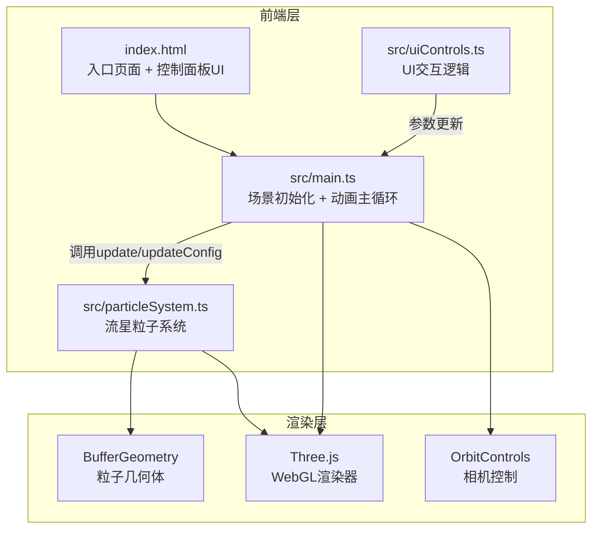

## 1. 架构设计



**数据流向**：UI控件 → uiControls.ts → main.ts.updateConfig() → particleSystem.ts.update() → Three.js渲染

## 2. 技术说明

- **前端框架**：原生 TypeScript + Three.js（无React/Vue，用户明确指定）
- **构建工具**：Vite + HMR
- **3D库**：three + @types/three
- **语言**：TypeScript（严格模式，目标ES2020）
- **后端**：无
- **状态管理**：简单配置对象，通过方法调用传递

### 依赖清单

| 包名 | 版本 | 用途 |
|------|------|------|
| three | ^0.160.0 | 3D渲染引擎 |
| @types/three | ^0.160.0 | Three.js类型定义 |
| typescript | ^5.3.0 | TypeScript编译器 |
| vite | ^5.0.0 | 构建工具与开发服务器 |

## 3. 文件结构与职责

```
project/
├── package.json              # 依赖与启动脚本
├── vite.config.js            # Vite构建配置，支持HMR
├── tsconfig.json             # TypeScript严格模式，目标ES2020
├── index.html                # 入口页面：深空背景、控制面板UI、加载动画
└── src/
    ├── main.ts               # 场景初始化、相机控制、动画主循环
    ├── particleSystem.ts     # 流星粒子系统：生成、更新、销毁、对象池
    └── uiControls.ts         # UI交互：滑块监听、参数传递
```

### 文件间调用关系

| 调用方 | 被调用方 | 调用方式 |
|--------|----------|----------|
| index.html | src/main.ts | script标签引入（Vite处理） |
| src/main.ts | src/particleSystem.ts | 创建MeteorParticleSystem实例，每帧调用update() |
| src/main.ts | src/uiControls.ts | 创建UIControls实例，注册updateConfig回调 |
| src/uiControls.ts | src/main.ts | 通过回调函数调用updateConfig()传递参数 |

## 4. 核心数据结构

### 4.1 粒子配置接口

```typescript
interface MeteorConfig {
  density: number;       // 1-50 颗/秒
  direction: number;     // 0-360 度
  speed: number;         // 5-30 单位/秒
}
```

### 4.2 流星粒子数据

```typescript
interface MeteorParticle {
  position: Float32Array;    // [x, y, z] 当前位置
  velocity: Float32Array;    // [vx, vy, vz] 速度向量
  life: number;              // 剩余生命 0-1
  maxLife: number;           // 最大生命时长
  trail: Float32Array;       // 轨迹点坐标数组
  trailColors: Float32Array; // 轨迹颜色数组（白→橙→红）
  active: boolean;           // 是否活跃
  size: number;              // 粒子大小
}
```

### 4.3 碎片粒子数据

```typescript
interface DebrisParticle {
  position: Float32Array;    // [x, y, z]
  velocity: Float32Array;    // [vx, vy, vz] 随机方向
  life: number;              // 剩余生命 0-1
  maxLife: number;           // 2秒
  flickerPhase: number;      // 闪烁相位（随机）
  active: boolean;
}
```

## 5. 对象池设计

为避免GC抖动，流星粒子和碎片粒子均使用对象池管理：

- **MeteorPool**：预分配200个MeteorParticle对象，获取时标记active=true，回收时重置属性标记active=false
- **DebrisPool**：预分配2000个DebrisParticle对象，碎片按需从池中获取，生命结束后回收
- 池满时跳过新粒子生成（不扩容），保证内存稳定

## 6. 渲染策略

### 6.1 流星轨迹
- 使用BufferGeometry + Line（或Points with custom shader）
- 轨迹颜色通过vertex color实现渐变：头部亮白→中部暖橙→尾部暗红
- 使用AdditiveBlending实现发光效果
- 轨迹长度随生命周期缩短

### 6.2 碎片粒子
- 使用Points + BufferGeometry
- 透明度在0.2-1之间快速变化（正弦函数+随机相位）
- AdditiveBlending发光

### 6.3 性能优化
- 合并几何体：所有活跃流星轨迹共享一个BufferGeometry，所有碎片共享另一个
- 每帧只更新需要变化的buffer区域（setNeedsUpdate标记）
- 对象池避免new/GC
- 最大密度50颗/秒时预计同时存在约75颗流星（1.5秒生命）+ 最多2250个碎片

## 7. 路由定义

| 路由 | 用途 |
|------|------|
| / | 单页面应用，全屏3D视口+控制面板 |
