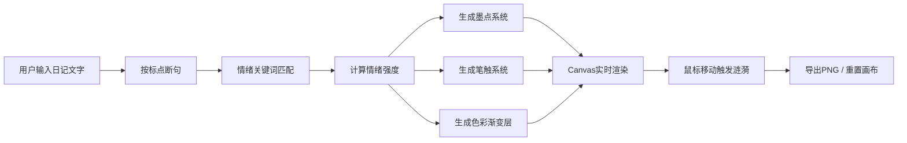

## 1. 产品概述

情绪墨水日记是一款将文字日记转化为动态水墨插画的创意工具，解决纯文字日记缺乏情感可视化表达的问题。用户输入日记文字后，系统自动分析情绪基调并生成独特的抽象水墨艺术作品。

- 核心价值：为日记赋予情感可视化表达，通过动态水墨艺术让用户直观感受文字中的情绪流动
- 目标用户：喜欢写日记、追求个性化表达、热爱艺术创作的年轻群体
- 市场定位：结合东方水墨美学与现代情感计算的创新型日记工具

## 2. 核心功能

### 2.1 用户角色

| 角色 | 注册方式 | 核心权限 |
|------|----------|----------|
| 普通用户 | 无需注册，直接使用 | 输入日记、生成插画、导出图片、重置画布 |

### 2.2 功能模块

1. **主页**：文本输入区、情绪分析关键词展示、动态水墨插画画布、操作按钮区
2. **情绪分析模块**：文本分句、关键词匹配、情绪强度计算
3. **插画渲染模块**：墨点系统、笔触系统、色彩渐变层、动画引擎
4. **交互模块**：鼠标涟漪效果、笔触拉伸动画
5. **导出模块**：PNG图片导出、画布重置

### 2.3 页面详情

| 页面名称 | 模块名称 | 功能描述 |
|----------|----------|----------|
| 主页 | 文本输入区 | 支持50-500字日记输入，实时字数统计，手写体字体，毛玻璃卡片样式 |
| 主页 | 情绪关键词展示 | 高亮圆点标注识别到的情绪关键词，颜色对应情绪类型 |
| 主页 | 水墨插画画布 | Canvas实时渲染动态插画，纸质纹理背景，60FPS动画 |
| 主页 | 操作按钮区 | 导出PNG按钮、重置按钮，墨色风格设计 |
| 主页 | 涟漪交互系统 | 鼠标移动触发墨点涟漪扩散，笔触沿鼠标方向拉伸 |

## 3. 核心流程

用户在文本框中输入日记文字 → 系统实时按标点断句并分析每句情绪 → 匹配情绪关键词库（50个情绪词）→ 计算情绪强度（1-5级）→ 在画布上生成对应墨点和笔触 → 色彩层叠加形成渐变背景 → 用户鼠标移动产生涟漪动画 → 用户可导出PNG或重置重新开始

## 4. 用户界面设计

### 4.1 设计风格

- **主色调**：米白色背景 #F5F0E8，墨色文字 #3B3228
- **情绪配色**：高兴暖黄 #FFD700、悲伤冰蓝 #00BFFF、愤怒猩红 #DC143C、平静薄荷 #98FF98、焦虑灰紫 #8B7B8B
- **按钮风格**：墨色圆角矩形，悬停变为 #5A4A3A，点击缩放0.95
- **字体**：手写体 'Ma Shan Zheng' 用于输入文字，系统无衬线字体用于界面文字
- **布局风格**：左右分栏布局，左侧40%输入区，右侧60%画布区
- **视觉细节**：毛玻璃卡片效果、纸质纹理背景、水墨晕染效果、柔和阴影

### 4.2 页面设计概述

| 页面名称 | 模块名称 | UI元素 |
|----------|----------|---------|
| 主页 | 文本输入区 | 毛玻璃卡片、1px边框 #D4C9B8、圆角12px、手写体输入、字数统计、情绪关键词圆点 |
| 主页 | 插画画布 | Canvas元素、纸质纹理CSS pattern、透明背景支持、60FPS渲染 |
| 主页 | 操作按钮 | 墨色按钮、圆角设计、悬停变色、点击缩放动画 |
| 主页 | 整体布局 | 弹性盒子布局、内容居中、最大宽度限制、移动端纵向排列 |
| 主页 | 动画效果 | 页面加载渐入动画（从下往上0.5秒）、涟漪扩散动画、笔触流动动画 |

### 4.3 响应式设计

- **桌面端（≥768px）**：左右分栏布局，左侧40%输入区，右侧60%画布区
- **移动端（<768px）**：纵向排列布局，输入区在上，画布区在下，全屏宽度
- **触摸优化**：按钮最小44px可点击区域，涟漪效果支持触摸事件

### 4.4 性能要求

- 插画渲染帧率保持30FPS以上
- 鼠标涟漪响应延迟不超过16ms
- 动画使用requestAnimationFrame实现
- Canvas采用分层渲染优化性能
