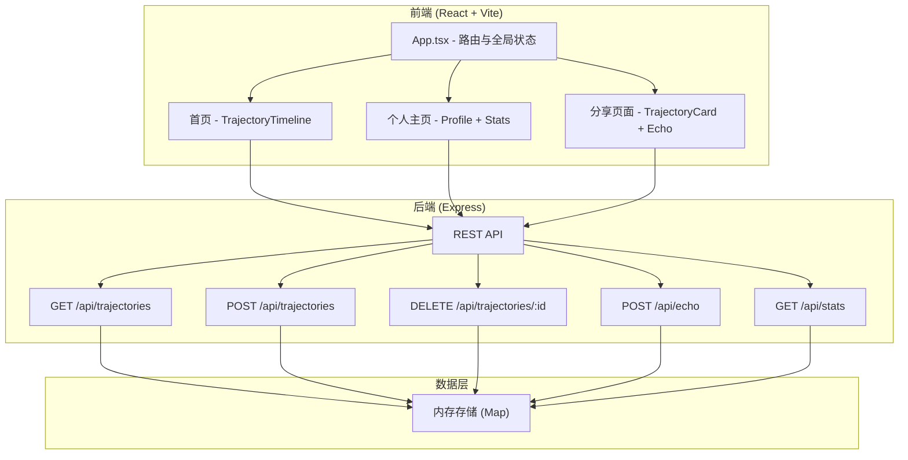
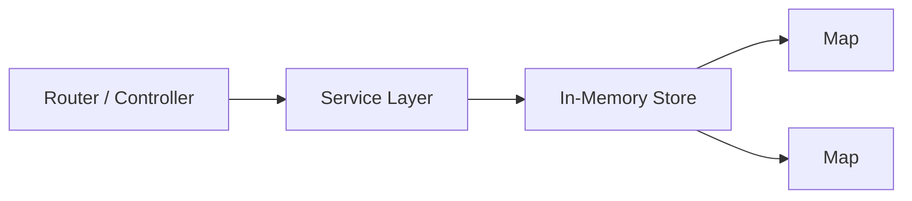
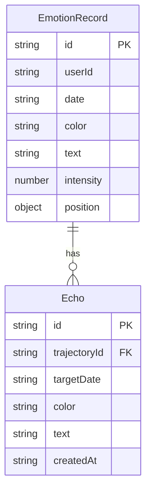

## 1. 架构设计



## 2. 技术说明
- 前端：React@18 + TypeScript + Tailwind CSS + Vite
- 初始化工具：vite-init (react-express-ts 模板)
- 后端：Express@4 + TypeScript
- 数据库：内存存储（Map结构），使用uuid生成ID
- 状态管理：Zustand
- 路由：React Router DOM
- 图表：Canvas 2D API（轨迹绘制、贝塞尔曲线）
- CORS：开放跨域

## 3. 路由定义
| 路由 | 用途 |
|------|------|
| / | 首页，展示30天情绪轨迹时间轴 |
| /profile | 个人主页，用户信息和统计面板 |
| /share/:shareId | 分享页面，查看轨迹并添加回声 |

## 4. API 定义

### 4.1 类型定义
```typescript
interface EmotionRecord {
  id: string;
  userId: string;
  date: string; // YYYY-MM-DD
  color: string; // hex color
  text: string; // max 50 chars
  intensity: number; // 1-5
  position?: { x: number; y: number }; // 拖拽后的自定义位置
}

interface Echo {
  id: string;
  trajectoryId: string;
  targetDate: string; // YYYY-MM-DD
  color: string;
  text: string;
  createdAt: string;
}

interface TrajectoryData {
  records: EmotionRecord[];
  echoes: Echo[];
}

interface StatsData {
  monthlyDistribution: { color: string; count: number; percentage: number }[];
  weeklyTrend: { date: string; intensity: number; color: string }[];
  totalDays: number;
}
```

### 4.2 API 端点
| 方法 | 路径 | 请求体 | 响应 |
|------|------|--------|------|
| GET | /api/trajectories?userId=xxx | - | TrajectoryData |
| POST | /api/trajectories | EmotionRecord (无id) | EmotionRecord (含id) |
| DELETE | /api/trajectories/:id | - | { success: boolean } |
| POST | /api/echo | Echo (无id) | Echo (含id) |
| GET | /api/stats?userId=xxx | - | StatsData |

## 5. 服务端架构图



## 6. 数据模型

### 6.1 数据模型定义


### 6.2 内存存储结构
- `trajectories: Map<string, EmotionRecord[]>` — 以userId为键存储情绪记录数组
- `echoes: Map<string, Echo[]>` — 以recordId为键存储回声数组
- `shares: Map<string, { userId: string; dateRange: [string, string] }>` — 以shareId为键存储分享信息
