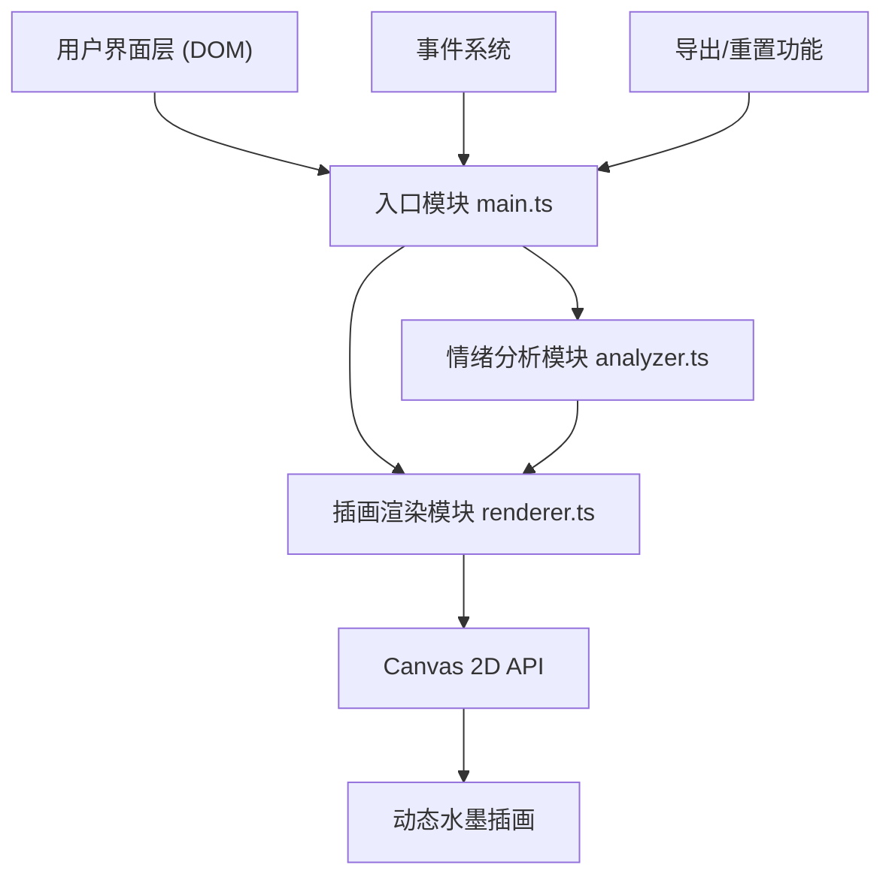

## 1. 架构设计

本项目采用纯前端架构，无需后端服务，所有逻辑在浏览器端完成。使用TypeScript编写，通过Vite构建工具实现开发热更新和生产构建。



## 2. 技术描述

- **前端技术栈**：TypeScript + Vite + Canvas 2D API
- **构建工具**：Vite 5.x，支持HMR热更新
- **语言规范**：TypeScript 5.x，严格模式，目标ES2020
- **无后端依赖**：所有功能在浏览器端完成，无需服务器
- **字体**：Google Fonts - Ma Shan Zheng（手写体）

## 3. 文件结构

```
auto43/
├── package.json          # 项目配置与依赖
├── vite.config.js        # Vite构建配置
├── tsconfig.json         # TypeScript编译配置
├── index.html            # 入口HTML页面
└── src/
    ├── main.ts           # 应用入口，UI初始化与事件绑定
    ├── analyzer.ts       # 情绪分析模块
    └── renderer.ts       # 插画渲染模块
```

## 4. 核心模块定义

### 4.1 类型定义

```typescript
// 情绪类型
type EmotionType = 'happy' | 'sad' | 'angry' | 'calm' | 'anxious';

// 情绪关键词
interface EmotionKeyword {
  word: string;
  emotion: EmotionType;
  intensity: number; // 1-5
  position: number;  // 在文本中的位置
}

// 句子分析结果
interface SentenceAnalysis {
  text: string;
  keywords: EmotionKeyword[];
  dominantEmotion: EmotionType;
  intensity: number;
  position: number; // 在全文中的位置比例 0-1
}

// 墨点
interface InkDot {
  x: number;
  y: number;
  baseRadius: number;
  currentRadius: number;
  color: string;
  opacity: number;
  emotion: EmotionType;
  ripplePhase: number; // 涟漪动画相位 0-1
  anchorX: number;
  anchorY: number;
}

// 笔触
interface BrushStroke {
  startX: number;
  startY: number;
  controlX: number;
  controlY: number;
  endX: number;
  endY: number;
  color: string;
  opacity: number;
  baseLength: number;
  stretchFactor: number;
  flowOffset: number;
}

// 色彩层
interface ColorLayer {
  x: number;
  y: number;
  radius: number;
  color: string;
  opacity: number;
}

// 分析结果
interface AnalysisResult {
  sentences: SentenceAnalysis[];
  overallEmotions: Record<EmotionType, number>;
  dominantEmotion: EmotionType;
}
```

### 4.2 情绪分析模块 (analyzer.ts)

| 函数名 | 参数 | 返回值 | 功能描述 |
|--------|------|--------|----------|
| `splitSentences` | `text: string` | `string[]` | 按标点符号将文本分割为句子 |
| `analyzeSentence` | `sentence: string, position: number` | `SentenceAnalysis` | 分析单句的情绪关键词和强度 |
| `analyzeText` | `text: string` | `AnalysisResult` | 分析全文，返回完整分析结果 |
| `getEmotionColor` | `emotion: EmotionType` | `string` | 获取情绪对应的主题色 |

**情绪词库**（50个常见情绪词）：
- 高兴：开心、快乐、喜悦、兴奋、幸福、满足、愉快、欢乐、欣喜、畅快、舒畅、甜蜜、愉悦、美好、欣慰
- 悲伤：难过、伤心、悲伤、痛苦、绝望、失落、沮丧、忧愁、哀伤、苦闷、心酸、悲凉、凄惨、落寞、惆怅
- 愤怒：生气、愤怒、暴怒、愤慨、恼怒、气愤、恼火、暴怒、怨恨、愤恨、震怒、愤懑、气恼、大怒、怒不可遏
- 平静：平静、安宁、宁静、安详、平和、淡定、从容、沉稳、恬静、闲适、悠然、淡然、安稳、平和、静谧
- 焦虑：焦虑、紧张、担忧、不安、烦躁、急躁、惶恐、恐慌、忐忑、忧虑、着急、焦急、揪心、慌乱、心慌

### 4.3 插画渲染模块 (renderer.ts)

| 函数名 | 参数 | 返回值 | 功能描述 |
|--------|------|--------|----------|
| `constructor` | `canvas: HTMLCanvasElement` | `Renderer` | 初始化渲染器，创建画布层 |
| `updateAnalysis` | `result: AnalysisResult` | `void` | 更新分析数据，重新生成插画元素 |
| `render` | `timestamp: number` | `void` | 渲染一帧画面（60FPS） |
| `handleMouseMove` | `x: number, y: number` | `void` | 处理鼠标移动，触发涟漪效果 |
| `exportPNG` |  | `string` | 导出当前画布为PNG图片（base64） |
| `reset` |  | `void` | 清空画布和所有元素 |
| `resize` | `width: number, height: number` | `void` | 调整画布尺寸 |

### 4.4 入口模块 (main.ts)

| 函数名 | 参数 | 返回值 | 功能描述 |
|--------|------|--------|----------|
| `initUI` |  | `void` | 初始化用户界面，创建DOM元素 |
| `bindEvents` |  | `void` | 绑定输入事件、鼠标事件、按钮事件 |
| `handleTextInput` | `text: string` | `void` | 处理文本输入，触发分析和渲染 |
| `handleExport` |  | `void` | 处理导出按钮点击 |
| `handleReset` |  | `void` | 处理重置按钮点击 |
| `animate` | `timestamp: number` | `void` | 主动画循环 |

## 5. 性能优化策略

1. **Canvas分层渲染**：
   - 底层：色彩渐变层（低频更新）
   - 中层：笔触路径（中频更新）
   - 顶层：墨点和涟漪（高频更新）

2. **动画优化**：
   - 使用 `requestAnimationFrame` 实现60FPS渲染
   - 只在需要时重绘变化区域
   - 限制同时进行的涟漪动画数量

3. **内存管理**：
   - 及时清理不再使用的Canvas离屏缓冲
   - 限制墨点和笔触的最大数量
   - 文本输入防抖处理（200ms延迟）

4. **响应式优化**：
   - 使用 `devicePixelRatio` 处理高清屏
   - 移动端降低粒子数量保证流畅度

## 6. 关键技术实现点

1. **情绪强度计算**：
   - 基于关键词数量和强度权重计算
   - 句子长度和位置作为辅助因子
   - 最终映射到1-5级强度

2. **墨点位置锚定**：
   - 根据句子在文本中的位置（0-1）映射到画布Y轴
   - X轴根据情绪类型分布在不同区域
   - 添加随机偏移避免排列过于整齐

3. **水墨效果实现**：
   - 使用 `globalCompositeOperation = 'multiply'` 实现水墨叠加
   - 径向渐变模拟墨晕效果
   - 随机贝塞尔曲线模拟笔触

4. **涟漪动画**：
   - 使用正弦函数实现半径的平滑伸缩
   - 距离鼠标最近的墨点优先响应
   - 涟漪效果随距离衰减

## 7. 构建配置

### 7.1 package.json
```json
{
  "name": "emotion-ink-diary",
  "version": "1.0.0",
  "type": "module",
  "scripts": {
    "dev": "vite",
    "build": "tsc && vite build",
    "preview": "vite preview"
  },
  "devDependencies": {
    "typescript": "^5.4.0",
    "vite": "^5.2.0"
  }
}
```

### 7.2 tsconfig.json
```json
{
  "compilerOptions": {
    "target": "ES2020",
    "useDefineForClassFields": true,
    "module": "ESNext",
    "lib": ["ES2020", "DOM", "DOM.Iterable"],
    "skipLibCheck": true,
    "moduleResolution": "bundler",
    "allowImportingTsExtensions": true,
    "resolveJsonModule": true,
    "isolatedModules": true,
    "noEmit": true,
    "strict": true,
    "noUnusedLocals": true,
    "noUnusedParameters": true,
    "noFallthroughCasesInSwitch": true
  },
  "include": ["src"]
}
```

### 7.3 vite.config.js
```javascript
import { defineConfig } from 'vite';

export default defineConfig({
  server: {
    port: 3000,
    open: true
  },
  build: {
    outDir: 'dist',
    minify: 'esbuild'
  }
});
```
