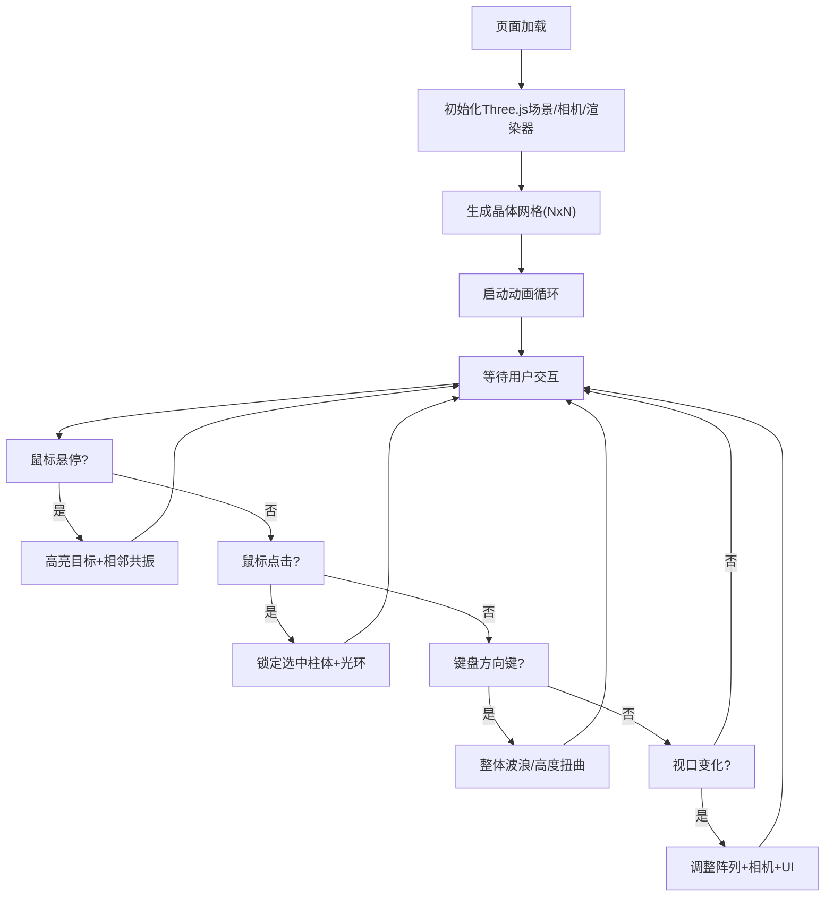

## 1. 产品概述

「晶格呼吸」是一款基于WebGL的交互式三维可视化应用，让用户在浏览器中探索和操控由数千个动态六棱柱组成的晶体结构阵列，体验类生物晶体森林的起伏律动之美。

- 面向人群：数字艺术爱好者、前端开发者、视觉设计师、普通用户
- 核心价值：提供沉浸式的交互式3D视觉体验，通过鼠标和键盘操控感受晶体呼吸的生命律动

## 2. 核心特性

### 2.1 用户角色

| 角色 | 注册方式 | 核心权限 |
|------|----------|----------|
| 访客用户 | 直接访问 | 完整的3D交互体验、所有操控功能 |

### 2.2 功能模块

1. **3D晶体阵列**：NxN六棱柱网格生成、独立属性控制、动态变形
2. **交互系统**：鼠标悬停高亮、点击选中锁定、键盘方向键扭曲控制
3. **动画系统**：独立呼吸动画、颜色渐变过渡、自转效果
4. **HUD界面**：交互状态显示、FPS监控、参数指示
5. **响应式适配**：多尺寸阵列、相机自动调整、UI平滑过渡

### 2.3 页面详情

| 页面名称 | 模块名称 | 功能描述 |
|----------|----------|----------|
| 主页面 | 3D场景渲染 | 全屏Three.js渲染器，深空蓝到暗紫渐变背景，居中晶体阵列 |
| 主页面 | 晶体网格 | 15x15/12x12/8x8六棱柱阵列，独立颜色渐变、呼吸相位、旋转轴 |
| 主页面 | 鼠标交互 | 悬停高亮膨胀、相邻共振、点击选中锁定光环 |
| 主页面 | 键盘交互 | 方向键控制波浪扭曲、中心膨胀/压缩，平滑过渡恢复 |
| 主页面 | 动画循环 | 60fps驱动呼吸缩放、颜色过渡、自转、浮动 |
| 主页面 | HUD面板 | 毛玻璃效果面板，显示悬停位置、扭曲模式、FPS、选中ID |
| 主页面 | 标题标识 | 左上角半透明白色细体标题 |
| 主页面 | 响应式适配 | 视口变化时调整阵列尺寸、HUD宽度、相机位置 |

## 3. 核心流程

## 4. 用户界面设计

### 4.1 设计风格

- **主色调**：深空蓝 #0B132B → 暗紫 #1F0B3A 渐变背景
- **晶体底部**：深蓝 #1A237E
- **暖色渐变**：#FF6F00 → #FFAB00（中心区域）
- **冷色渐变**：#00BCD4 → #00E5FF（外围区域）
- **高亮白色**：#FFFFFF（悬停）
- **选中荧光绿**：#76FF03（点击锁定）
- **HUD文字**：浅蓝色 #90CAF9
- **标题文字**：半透明白色 #FFFFFF80
- **HUD背景**：rgba(15,20,40,0.6) + backdrop-filter blur 10px
- **圆角**：HUD 16px
- **字体**：无衬线细体（font-weight 200-400）
- **过渡动画**：0.5s ease-in-out（UI变化）、0.2-0.8s（3D变形）

### 4.2 页面设计概览

| 页面名称 | 模块名称 | UI元素 |
|----------|----------|--------|
| 主页面 | 3D场景 | 全屏Canvas、渐变背景、柔和环境光+方向光、雾效增强景深 |
| 主页面 | 六棱柱 | 高度0.8、半径0.3、间距0.5、渐变着色、自发光0.3、颗粒质感 |
| 主页面 | 悬停效果 | 1.6倍膨胀(0.3s)、亮白色、上方1.2单位点光源光晕、八邻居1.1倍共振(0.2s) |
| 主页面 | 选中效果 | 荧光绿锁定、旋转光环环绕 |
| 主页面 | 扭曲效果 | ←左波浪15°、↑中心2倍/外围0.7倍、→右波浪、↓中心压缩，均0.5s过渡，释放0.8s恢复 |
| 主页面 | 呼吸动画 | 0.9-1.2倍正弦高度变化(1.5-3s)、冷暖色过渡(2-4s)、Y轴自转0.01-0.03rad/s |
| 主页面 | HUD面板 | 底部中央、距底40px、宽600px/80%视口、高52px、圆角16px、毛玻璃、两行状态文字14px |
| 主页面 | 标题 | 左上角、20px、font-weight 200、#FFFFFF80 |

### 4.3 响应式设计

- **>1024px（桌面端）**：15x15阵列、HUD宽600px、相机(20,15,20)
- **768-1024px（平板）**：12x12阵列、HUD宽80%视口、相机自动退远
- **<768px（移动端）**：8x8阵列、HUD宽80%视口、相机进一步退远
- **所有过渡**：transition 0.5s ease-in-out 无缝衔接

### 4.4 3D场景指引

- **环境/HDRI**：纯程序化渐变背景，增强深空神秘感
- **光照配置**：AmbientLight(0xffffff, 0.6) + DirectionalLight(0xffffff, 0.8) 从(10,20,10)照射 + 每个晶体MeshStandardMaterial自发光
- **相机设置**：PerspectiveCamera(fov=45, aspect, near=0.1, far=1000)，初始(20,15,20)看向原点，OrbitControls限制合理范围
- **构图焦点**：阵列中心为视觉中心，暖色中心与冷色外围形成对比，动态起伏形成视觉引导
- **交互动画**：悬停高亮<16ms响应、点击反馈<30ms可见、扭曲过渡0.5s、恢复0.8s
- **后处理效果**：可选BloomEffect增强光晕，PerformanceMonitor监控FPS
- **性能预算**：单帧渲染<16ms(60fps)、扭曲计算<2ms、内存<200MB、Draw Calls优化(InstancedMesh优先)
