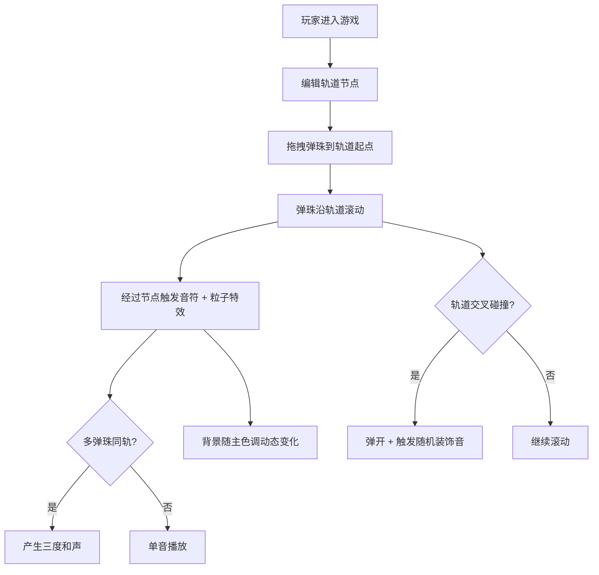

## 1. 产品概述

「音链弹珠」是一款在浏览器中运行的交互式音乐生成游戏，创造性地将音序器与物理弹珠玩法相结合。玩家通过拖拽不同颜色的弹珠沿自定义轨道下落，每经过一个节点触发对应音符，多颗弹珠同时滚动形成多轨循环旋律，实现"可视化音乐创作"的独特体验。

- 核心目标：让音乐创作变得可视化、游戏化，无需乐理基础即可生成动听旋律
- 目标用户：音乐爱好者、创意玩家、对交互式艺术感兴趣的年轻人
- 产品价值：将物理弹珠的趣味性与音乐创作的成就感结合，打造独特的赛博朋克风格视听体验

## 2. 核心功能

### 2.1 功能模块

1. **轨道编辑器**：屏幕上半区域（40%）绘制自由曲线轨道，支持最多4条并行轨道，每条6-8个可拖拽节点
2. **弹珠发射系统**：从顶部发射区拖拽4种颜色弹珠（红=鼓、蓝=贝斯、绿=钢琴、黄=合成器）到轨道起始点
3. **音序触发系统**：弹珠经过节点时触发对应音阶音符，节点高亮发光并散射粒子
4. **多轨与碰撞和声**：最多4颗弹珠同时运行，相邻节点同时触发产生三度和声，轨道交叉点碰撞触发随机装饰音
5. **动态背景系统**：根据当前主音色基调动态变换背景渐变色彩
6. **速度控制**：全局速度滑块调节音符触发间隔（0.2-1.5秒）

### 2.2 页面详情

| 页面名称 | 模块名称 | 功能描述 |
|-----------|-------------|---------------------|
| 主游戏界面 | 顶部标题栏 | 磨砂玻璃效果，显示游戏名称和全局速度滑块 |
| 主游戏界面 | 弹珠发射区 | 4种颜色弹珠可拖拽，悬停显示对应乐器名称 |
| 主游戏界面 | 轨道编辑区 | 上半屏40%区域，点击创建轨道节点，拖拽移动节点位置 |
| 主游戏界面 | 游戏画布 | Canvas渲染区域，包含轨道、节点、弹珠、粒子、动态背景 |
| 主游戏界面 | 状态栏 | 显示当前激活音色、弹珠数量、FPS信息 |

## 3. 核心流程

玩家进入游戏 → 在编辑区点击创建/调整轨道节点 → 从发射区拖拽弹珠到轨道起始点 → 弹珠沿轨道滚动触发音符 → 多颗弹珠形成和声 → 观察背景随音乐动态变化 → 可随时调整速度或重置轨道

## 4. 用户界面设计

### 4.1 设计风格

- **主题**：赛博朋克霓虹风格
- **主色调**：深灰#1A1A2E → 暗紫#16213E径向渐变背景
- **强调色**：
  - 霓虹蓝#00D4FF（轨道线，带发光描边）
  - 红#FF3366→#FF6633（鼓弹珠）
  - 蓝#00BFFF→#1E90FF（贝斯弹珠）
  - 绿#00FF88→#33FFAA（钢琴弹珠）
  - 黄#FFD700→#FFA500（合成器弹珠）
- **字体**：Orbitron（标题），Rajdhani（正文）
- **视觉元素**：发光描边、粒子火花、磨砂玻璃、动态渐变

### 4.2 页面设计概览

| 页面名称 | 模块名称 | UI元素 |
|-----------|-------------|-------------|
| 主游戏界面 | 标题栏 | 磨砂玻璃(backdrop-filter)，Orbitron字体，霓虹蓝发光边框 |
| 主游戏界面 | 发射区弹珠 | 径向渐变球体，悬停放大1.1倍，cursor:grab，显示乐器名标签 |
| 主游戏界面 | 轨道线 | 霓虹蓝#00D4FF，0.5px发光描边(shadowBlur)，平滑曲线连接 |
| 主游戏界面 | 网格节点 | 半透明白色圆环(rgba(255,255,255,0.3))，可拖拽，触发时放大闪烁 |
| 主游戏界面 | 粒子效果 | 触发时5-10个粒子从节点向外扩散，匹配弹珠颜色，持续0.1秒 |
| 主游戏界面 | 速度滑块 | 自定义霓虹样式，range input配合发光效果 |

### 4.3 响应式

- 桌面端优先，固定1280x720画布居中展示
- 支持窗口缩放时画布等比缩放保持比例
- 鼠标交互：点击、拖拽(cursor:grab/grabbing)、悬停样式变化

### 4.4 性能要求

- 60FPS流畅运行
- 弹珠数量≤5颗时无卡顿
- 使用requestAnimationFrame主循环
- Canvas分层优化渲染
