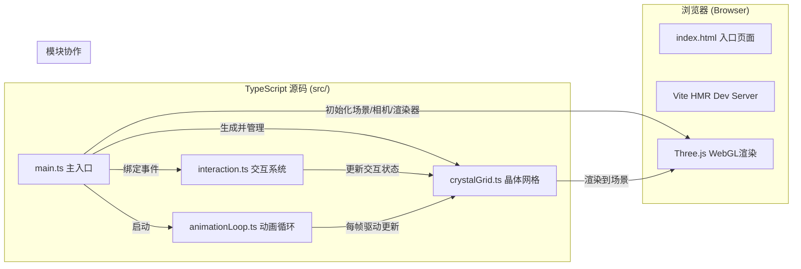
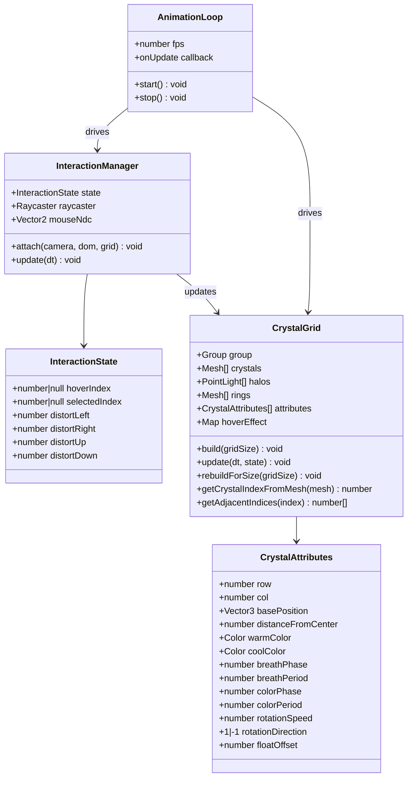

## 1. 架构设计



## 2. 技术描述

- **前端框架**：原生 TypeScript + Three.js (无React，保持轻量高性能)
- **构建工具**：Vite 5.x（极速HMR、零配置TypeScript支持）
- **3D引擎**：Three.js 0.160.x（WebGL封装、材质/几何/光照系统）
- **类型定义**：@types/three 0.160.x（TypeScript类型支持）
- **语言标准**：TypeScript 5.x（严格模式 strict、目标 ES2020）
- **后端服务**：无（纯前端渲染应用）
- **数据库**：无（所有状态内存管理）

### 文件结构

```
auto44/
├── package.json              # 依赖与脚本
├── vite.config.js            # Vite构建配置
├── tsconfig.json             # TypeScript严格模式配置
├── index.html                # 入口HTML(渐变背景/字体/meta)
└── src/
    ├── main.ts               # 主入口：场景/相机/渲染器/协调器
    ├── crystalGrid.ts        # 核心：NxN六棱柱网格生成与变形
    ├── interaction.ts        # 交互：鼠标/键盘事件处理
    └── animationLoop.ts      # 动画：统一RAF循环与状态更新
```

## 3. 路由定义

| 路由 | 用途 |
|------|------|
| / | 单页应用入口，直接渲染3D场景与HUD |

## 4. API定义（无后端）

### 4.1 内部模块接口定义

```typescript
// crystalGrid.ts 核心类型
export interface CrystalAttributes {
  row: number;
  col: number;
  basePosition: THREE.Vector3;
  distanceFromCenter: number;
  warmColor: THREE.Color;
  coolColor: THREE.Color;
  breathPhase: number;
  breathPeriod: number;       // 1.5-3秒随机
  colorPhase: number;
  colorPeriod: number;        // 2-4秒随机
  rotationSpeed: number;      // 0.01-0.03 rad/s
  rotationDirection: 1 | -1;
  floatOffset: number;
}

export interface InteractionState {
  hoverIndex: number | null;
  selectedIndex: number | null;
  distortLeft: number;        // 0-1 平滑过渡值
  distortRight: number;
  distortUp: number;
  distortDown: number;
}

export interface CrystalGrid {
  group: THREE.Group;
  crystals: THREE.Mesh[];
  halos: THREE.PointLight[];
  rings: THREE.Mesh[];
  attributes: CrystalAttributes[];
  hoverEffect: Map<number, { progress: number; type: 'hover'|'resonance' }>;
  
  build(gridSize: number): void;
  update(dt: number, state: InteractionState): void;
  dispose(): void;
  getCrystalIndexFromMesh(mesh: THREE.Mesh): number;
  getAdjacentIndices(index: number): number[];
  rebuildForSize(gridSize: number): void;
}

// interaction.ts
export interface InteractionManager {
  state: InteractionState;
  onHover: (index: number | null) => void;
  onClick: (index: number | null) => void;
  
  attach(camera: THREE.PerspectiveCamera, domElement: HTMLElement, grid: CrystalGrid): void;
  update(dt: number): void;
  dispose(): void;
}

// animationLoop.ts
export interface AnimationLoop {
  start(): void;
  stop(): void;
  onUpdate: (dt: number, elapsed: number) => void;
  fps: number;
}
```

## 5. 服务端架构图（无后端）

纯前端应用，无服务端。

## 6. 数据模型

### 6.1 数据模型定义（内存对象）



### 6.2 关键算法与常量

```typescript
// 网格尺寸常量 (响应式)
const GRID_SIZES = { desktop: 15, tablet: 12, mobile: 8 };
const BREAKPOINTS = { mobile: 768, tablet: 1024 };

// 晶体几何常量
const CRYSTAL_HEIGHT = 0.8;
const CRYSTAL_RADIUS = 0.3;
const CRYSTAL_SPACING = 0.5;

// 动画常量
const BREATH_MIN = 0.9;
const BREATH_MAX = 1.2;
const SELF_ROTATION_SPEED_MIN = 0.01;
const SELF_ROTATION_SPEED_MAX = 0.03;

// 交互过渡时长(秒)
const HOVER_TWEEN = 0.3;
const RESONANCE_TWEEN = 0.2;
const DISTORT_TWEEN = 0.5;
const RECOVER_TWEEN = 0.8;

// 扭曲强度
const WAVE_ANGLE_MAX = THREE.MathUtils.degToRad(15); // 15度
const HEIGHT_CENTER_MAX = 2.0;
const HEIGHT_OUTER_MIN = 0.7;

// 性能优化：使用InstancedMesh（若225个对象仍可用普通Mesh，
// 若后续扩展到更大网格则切换为InstancedMesh，单draw call）
```

### 6.3 相机位置计算

根据阵列总尺寸自动调整相机距离：

```typescript
function computeCameraDistance(gridSize: number): THREE.Vector3 {
  const totalWidth = gridSize * (CRYSTAL_RADIUS * 2 + CRYSTAL_SPACING);
  const fovRad = THREE.MathUtils.degToRad(45);
  const distance = (totalWidth / 2) / Math.tan(fovRad / 2) * 1.2;
  const y = distance * 0.6;
  return new THREE.Vector3(distance, y, distance);
}
```
