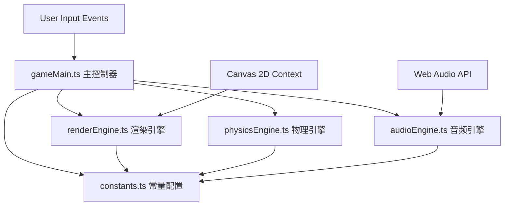

## 1. 架构设计



## 2. 技术说明

- **前端框架**：Vanilla TypeScript（无UI框架），用户明确要求不使用React/Vue
- **构建工具**：Vite 5.x，支持HMR热更新
- **语言**：TypeScript 5.x，严格模式，目标ES2020
- **渲染**：HTML5 Canvas 2D API，自研渲染循环
- **音频**：Web Audio API，实时合成声音（OscillatorNode + GainNode）
- **物理**：自研轻量物理系统（弹珠沿贝塞尔曲线插值移动 + 碰撞检测），不使用第三方物理引擎
- **样式**：原生CSS + CSS变量实现霓虹主题

## 3. 项目结构

```
auto44/
├── package.json          # 依赖：typescript、vite，启动脚本 npm run dev
├── vite.config.js        # Vite基础配置，HMR支持
├── tsconfig.json         # strict模式，target ES2020
├── index.html            # 入口页面，全局霓虹主题样式和字体
└── src/
    ├── constants.ts      # 颜色常量、音阶映射、弹珠类型、轨道配置接口
    ├── audioEngine.ts    # Web Audio API封装，音源节点、音符触发、音色参数
    ├── physicsEngine.ts  # 弹珠滚动逻辑、碰撞检测与响应、速度计算
    ├── renderEngine.ts   # Canvas绘制主循环，轨道/节点/弹珠/粒子/背景
    └── gameMain.ts       # 主控制器，初始化模块、游戏状态、玩家输入
```

## 4. 核心数据模型

### 4.1 类型定义（constants.ts）

```typescript
// 弹珠颜色/乐器类型
type MarbleType = 'drum' | 'bass' | 'piano' | 'synth';

// 坐标点
interface Point { x: number; y: number; }

// 轨道节点
interface TrackNode {
  id: string;
  position: Point;
  noteIndex: number;       // 音阶索引 0-7 (C4-C5)
  triggered: boolean;      // 是否刚被触发
  triggerTime: number;     // 触发时间戳
}

// 轨道
interface Track {
  id: string;
  nodes: TrackNode[];      // 6-8个节点
  startNote: number;       // 起始音索引
  color: string;           // 轨道颜色
}

// 弹珠
interface Marble {
  id: string;
  type: MarbleType;
  trackId: string;
  currentNodeIndex: number;
  progress: number;        // 两节点间进度 0-1
  speed: number;           // 速度系数
  position: Point;
}

// 粒子
interface Particle {
  x: number; y: number;
  vx: number; vy: number;
  life: number; maxLife: number;
  color: string; size: number;
}
```

### 4.2 音阶映射表

C大调8个音（C4到C5）的频率表：
- C4: 261.63 Hz
- D4: 293.66 Hz
- E4: 329.63 Hz
- F4: 349.23 Hz
- G4: 392.00 Hz
- A4: 440.00 Hz
- B4: 493.88 Hz
- C5: 523.25 Hz

## 5. 模块职责说明

### 5.1 audioEngine.ts
- 封装AudioContext、OscillatorNode、GainNode
- 四种音色波形：鼓(方波+快速包络)、贝斯(锯齿波+低通)、钢琴(三角波+ADSR)、合成器(正弦波+颤音)
- playNote(type, frequency, duration)方法触发音符
- playHarmony(frequencies)同时播放多个音
- 主音量控制

### 5.2 physicsEngine.ts
- 弹珠沿轨道节点间贝塞尔曲线插值移动
- 每节点间隔由全局速度控制（默认0.5秒/节点）
- 碰撞检测：同一轨道相邻节点同时触发 → 三度和声
- 交叉点碰撞：不同轨道弹珠位置接近 → 交换轨道 + 触发装饰音
- 速度计算：基于全局速度滑块

### 5.3 renderEngine.ts
- requestAnimationFrame主循环（60FPS）
- 分层渲染：背景渐变 → 轨道曲线 → 节点圆环 → 弹珠球体 → 粒子火花
- 动态背景：根据当前主导音色在颜色空间渐变插值
- 节点触发特效：放大动画 + 颜色闪烁 + 粒子散射
- 弹珠渲染：径向渐变 + 高光点模拟光滑球体

### 5.4 gameMain.ts
- 初始化AudioContext、Canvas、各引擎实例
- 管理游戏状态：轨道数组、弹珠数组、粒子数组
- 处理鼠标事件：轨道节点点击创建/拖拽、弹珠拖拽发射
- 主循环驱动：物理更新 → 音频触发 → 渲染
- UI控件：速度滑块事件绑定

## 6. 性能优化策略

1. **Canvas离屏缓存**：静态轨道绘制到离屏canvas，每帧只重绘动态元素
2. **粒子池化**：复用Particle对象避免GC
3. ** requestAnimationFrame**：使用时间戳(deltaTime)控制动画速度一致
4. **音频节点复用**：预创建OscillatorNode池而非每次新建
5. **碰撞检测优化**：只检测相邻节点和已知交叉点
