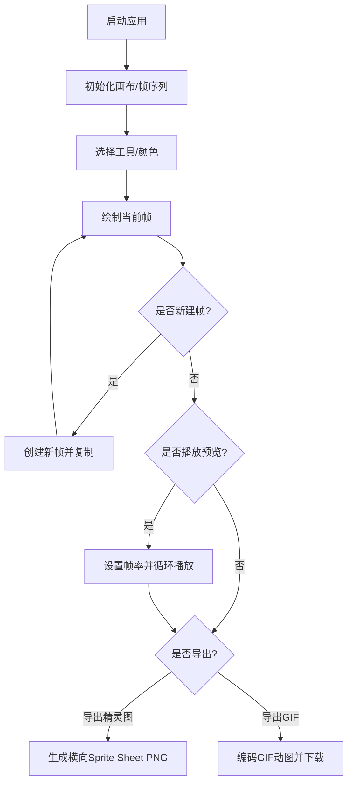

## 1. 产品概述

像素帧工坊是一款面向独立游戏开发者的像素风格动画帧生成工具，通过浏览器Canvas技术实现快速绘制和导出像素角色行走动画，解决手绘逐帧动画耗时费力的问题。

- **目标用户**：独立游戏开发者、像素艺术家、复古风格游戏爱好者
- **核心价值**：提供高效的像素帧绘制环境，支持多帧动画编辑、对称绘制、快速导出精灵图和GIF动图

## 2. 核心功能

### 2.1 功能模块

1. **画布绘制系统**：32×32像素网格画布，放大显示，像素精准绘制
2. **工具栏系统**：铅笔、橡皮擦、矩形填充、镜像对称绘制、吸管工具
3. **颜色面板**：8种预设颜色选择，自定义颜色拾取
4. **帧序列管理**：最多8帧动画序列，缩略图列表，拖拽排序
5. **时间轴播放**：6/12/24fps帧率选择，循环播放，进度指示
6. **撤销重做系统**：每帧独立20步历史记录栈
7. **导出系统**：精灵图（Sprite Sheet）PNG导出、GIF动图导出

### 2.2 页面详情

| 页面名称 | 模块名称 | 功能描述 |
|---------|---------|---------|
| 主页面 | 顶部工具栏 | 工具切换按钮、颜色面板、帧率选择、导出按钮、播放控制 |
| 主页面 | 左侧帧列表 | 帧缩略图显示、选中高亮、拖拽排序、添加/删除帧 |
| 主页面 | 中央画布区 | 32×32像素网格绘制区域、8px圆角内边框、撤销/重做悬浮按钮 |
| 主页面 | 右侧信息面板 | 当前帧像素统计、历史步数显示、镜像模式选择 |
| 主页面 | 底部时间轴 | 帧缩略图序列、进度条、拖动调整帧顺序 |

## 3. 核心流程

用户打开应用 → 选择绘图工具和颜色 → 在画布上绘制像素 → 创建多帧动画 → 调整帧顺序 → 设置播放帧率预览 → 满意后导出精灵图或GIF

## 4. 用户界面设计

### 4.1 设计风格

- **主色调**：深炭灰#1A1A1A → 暗夜蓝#0D1B2A 全屏渐变背景
- **面板色**：#2A2A2A（深灰面板）、#1A1A1A80（半透明深色）
- **高亮色**：金色#D4AF37（选中/激活）、亮青色#4ECDC4（功能色）
- **分隔线**：亮灰色#E0E0E0
- **字体**：像素风格字体（Press Start 2P或VT323），标题"像素帧工坊"
- **按钮样式**：图标化32×32px，悬停变功能色，按下时scale(0.95)弹性动画（150ms）
- **圆角规范**：颜色面板16px圆角，画布8px圆角内边框

### 4.2 页面设计概览

| 区域 | 模块 | UI元素 | 样式规范 |
|-----|------|--------|---------|
| 顶部(60px) | 工具栏 | 工具按钮组、颜色面板、帧率、播放、导出 | 毛玻璃背景(模糊12px)，底部1px#E0E0E0分隔线 |
| 左侧(100px) | 帧列表 | 帧缩略图(48×48px，间距4px) | #1A1A1A80背景，选中金色#D4AF37描边 |
| 中央 | 画布区 | 32×32网格(每格20px，#FFFFFF15网格线) | 最小宽600px，#2C2C2C内边框，8px圆角 |
| 右侧(200px) | 信息面板 | 像素统计、历史步数、镜像选项 | 背景同左侧 |
| 底部 | 时间轴 | 帧缩略图序列、进度条 | 选中帧金色边框高亮 |

### 4.3 交互细节

- **工具指针**：铅笔=十字准星(crosshair)，橡皮擦=灰色方块，填充=十字箭头(nesw-resize)
- **吸管工具**：悬停显示2x放大镜效果
- **撤销/重做按钮**：30px直径圆形，毛玻璃半透明，悬停#FFFFFF40背景，显示可操作步数
- **播放时**：帧序号上方显示动画进度条

### 4.4 响应式

- 桌面端优先设计，中央画布区自适应窗口大小
- 画布最小宽度600px，窗口不足时显示横向滚动条
