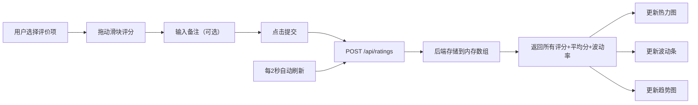

## 1. 产品概述
「评价热流」是一个跨部门协作团队的匿名互评仪表板，解决现有问卷调查工具缺乏实时可视化反馈的痛点。
- 目标用户：跨部门协作团队成员，用于匿名评价团队在技术协作、创新能力等维度的表现
- 产品价值：通过实时热力图和动态可视化，让评分结果直观、生动、可感知，提升互评参与度和反馈及时性

## 2. 核心功能

### 2.1 用户角色
| 角色 | 注册方式 | 核心权限 |
|------|----------|----------|
| 普通用户 | 匿名访问 | 提交评分、查看热力图、生成模拟数据 |

### 2.2 功能模块
1. **主页面**：评分表单区域、热力图仪表板、工具栏、趋势柱状图
2. **评分表单**：评价项选择、分数滑块、匿名备注、提交按钮
3. **热力图仪表板**：Canvas动态热力图、平均分显示、波动指示器
4. **趋势柱状图**：最近10次评分趋势展示
5. **工具栏**：清空数据、生成模拟数据

### 2.3 页面详情
| 页面名称 | 模块名称 | 功能描述 |
|-----------|-------------|---------------------|
| 主页面 | 评分表单 | 下拉选择5个评价项、1-5分滑块（显示具体数字）、最多100字匿名备注输入框、提交按钮（提交成功后500ms变绿动画） |
| 主页面 | 热力图仪表板 | Canvas绘制动态热力图，每格代表一个评价项，颜色从#1E90FF到#FF4500渐变，带脉动动画，每2秒刷新数据 |
| 主页面 | 波动指示器 | 根据最新5次评分标准差动态变化高度（5-30px），波动过大时闪烁红色 |
| 主页面 | 趋势柱状图 | 底部展示最近10次评分趋势，柱形0.3秒填充动画，颜色同热力图渐变 |
| 主页面 | 工具栏 | 「清空所有数据」带确认弹窗，「生成模拟评分」自动生成20条随机数据，每0.2秒一条 |

## 3. 核心流程
用户进入首页 → 选择评价项 → 拖动滑块评分 → 可选输入备注 → 点击提交 → 数据通过POST发送到后端 → 后端存储并返回更新后的数据 → 前端更新热力图、波动条和趋势图 → 每2秒自动刷新数据

## 4. 用户界面设计

### 4.1 设计风格
- **主色调**：深色主题，背景从#0D1117到#161B22的径向渐变
- **渐变色彩**：冷色蓝#1E90FF → 暖色红#FF4500，表示评分高低
- **卡片样式**：半透明深灰背景rgba(30,30,30,0.8)，微弱白边阴影0 0 15px rgba(0,200,255,0.1)
- **按钮样式**：圆角设计，悬停时底部投射对应颜色光晕（热发光效果）
- **滑块样式**：拖动时周围有蓝到红的光晕渐变，带光晕拖尾效果
- **字体**：使用现代无衬线字体，清晰易读
- **动画效果**：所有数据变化带0.3-0.5秒CSS过渡，热力图刷新时1.05→1倍缩放回弹

### 4.2 页面设计概览
| 页面名称 | 模块名称 | UI元素 |
|-----------|-------------|-------------|
| 主页面 | 评分表单 | 下拉菜单、滑块（带光晕拖尾）、文本输入框、提交按钮（成功变绿动画） |
| 主页面 | 热力图仪表板 | Canvas网格、颜色渐变、脉动动画、微粒子密度效果、平均分标签 |
| 主页面 | 波动指示器 | 微型竖条、标准差驱动高度、红色闪烁警告 |
| 主页面 | 趋势柱状图 | 底部横向排列、柱形填充动画、渐变颜色 |
| 主页面 | 工具栏 | 圆角按钮、确认弹窗、进度提示 |

### 4.3 响应式设计
- 桌面端（默认）：左侧评分表单 + 右侧仪表板，左右布局
- 平板/移动端：上下堆叠布局，热力图网格自动缩小尺寸适配屏幕
- 触摸优化：滑块和按钮增大点击区域，确保移动端操作流畅

### 4.4 视觉特效
- 热力图每格脉动效果：缩放1.0→1.02→1.0，循环动画
- 滑块拖动光晕：径向渐变从蓝到红跟随滑块位置
- 数据刷新过渡：所有数值变化带平滑过渡动画
- 按钮悬停发光：底部投射对应颜色的模糊光晕
