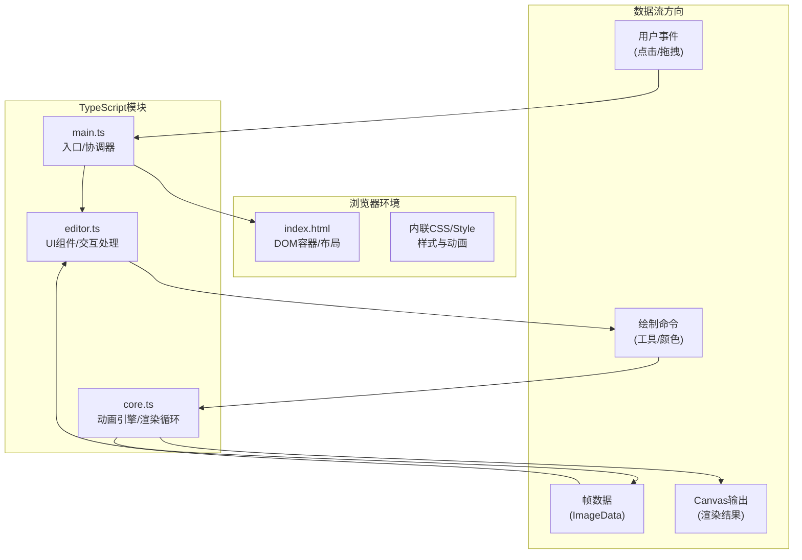

## 1. 架构设计



## 2. 技术描述

- **构建工具**：Vite（支持HMR热更新）
- **语言**：TypeScript（严格模式，目标ES2020）
- **渲染技术**：原生Canvas 2D API（无第三方渲染库）
- **包管理器**：npm
- **启动命令**：`npm run dev`

### 2.1 依赖清单

| 依赖包 | 版本 | 用途 |
|-------|------|------|
| typescript | ^5.0 | TypeScript编译支持 |
| vite | ^5.0 | 开发服务器与构建 |

### 2.2 无外部UI库

所有UI组件使用原生DOM + CSS手动实现，不引入React/Vue等框架，保持轻量高性能。

## 3. 文件结构与职责

```
项目根/
├── package.json          # 依赖声明与启动脚本
├── vite.config.js        # Vite构建配置(HMR支持)
├── tsconfig.json         # TS配置(严格模式/ES2020)
├── index.html            # 入口页面/布局骨架/样式
└── src/
    ├── main.ts           # 入口：初始化，事件协调
    ├── core.ts           # 核心：帧管理/渲染循环/导出
    └── editor.ts         # 编辑器：UI组件/用户交互
```

### 3.1 模块调用关系

| 调用方 | 被调用方 | 数据流向 |
|-------|---------|---------|
| main.ts | editor.ts | 初始化Editor实例，传入DOM容器引用 |
| main.ts | core.ts | 初始化AnimationEngine实例，传入画布引用 |
| editor.ts | core.ts | 用户操作→调用engine.drawPixel()/addFrame()/play()等方法 |
| core.ts | editor.ts | 渲染完成→回调通知editor更新缩略图/统计信息 |
| main.ts | - | 监听window事件→分发给editor和core |

### 3.2 核心数据结构

```typescript
// core.ts 内部
type FrameData = {
  id: number;
  pixels: Uint8ClampedArray;  // 32×32×4 RGBA数据
  history: HistoryEntry[];    // 撤销栈
  historyIndex: number;       // 当前历史位置
};

type HistoryEntry = {
  pixels: Uint8ClampedArray;  // 操作前快照
};

type Tool = 'pencil' | 'eraser' | 'fill' | 'eyedropper';
type MirrorMode = 'none' | 'horizontal' | 'vertical' | 'both';
```

## 4. 性能优化策略

### 4.1 渲染性能
- **Offscreen Canvas**：每帧使用独立离屏Canvas存储，主画布只做blit
- **脏区域渲染**：绘制操作仅重绘受影响像素区域，不全屏刷新
- **requestAnimationFrame**：播放动画使用RAF对齐浏览器刷新率
- **ImageData直接操作**：像素级操作通过ImageData数组，避免频繁getContext调用

### 4.2 交互性能
- **节流/防抖**：mousemove事件使用requestAnimationFrame节流
- **历史记录优化**：仅存储差异区域或使用压缩快照（32×32极小，全量存储即可）
- **缩略图缓存**：帧缩略图绘制后缓存至内存，仅在帧变更时重绘

### 4.3 性能指标承诺
| 指标 | 目标 |
|-----|------|
| 24fps播放8帧动画 | 稳定≥24fps |
| 撤销/重做响应 | ≤100ms |
| 单次绘制操作 | ≤16ms (60fps单帧预算) |

## 5. 导出实现方案

### 5.1 Sprite Sheet导出
- 创建宽度=32×帧数、高度=32的离屏Canvas
- 逐帧blit到对应x偏移位置
- 调用canvas.toDataURL('image/png')生成base64
- 创建<a>标签触发下载，文件名：`spritesheet_${timestamp}.png`

### 5.2 GIF导出（内置简易编码器）
- 实现LZW压缩算法最小子集
- 颜色量化：中位切分法将全彩量化至≤64色
- 帧延迟：根据fps计算（6fps=166ms, 12fps=83ms, 24fps=41ms，单位10ms）
- 文件格式：GIF89a标准，支持透明背景
- 下载触发：Blob URL + <a>标签download属性

## 6. 关键技术实现点

| 功能 | 实现方案 |
|-----|---------|
| 像素网格 | 主画布=640×640px，内部逻辑32×32，绘制时×20缩放 |
| 镜像绘制 | 对称点坐标计算后同时绘制多个对称像素 |
| 拖拽排序 | HTML5 Drag & Drop API，dataTransfer传递帧索引 |
| 吸色工具 | getImageData读取悬停位置RGBA，放大镜用额外div+背景缩放 |
| 进度条 | 播放时根据当前帧index/totalFrames计算CSS width百分比 |
