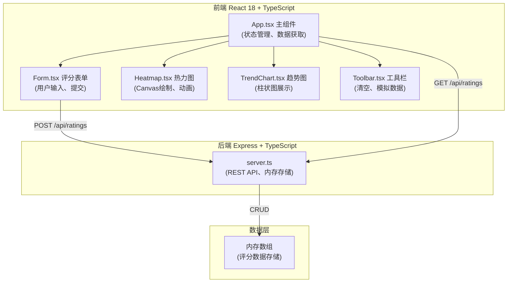
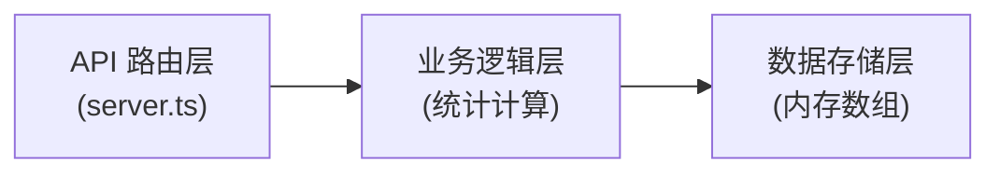
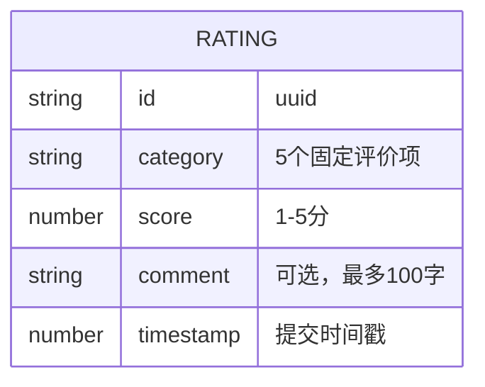

## 1. 架构设计



## 2. 技术描述
- **前端**：React@18 + TypeScript + Vite，不使用Tailwind，采用原生CSS + CSS变量
- **后端**：Express@4 + TypeScript，CORS中间件
- **初始化工具**：vite-init react-express-ts 模板
- **数据存储**：内存数组（无需数据库）
- **动画库**：原生CSS动画 + Canvas requestAnimationFrame
- **图标库**：lucide-react

## 3. 路由定义
| 路由 | 用途 |
|-------|---------|
| / | 首页，主仪表板 |
| GET /api/ratings | 获取所有评分数据及统计信息 |
| POST /api/ratings | 提交新的评分 |
| DELETE /api/ratings | 清空所有评分数据 |

## 4. API 定义

### 数据类型
```typescript
interface Rating {
  id: string;
  category: '技术协作' | '创新能力' | '响应速度' | '文档质量' | '沟通效率';
  score: number; // 1-5
  comment?: string; // 最多100字
  timestamp: number;
}

interface CategoryStats {
  category: string;
  average: number;
  volatility: number; // 标准差
  count: number;
  recentScores: number[]; // 最近5次
}

interface RatingsResponse {
  ratings: Rating[];
  stats: CategoryStats[];
  recentRatings: Rating[]; // 最近10次
}
```

### POST /api/ratings
请求体：
```typescript
{
  category: string;
  score: number;
  comment?: string;
}
```
响应：`RatingsResponse`

### GET /api/ratings
响应：`RatingsResponse`

### DELETE /api/ratings
响应：`{ success: true }`

## 5. 服务端架构



### 核心模块职责
- **路由层**：处理HTTP请求、参数校验、CORS、JSON解析
- **业务逻辑层**：计算平均分、标准差（波动率）、分类统计
- **数据层**：内存数组存储评分记录，按时间戳排序

## 6. 数据模型

### 6.1 数据模型定义



### 6.2 核心算法
1. **平均分计算**：按category分组求和后除以数量
2. **波动率（标准差）**：对最近5次评分计算标准差 σ = √(Σ(xi-μ)²/n)
3. **颜色插值**：分数1-5映射到颜色#1E90FF→#FF4500的RGB线性插值
4. **微粒子密度**：根据评分数量动态调整每格内粒子数量

### 6.3 性能保障
- 前端数据刷新：setInterval 每2秒调用GET /api/ratings
- 动画帧率：Canvas使用requestAnimationFrame，保持30fps以上
- 批量数据处理：生成20条模拟数据时使用setTimeout分批处理，每0.2秒一条
- 响应式布局：使用CSS媒体查询和flex布局，热力图cell尺寸根据容器宽度动态计算
