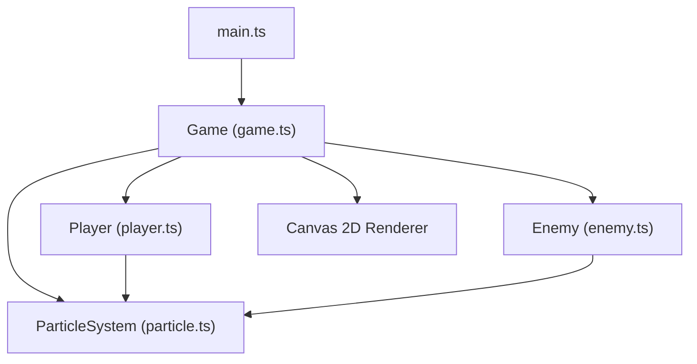

## 1. 架构设计



## 2. 技术说明

- **前端框架**：纯TypeScript + Canvas 2D API，无额外UI框架
- **构建工具**：Vite 5.x，支持HMR热更新
- **开发语言**：TypeScript 5.x，严格模式，target ES2020
- **无后端**：纯前端游戏，无需服务器支持

## 3. 项目结构

```
auto46/
├── package.json          # 项目依赖和脚本
├── vite.config.js        # Vite构建配置
├── tsconfig.json         # TypeScript配置
├── index.html            # 入口HTML
└── src/
    ├── main.ts           # 入口文件，初始化Canvas和游戏循环
    ├── game.ts           # 游戏主类，管理循环、碰撞、敌人生成
    ├── player.ts         # 玩家飞船类，控制、射击、能量、蓄力
    ├── enemy.ts          # 幽灵敌人类，移动、闪烁、受击、核心
    └── particle.ts       # 粒子系统，管理子弹、碎片、声波圈
```

## 4. 核心类定义

### 4.1 Game (game.ts)
```typescript
class Game {
  canvas: HTMLCanvasElement;
  ctx: CanvasRenderingContext2D;
  player: Player;
  enemies: Enemy[];
  particles: ParticleSystem;
  width: number;
  height: number;
  time: number;
  speedMultiplier: number;
  isSilentMode: boolean;
  silentModeTimer: number;
  
  constructor(canvas: HTMLCanvasElement);
  init(): void;
  update(dt: number): void;
  render(): void;
  checkCollisions(): void;
  spawnEnemy(): void;
  startSilentMode(): void;
}
```

### 4.2 Player (player.ts)
```typescript
class Player {
  x: number;
  y: number;
  width: number;
  height: number;
  speed: number;
  energy: number;
  maxEnergy: number;
  isCharging: boolean;
  chargeTime: number;
  isInvincible: boolean;
  invincibleTimer: number;
  lastShotTime: number;
  
  update(dt: number, keys: Set<string>): void;
  render(ctx: CanvasRenderingContext2D): void;
  shoot(): Bullet;
  startCharge(): void;
  releaseCharge(): boolean;
  takeDamage(): void;
  renderEnergyBar(ctx: CanvasRenderingContext2D, width: number, height: number): void;
  renderChargeRing(ctx: CanvasRenderingContext2D): void;
}
```

### 4.3 Enemy (enemy.ts)
```typescript
class Enemy {
  x: number;
  y: number;
  radius: number;
  vx: number;
  vy: number;
  color: string;
  alpha: number;
  isStunned: boolean;
  stunTimer: number;
  showCore: boolean;
  health: number;
  flickerPhase: number;
  
  constructor(x: number, y: number, vx: number, vy: number);
  update(dt: number, speedMultiplier: number): void;
  render(ctx: CanvasRenderingContext2D, isSilentMode: boolean): void;
  hit(isCore: boolean): boolean;
  getFragments(): Fragment[];
  getShockwave(): Shockwave;
}
```

### 4.4 ParticleSystem (particle.ts)
```typescript
interface Bullet {
  x: number; y: number; vx: number; vy: number;
  radius: number; color: string;
  trail: {x: number; y: number; alpha: number}[];
  isReflected: boolean;
}

interface Fragment {
  x: number; y: number; vx: number; vy: number;
  radius: number; color: string; life: number; maxLife: number;
}

interface Shockwave {
  x: number; y: number; radius: number; maxRadius: number;
  life: number; maxLife: number; color: string;
}

interface ThrusterParticle {
  x: number; y: number; vx: number; vy: number;
  life: number; maxLife: number; color: string; size: number;
}

class ParticleSystem {
  bullets: Bullet[];
  fragments: Fragment[];
  shockwaves: Shockwave[];
  thrusters: ThrusterParticle[];
  maxParticles: number;
  
  update(dt: number): void;
  render(ctx: CanvasRenderingContext2D): void;
  addBullet(bullet: Bullet): void;
  addFragments(fragments: Fragment[]): void;
  addShockwave(shockwave: Shockwave): void;
  addThrusterParticle(particle: ThrusterParticle): void;
  checkBulletShockwaveCollisions(): void;
  cleanOldParticles(): void;
}
```

## 5. 碰撞检测

1. **子弹-幽灵碰撞**：检测子弹圆心与幽灵边缘的距离，精度2px
2. **声波圈-子弹碰撞**：检测子弹是否在声波圈半径内，反弹方向为圆心到子弹向量的反向
3. **幽灵-飞船碰撞**：检测飞船矩形与幽灵圆的碰撞

## 6. 性能优化

- **对象池**：粒子和子弹使用对象池复用，避免频繁GC
- **批量渲染**：同类型粒子统一渲染，减少状态切换
- **空间划分**：使用网格划分优化碰撞检测
- **帧率控制**：使用requestAnimationFrame，deltaTime计算确保动画速度一致
