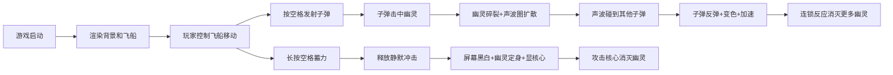

## 1. 产品概述

「回声弹幕」是一款基于HTML5 Canvas的太空射击游戏，玩家控制飞船发射音符子弹，击碎带有残响效果的透明幽灵，利用声波反弹机制创造连锁反应。

- 核心玩法：射击+声波反弹连锁+蓄力技能
- 目标用户：休闲游戏玩家，喜欢弹幕射击和策略元素的用户
- 产品价值：提供视觉效果炫酷、玩法有深度的弹幕射击体验

## 2. 核心功能

### 2.1 用户角色
| 角色 | 注册方式 | 核心权限 |
|------|----------|----------|
| 玩家 | 无需注册 | 完整游戏体验 |

### 2.2 功能模块
1. **游戏主界面**：Canvas渲染、飞船控制、子弹发射
2. **敌方系统**：幽灵生成、移动、闪烁、受击效果
3. **粒子系统**：子弹拖尾、碎片炸裂、声波圈、推进器火焰
4. **技能系统**：能量条、蓄力、静默冲击
5. **碰撞系统**：子弹-幽灵、声波-子弹、幽灵-飞船碰撞检测

### 2.3 页面详情
| 页面名称 | 模块名称 | 功能描述 |
|----------|----------|----------|
| 游戏主界面 | 飞船控制 | A/D或←/→水平移动，W或↑加速，空格射击 |
| 游戏主界面 | 子弹系统 | 音符形状子弹，带拖尾效果，0.2秒发射间隔 |
| 游戏主界面 | 幽灵系统 | 四边随机生成，半透明模糊，颜色闪烁 |
| 游戏主界面 | 声波反弹 | 幽灵死亡产生声波圈，反弹子弹形成连锁 |
| 游戏主界面 | 能量系统 | 能量条恢复/消耗，低能量警告 |
| 游戏主界面 | 蓄力技能 | 长按空格蓄力，释放静默冲击定住幽灵 |

## 3. 核心流程

## 4. 用户界面设计

### 4.1 设计风格
- 主色调：深空蓝(#0B1026)到墨紫(#1A0E30)的径向渐变背景
- 霓虹色：青蓝(#66D9EF)飞船、橙色(#FFB86C)子弹、粉紫(#BD93F9/#FF79C6)幽灵、紫色(#A78BFA)反弹子弹
- 能量条：绿色(#50FA7B)到青色(#8BE9FD)渐变，低能量红色(#FF5555)闪烁
- 整体风格：赛博朋克，深色背景+霓虹发光效果+粒子拖尾

### 4.2 页面设计详情
| 页面名称 | 模块名称 | UI元素 |
|----------|----------|--------|
| 游戏主界面 | 背景 | 深空径向渐变，营造太空氛围 |
| 游戏主界面 | 飞船 | 发光线条勾勒，左右推进器火焰粒子 |
| 游戏主界面 | 子弹 | 音符圆点，拖尾消散效果 |
| 游戏主界面 | 幽灵 | 半透明模糊球体，颜色缓慢闪烁 |
| 游戏主界面 | 能量条 | 底部中央，圆角矩形，渐变填充 |
| 游戏主界面 | 蓄力光环 | 旋转线段组成的光环，蓄力时显示 |
| 游戏主界面 | 静默冲击 | 全屏黑白滤镜，幽灵显红色核心 |

### 4.3 响应式设计
- 桌面优先，支持1920x1080和1366x768分辨率
- Canvas自适应窗口大小，保持游戏区域比例
- 所有UI元素使用相对坐标，确保在不同分辨率下显示完整

### 4.4 性能要求
- FPS不低于55帧
- 幽灵数量上限：200个
- 粒子系统上限：2000个，超出时淘汰最早生成的粒子
- 碰撞检测精度：2px以内
