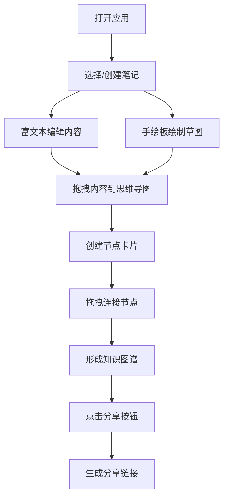

## 1. 产品概述

「织梦笔记」是一款面向知识工作者的富文本笔记应用，集成思维导图功能，帮助用户以可视化方式组织和关联知识节点。通过富文本编辑、手绘草图和知识图谱三大核心模块，打造沉浸式的知识创作与管理体验。

- 核心目标：解决传统笔记工具内容碎片化、关联性弱的痛点
- 目标用户：学生、研究人员、内容创作者等需要深度知识管理的人群

## 2. 核心功能

### 2.1 用户角色
| 角色 | 注册方式 | 核心权限 |
|------|---------|---------|
| 普通用户 | 无需注册 | 创建、编辑、删除笔记；管理知识图谱；生成分享链接 |

### 2.2 功能模块
1. **笔记列表模块**：笔记搜索、笔记创建、笔记切换、笔记删除
2. **富文本编辑器模块**：加粗、斜体、列表、插入图片、代码块
3. **手绘板模块**：自由绘制、压力感应笔触、颜色渐变
4. **思维导图模块**：节点创建、节点拖拽、节点编辑、节点间连线
5. **分享模块**：生成可分享链接、一键复制、操作提示

### 2.3 页面详情
| 页面名称 | 模块名称 | 功能描述 |
|---------|---------|---------|
| 主页面 | 笔记列表侧栏 | 毛玻璃效果侧栏，搜索过滤，悬停动画，点击切换笔记 |
| 主页面 | 富文本编辑器 | 工具栏按钮，文本编辑，图片插入，代码块高亮 |
| 主页面 | 手绘板 | Canvas绑定，自由绘制，渐变笔触，牛皮纸背景 |
| 主页面 | 思维导图区域 | 节点拖拽创建，贝塞尔曲线连线，双击编辑，悬停效果 |
| 主页面 | 分享功能 | 圆形渐变按钮，链接生成，顶部提示条动画 |

## 3. 核心流程

用户打开应用 → 从侧栏选择或创建笔记 → 在富文本编辑器中编写内容（文本/图片/代码块）→ 在手绘图板绘制草图 → 将内容拖拽到思维导图区域生成节点 → 连接节点形成知识图谱 → 点击分享按钮生成链接

## 4. 用户界面设计

### 4.1 设计风格
- **主色调**：冷灰蓝系列（#2C3E50、#34495E、#7F8C8D）
- **辅助色**：暖色点缀（#E74C3C 红色、#F1C40F 黄色、#2ECC71 绿色）
- **背景渐变**：浅灰蓝#E8EDF2 → 云雾白#F5F7FA
- **按钮样式**：圆角按钮，0.3s ease-out过渡动画，悬停阴影
- **布局风格**：三栏式布局（侧栏:编辑器:思维导图 = 1:2:1.5），1px细线分隔
- **字体**：使用系统无衬线字体，层级分明

### 4.2 页面设计概述
| 页面名称 | 模块名称 | UI元素 |
|---------|---------|--------|
| 主页面 | 笔记侧栏 | 半透明毛玻璃（backdrop-blur 12px），宽280px，悬停渐变#2C3E50→#34495E |
| 主页面 | 搜索框 | 宽260px，圆角20px，白色背景，搜索图标#7F8C8D，匹配高亮#F1C40F |
| 主页面 | 富文本编辑器 | 白色#FFFFFF背景，8px圆角边框，工具栏按钮组 |
| 主页面 | 手绘板 | 800px×300px，牛皮纸色#F5DEB3，笔触颜色#2C3E50→#E74C3C渐变 |
| 主页面 | 思维导图区域 | 浅米色#F5F0E8背景，宽600px，节点圆角12px渐变背景 |
| 主页面 | 分享按钮 | 圆形36px直径，绿色渐变#2ECC71→#27AE60 |
| 主页面 | 提示条 | 顶部滑入，3秒后渐隐消失 |

### 4.3 响应式设计
- **桌面端**（≥768px）：三栏水平布局，比例1:2:1.5
- **移动端**（<768px）：思维导图区域折叠到底部，垂直滚动访问
- **触控优化**：节点拖拽区域增大，按钮最小触控尺寸44px

### 4.4 动画与交互
- 所有交互元素0.3s ease-out过渡
- 笔记列表项悬停时轻微上浮（transform: translateY(-2px)）
- 连线悬停时变为虚线并闪烁
- 提示条从顶部滑入，渐变透明消失
