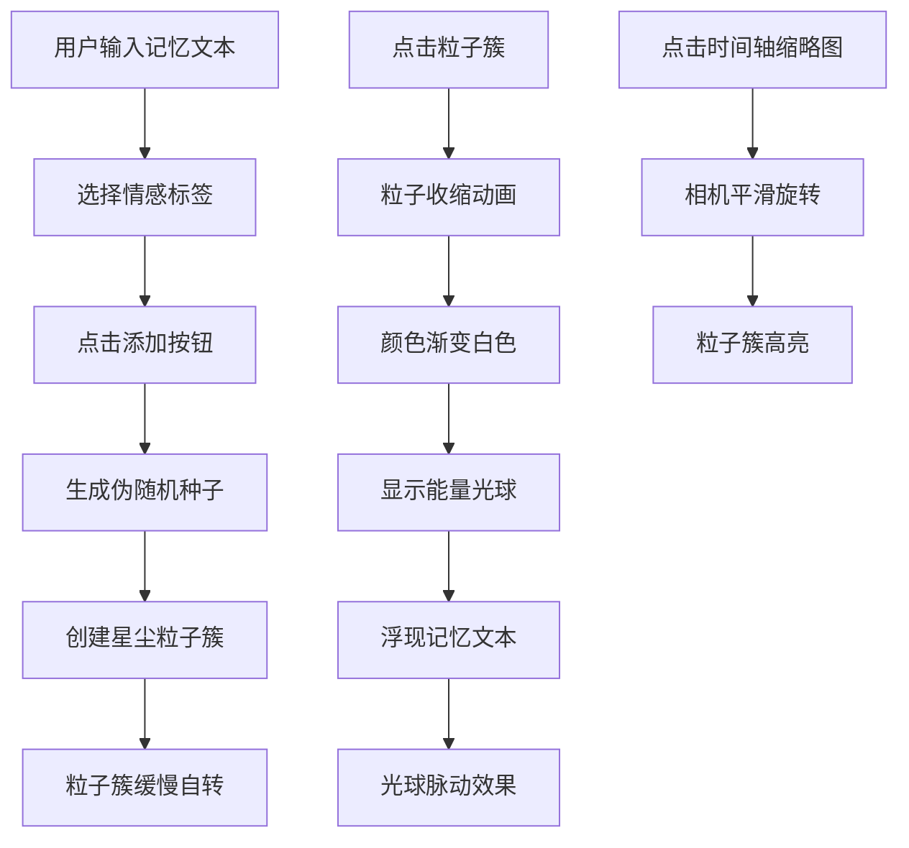

## 1. 产品概述

「水晶记忆」是一款基于WebGL的浏览器交互式三维粒子记忆相册，用户可以将生活中的重要瞬间以星尘粒子的形式存储和回溯。通过情感标签与文字记忆的结合，创造出独特的沉浸式回忆体验。

- 核心价值：将抽象的记忆转化为可视化的三维星尘粒子簇，提供独特的情感化交互体验
- 目标用户：追求个性化数字体验、喜欢收藏生活瞬间的年轻用户群体

## 2. 核心特性

### 2.1 功能模块
1. **记忆创建模块**：输入记忆文本 + 选择情感标签 → 生成粒子簇
2. **记忆召回模块**：点击粒子簇 → 收缩动画 → 能量光球显示记忆文本
3. **时间轴导航模块**：右侧垂直时间轴 → 缩略图列表 → 点击定位粒子簇
4. **视角控制模块**：鼠标拖拽旋转、键盘快捷键重置视角

### 2.2 页面详情

| 页面名称 | 模块名称 | 功能描述 |
|---------|---------|---------|
| 主场景 | 3D粒子系统 | 渲染星尘粒子簇，支持旋转、点击交互 |
| 主场景 | 输入面板 | 记忆文本输入、情感标签选择、添加按钮 |
| 主场景 | 时间轴面板 | 记忆缩略图列表、点击定位、滚动浏览 |
| 主场景 | 召回展示 | 粒子收缩动画、能量光球、记忆文本显示 |

## 3. 核心流程

### 3.1 添加记忆流程
用户输入记忆文本 → 选择情感标签 → 点击添加按钮 → 字符编码生成伪随机种子 → 根据种子在三维空间生成粒子簇 → 粒子簇缓慢自转

### 3.2 召回记忆流程
用户点击粒子簇 → 粒子向中心点收缩（1秒，easeOutCubic）→ 颜色渐变为纯白色（0.5秒）→ 显示半透明能量光球 → 光球内浮现记忆文本 → 光球缓慢脉动

### 3.3 时间轴导航流程
用户点击时间轴缩略图 → 相机平滑旋转对准对应粒子簇（0.5秒）→ 粒子簇短暂高亮（大小放大1.5倍，0.3秒）

## 4. 用户界面设计

### 4.1 设计风格
- **设计主题**：深空星尘主题，神秘而浪漫
- **主色调**：深蓝 #0B0B2A 渐变到深紫 #1B1B4A
- **情感色彩**：
  - 喜悦：暖橙 #FF8C00 → 亮黄 #FFD700
  - 忧伤：冰蓝 #00BFFF → 淡紫 #DDA0DD
  - 怀念：复古棕 #8B4513 → 琥珀 #FFBF00
  - 平静：薄荷 #98FF98 → 天蓝 #87CEEB
  - 期待：粉紫 #FF69B4 → 金紫 #DDA0DD
- **按钮风格**：圆角胶囊形按钮，渐变背景，悬停光晕扩散
- **字体**：现代无衬线字体，白色主文字，灰色辅助文字
- **布局风格**：沉浸式全屏3D场景 + 浮动UI面板
- **动效**：所有交互元素0.1秒过渡动画，粒子动画平滑流畅

### 4.2 页面设计概述

| 页面名称 | 模块名称 | UI元素 |
|---------|---------|--------|
| 主场景 | 输入面板 | 半透明浮动面板（圆角12px，背景rgba(15,15,35,0.85)），输入框（高40px，宽250px，圆角8px），情感标签圆形按钮（直径36px），添加按钮（宽120px，高40px，圆角20px） |
| 主场景 | 时间轴面板 | 右侧垂直排列，宽200px，半透明毛玻璃背景，圆形缩略图（直径40px），可滚动 |
| 主场景 | 粒子系统 | 星尘粒子簇，球壳状分布，绕Y轴自转，收缩/扩散动画 |
| 主场景 | 能量光球 | 半透明发光球体（半径0.5，透明度0.6），内部文字Sprite，脉动效果 |

### 4.3 响应性
- 桌面端优先设计，全屏沉浸式体验
- 输入面板固定左下角，时间轴固定右侧
- 3D场景自适应窗口大小

### 4.4 3D场景指引
- **环境**：深空渐变背景，营造宇宙星尘氛围
- **光照**：环境光 + 点光源，突出粒子发光效果
- **相机**：PerspectiveCamera，初始位置(0, 5, 20)，OrbitControls控制
- **构图**：粒子簇分布在-15到15单位三维空间内，相机始终能看到全部粒子
- **交互**：鼠标拖拽旋转视角，点击粒子簇召回记忆，时间轴导航
- **后处理**：粒子发光效果，光晕质感
- **性能**：粒子总数不超过2000个，稳定60FPS
