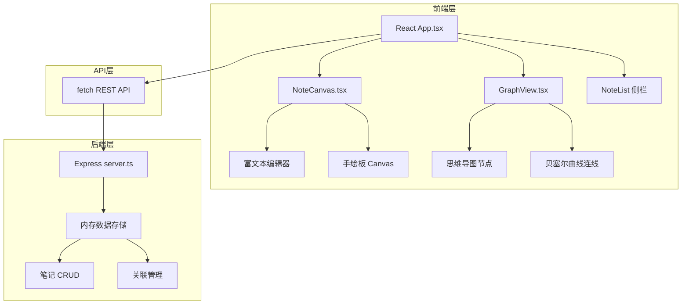
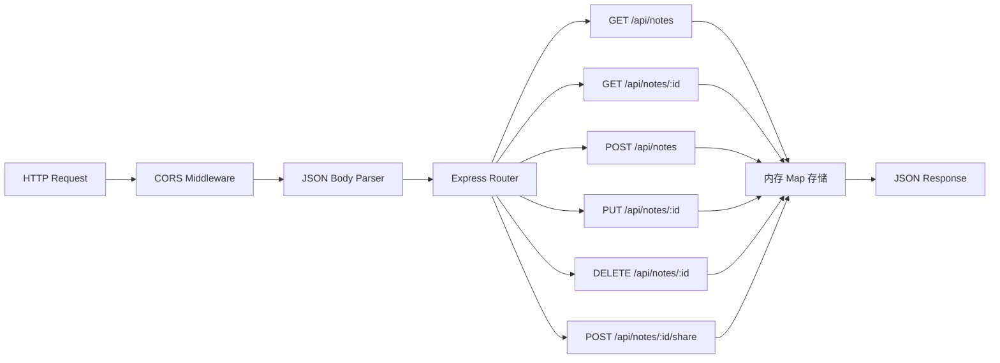

## 1. 架构设计



## 2. 技术说明

- **前端框架**：React 18 + TypeScript
- **构建工具**：Vite（支持HMR和React插件）
- **后端框架**：Express 4 + TypeScript
- **状态管理**：React useState/useReducer（轻量级场景）
- **数据存储**：后端内存存储（使用Map结构）
- **样式方案**：原生CSS + CSS变量（无需额外CSS框架）
- **富文本编辑**：contenteditable + document.execCommand
- **手绘功能**：HTML5 Canvas API
- **思维导图**：SVG + 原生拖拽事件

## 3. 项目文件结构

| 路径 | 用途 |
|------|------|
| `package.json` | 项目依赖和启动脚本 |
| `vite.config.js` | Vite构建配置 |
| `tsconfig.json` | TypeScript配置（严格模式，ES2020） |
| `index.html` | 入口HTML页面 |
| `src/App.tsx` | 主组件，路由和全局状态管理 |
| `src/NoteCanvas.tsx` | 笔记画布组件（富文本+手绘板） |
| `src/GraphView.tsx` | 知识图谱视图组件 |
| `server/server.ts` | Express后端API服务 |

## 4. API定义

### 4.1 TypeScript类型定义

```typescript
interface Note {
  id: string;
  title: string;
  content: string;
  sketchData: string;
  mindMapNodes: MindMapNode[];
  mindMapConnections: MindMapConnection[];
  createdAt: number;
  updatedAt: number;
}

interface MindMapNode {
  id: string;
  title: string;
  x: number;
  y: number;
}

interface MindMapConnection {
  id: string;
  fromId: string;
  toId: string;
}
```

### 4.2 RESTful API端点

| 方法 | 路径 | 功能 | 请求体 | 响应 |
|------|------|------|--------|------|
| GET | `/api/notes` | 获取所有笔记列表 | - | `Note[]` |
| GET | `/api/notes/:id` | 获取单篇笔记详情 | - | `Note` |
| POST | `/api/notes` | 创建新笔记 | `{title: string}` | `Note` |
| PUT | `/api/notes/:id` | 更新笔记内容 | `Partial<Note>` | `Note` |
| DELETE | `/api/notes/:id` | 删除笔记 | - | `{success: boolean}` |
| POST | `/api/notes/:id/share` | 生成分享链接 | - | `{shareUrl: string}` |

## 5. 服务器架构



## 6. 数据模型

### 6.1 实体关系

```mermaid
erDiagram
    NOTE {
        string id PK
        string title
        string content
        string sketchData
        number createdAt
        number updatedAt
    }
    MIND_MAP_NODE {
        string id PK
        string noteId FK
        string title
        number x
        number y
    }
    MIND_MAP_CONNECTION {
        string id PK
        string noteId FK
        string fromNodeId FK
        string toNodeId FK
    }
    NOTE ||--o{ MIND_MAP_NODE : contains
    NOTE ||--o{ MIND_MAP_CONNECTION : contains
    MIND_MAP_NODE ||--o{ MIND_MAP_CONNECTION : from
    MIND_MAP_NODE ||--o{ MIND_MAP_CONNECTION : to
```

### 6.2 内存数据结构

```typescript
// 内存存储结构
interface DataStore {
  notes: Map<string, Note>;
  shareTokens: Map<string, string>; // token -> noteId
}
```

## 7. 性能优化策略

- **笔记切换**：使用React.memo避免不必要重渲染，目标<200ms
- **手绘板**：Canvas离屏缓冲，requestAnimationFrame节流，目标60FPS
- **思维导图**：SVG虚拟化渲染，拖拽时使用transform而非top/left，目标30FPS+
- **数据传输**：增量更新，仅发送变化字段
