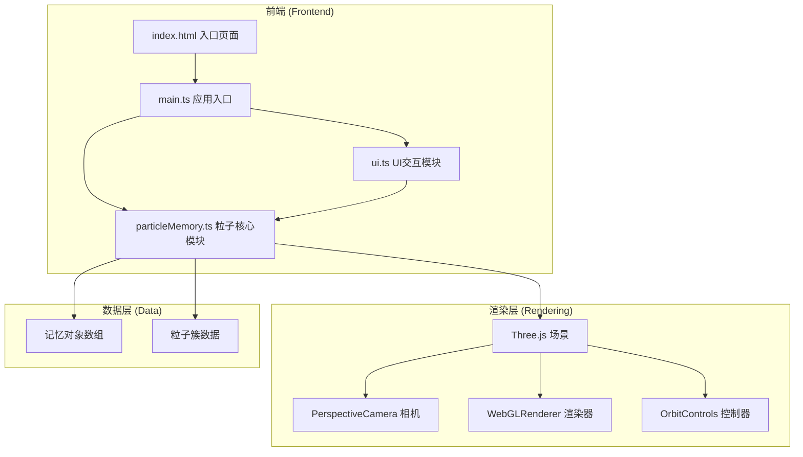

## 1. 架构设计



## 2. 技术描述

- **前端框架**：原生 TypeScript + Three.js
- **构建工具**：Vite (支持HMR热更新)
- **3D引擎**：Three.js (粒子系统、Points材质、Sprite文字)
- **UI交互**：原生HTML/CSS + TypeScript事件处理
- **依赖库**：
  - three：WebGL 3D渲染
  - @types/three：Three.js类型定义
  - typescript：类型安全
  - vite：构建与开发服务器
  - cuid：唯一ID生成

## 3. 文件结构

| 文件路径 | 用途 |
|---------|------|
| package.json | 项目依赖与脚本配置 |
| vite.config.js | Vite构建配置，支持HMR |
| tsconfig.json | TypeScript编译配置（严格模式，ES2020） |
| index.html | 入口HTML，深蓝渐变背景与加载提示 |
| src/main.ts | 应用入口，初始化场景/相机/渲染器，启动动画循环 |
| src/particleMemory.ts | 核心模块，粒子数组管理、粒子簇生成与召回、动画控制 |
| src/ui.ts | UI交互模块，输入框/按钮事件、记忆对象创建、时间轴面板 |

## 4. 核心数据模型

### 4.1 记忆对象 (Memory)
```typescript
interface Memory {
  id: string;
  text: string;
  emotion: 'joy' | 'sadness' | 'nostalgia' | 'calm' | 'expectation';
  createdAt: number;
  center: { x: number; y: number; z: number };
  seed: number;
}
```

### 4.2 粒子数据 (ParticleData)
```typescript
interface ParticleData {
  position: { x: number; y: number; z: number };
  originalPosition: { x: number; y: number; z: number };
  color: { r: number; g: number; b: number };
  originalColor: { r: number; g: number; b: number };
  size: number;
  originalSize: number;
  rotationSpeed: number;
}
```

### 4.3 粒子簇 (ParticleCluster)
```typescript
interface ParticleCluster {
  id: string;
  memory: Memory;
  particles: ParticleData[];
  points: THREE.Points;
  center: THREE.Vector3;
  rotationAngle: number;
  isCollapsed: boolean;
  animationProgress: number;
  energyOrb?: THREE.Mesh;
  textSprite?: THREE.Sprite;
}
```

## 5. 核心算法

### 5.1 伪随机种子生成
- 将记忆文本通过字符编码转换生成数字种子
- 使用种子生成确定性的粒子位置、颜色、大小

### 5.2 球壳分布算法
- 在三维空间中生成均匀分布的球壳粒子
- 使用球面坐标系转换：θ(方位角), φ(极角), r(半径)
- 粒子围绕中心点呈球壳状分布

### 5.3 缓动函数
- easeOutCubic：`cubic(t) = 1 - Math.pow(1 - t, 3)`
- 用于粒子收缩/扩散动画

### 5.4 颜色渐变
- 基于情感标签的双色渐变
- 粒子颜色在渐变色带中随机取值

## 6. 性能优化

- **粒子池化**：使用BufferGeometry管理粒子顶点数据
- **GPU渲染优先**：使用Points材质，减少Draw Call
- **动画优化**：requestAnimationFrame循环，仅更新必要属性
- **粒子总数限制**：不超过2000个粒子，确保60FPS
- **内存管理**：及时清理移除的粒子簇资源

## 7. 交互设计

### 7.1 鼠标交互
- 拖拽：OrbitControls控制视角旋转
- 点击粒子簇：触发召回/恢复动画
- 点击时间轴缩略图：相机对准对应粒子簇

### 7.2 键盘快捷键
- R键：重置相机到初始视角（0.8秒动画）
- C键：清除当前选中的粒子簇高亮状态
- ESC键：退出召回模式，粒子恢复原状

### 7.3 UI动画
- 情感标签按钮：点击缩放反弹（0.2秒）
- 添加按钮：悬停光晕扩散效果
- 时间轴缩略图：点击白色边框闪烁（0.2秒）
- 所有交互元素：悬停0.1秒过渡动画
