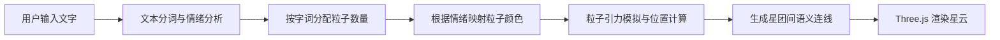
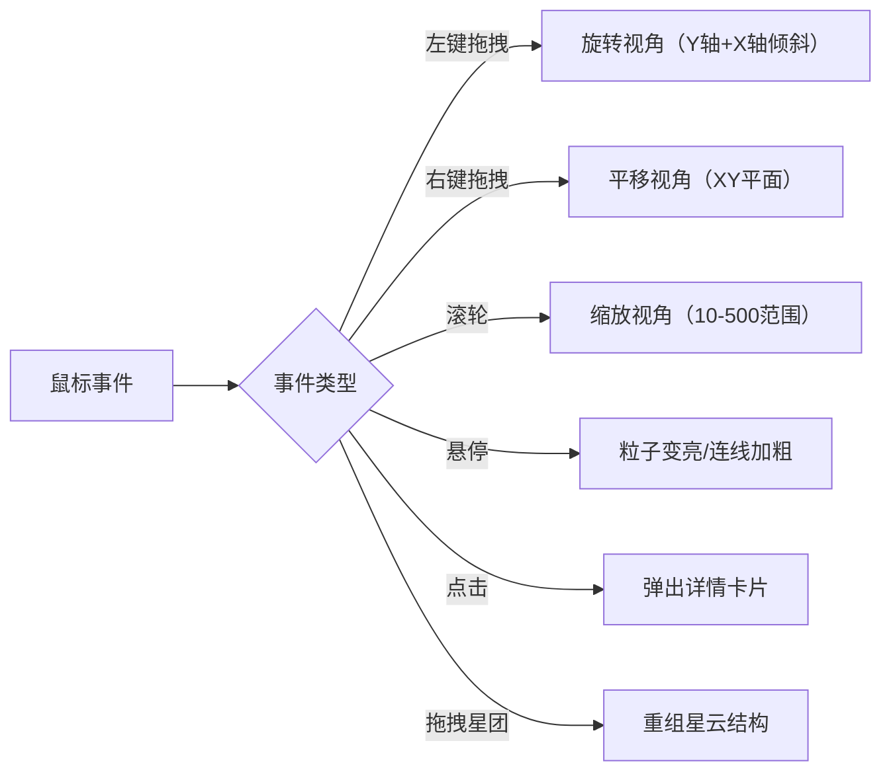

## 1. 产品概述

记忆星云是一款基于 WebGL 的交互式三维可视化应用，将抽象的文字记忆转化为由粒子组成的动态星云，帮助用户以视觉形式记录和回溯记忆。用户输入文字后，系统会生成数千颗粒子构成的星云，每个字词对应一个星团，星团之间通过发光连线形成语义网络。

- **核心问题**：抽象记忆难以用视觉形式记录和回溯
- **目标用户**：需要可视化记录想法、记忆和创意的创作者与学习者
- **产品价值**：将文字转化为沉浸式3D星云体验，让记忆可视化、可交互、可分享

## 2. 核心功能

### 2.1 功能模块

1. **星云生成模块**：文本输入 → 情绪分析 → 粒子分配 → 动态星云渲染
2. **交互控制模块**：鼠标旋转、平移、缩放、点击、拖拽
3. **详情卡片模块**：点击星团显示文字详情、情绪标签、创建时间
4. **保存分享模块**：导出JSON状态、生成分享链接、重建星云

### 2.2 页面详情

| 页面名称 | 模块名称 | 功能描述 |
|---------|---------|---------|
| 主页面 | 背景层 | 深空蓝黑到暗紫的径向渐变背景 |
| 主页面 | 星云场景 | Three.js 3D粒子系统，包含数千颗粒子和连线 |
| 主页面 | 文本输入区 | 顶部输入框，输入文字实时生成星云 |
| 主页面 | 操作提示面板 | 右上角悬浮，展示交互说明 |
| 主页面 | 详情卡片 | 点击星团弹出，毛玻璃效果 |
| 主页面 | 保存分享按钮 | 底部工具栏，导出状态和生成链接 |

## 3. 核心流程

### 3.1 星云生成流程

### 3.2 交互流程

## 4. 用户界面设计

### 4.1 设计风格

- **主色调**：深空蓝黑 (#0D1117) → 暗紫 (#1A0A3E) 径向渐变背景
- **辅助色**：
  - 暖色情绪：#FF6B6B → #FFD93D
  - 冷色情绪：#6BCB77 → #4D96FF
  - 中性情绪：#E0E0E0
- **控件色**：深蓝色 #1E3A5F（常态）→ #2A4E77（悬停）→ #152A44（点击）
- **毛玻璃效果**：背景模糊 8-12px，半透明白色边框
- **圆角规范**：按钮 6px，卡片 8-12px
- **字体**：现代无衬线字体，白色文字，暗色主题

### 4.2 页面设计概览

| 页面名称 | 模块名称 | UI 元素 |
|---------|---------|--------|
| 主页面 | 背景 | 径向渐变，深空氛围 |
| 主页面 | 星云场景 | 动态粒子系统，发光连线，视差效果 |
| 主页面 | 输入框 | 深蓝色背景，圆角6px，白色文字，顶部居中 |
| 主页面 | 操作提示面板 | 右上角悬浮，毛玻璃效果，默认半透明，悬停完全显示 |
| 主页面 | 详情卡片 | 毛玻璃效果，渐变背景，可拖动，点击外部关闭 |
| 主页面 | 底部工具栏 | 保存/分享按钮，深蓝色，悬停变浅 |

### 4.3 响应式设计

- **桌面端**：完整布局，操作提示面板完整显示
- **移动端**（<768px）：操作提示面板折叠为图标按钮，点击展开
- **触摸优化**：支持手势旋转和缩放

### 4.4 3D 场景指引

- **环境**：深空渐变背景，无额外光源，粒子自发光
- **粒子系统**：BufferGeometry + PointsMaterial，高性能渲染
- **连线系统**：LineSegments，根据关联度控制透明度
- **相机**：PerspectiveCamera，支持旋转、平移、缩放
- **交互**：鼠标拾取（Raycaster），粒子高亮反馈
- **动画**：引力模拟，粒子漂浮运动，视差效果
- **性能**：粒子数 ≤ 5000，目标 60 FPS

## 5. 性能要求

- **帧率**：稳定 60 FPS
- **粒子上限**：5000 颗
- **初始化时间**：中等配置笔记本（i5+集成显卡）5 秒内完成
- **渲染技术**：Three.js BufferGeometry，GPU 粒子渲染
