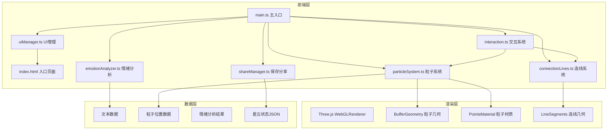

## 1. 架构设计



## 2. 技术说明

- **前端框架**：TypeScript + Three.js（原生实现，无 React/Vue）
- **构建工具**：Vite 5.x（支持 HMR、TypeScript）
- **3D 引擎**：Three.js r160+
- **类型定义**：@types/three
- **包管理器**：npm

### 技术选型理由

1. **Three.js**：业界最成熟的 WebGL 库，支持高性能粒子系统和鼠标交互
2. **BufferGeometry**：相比 Geometry 性能提升显著，适合数千颗粒子渲染
3. **TypeScript**：类型安全，便于维护复杂的 3D 应用逻辑
4. **Vite**：快速的开发服务器和构建，支持 HMR 实时预览

## 3. 项目文件结构

| 文件路径 | 职责 |
|---------|------|
| `package.json` | 项目依赖和脚本配置 |
| `vite.config.js` | Vite 构建配置 |
| `tsconfig.json` | TypeScript 编译配置 |
| `index.html` | 入口 HTML 页面 |
| `src/main.ts` | 应用主入口，初始化 Three.js 场景 |
| `src/particleSystem.ts` | 粒子生成、运动、颜色管理和渲染 |
| `src/connectionLines.ts` | 语义连线生成与更新 |
| `src/interaction.ts` | 鼠标/键盘事件处理，相机控制 |
| `src/emotionAnalyzer.ts` | 文本情绪分析（正/负/中性） |
| `src/uiManager.ts` | UI 面板管理（详情卡片、操作提示等） |
| `src/shareManager.ts` | 保存/分享功能，JSON 序列化 |
| `src/types.ts` | 共享类型定义 |

## 4. 核心数据模型

### 4.1 粒子数据结构

```typescript
interface ParticleData {
  id: string;
  position: { x: number; y: number; z: number };
  velocity: { x: number; y: number; z: number };
  color: string;
  size: number;
  clusterId: string;
  brightness: number;
}
```

### 4.2 星团数据结构

```typescript
interface ClusterData {
  id: string;
  word: string;
  emotion: 'positive' | 'negative' | 'neutral';
  position: { x: number; y: number; z: number };
  particleIds: string[];
  createdAt: number;
}
```

### 4.3 连线数据结构

```typescript
interface ConnectionData {
  id: string;
  fromClusterId: string;
  toClusterId: string;
  strength: number;
  opacity: number;
}
```

### 4.4 星云状态结构

```typescript
interface NebulaState {
  text: string;
  clusters: ClusterData[];
  particles: ParticleData[];
  connections: ConnectionData[];
  camera: {
    position: { x: number; y: number; z: number };
    rotation: { x: number; y: number };
  };
  createdAt: number;
}
```

## 5. 核心数据流

### 5.1 星云生成数据流

```
文本输入
  ↓
emotionAnalyzer.analyze(text)
  → { words[], emotions[] }
  ↓
particleSystem.createParticles(words, emotions)
  → 分配粒子数量、颜色、初始位置
  → BufferGeometry 属性更新
  ↓
connectionLines.createConnections(clusters)
  → 计算关联强度
  → LineSegments 创建
  ↓
Three.js 渲染
```

### 5.2 交互数据流

```
鼠标事件 (mousedown/mousemove/mouseup/wheel)
  ↓
interaction.ts 事件监听
  → 计算偏移量
  → 更新相机状态（旋转/平移/缩放）
  → 平滑过渡动画
  ↓
粒子系统响应
  → 悬停粒子变亮
  → 连线加粗
  → 拖拽星团更新位置
  ↓
Three.js 重新渲染
```

## 6. 性能优化策略

1. **BufferGeometry**：使用 BufferGeometry 而非 Geometry，减少 CPU → GPU 数据传输
2. **PointsMaterial**：使用点精灵材质，单 draw call 渲染所有粒子
3. **GPU 粒子**：尽可能在着色器中处理粒子运动
4. **视锥体剔除**：远离相机的粒子适当减小尺寸或降低细节
5. **帧率控制**：requestAnimationFrame 自适应刷新率
6. **对象池**：粒子和连线对象复用，避免频繁 GC
7. **距离衰减**：使用 sizeAttenuation 实现近大远小的透视效果

## 7. 情绪分析实现

采用轻量级词典匹配法，无需外部依赖：

- **正面词汇库**：快乐、喜欢、美好、希望、爱、成功、温暖...
- **负面词汇库**：悲伤、痛苦、恐惧、失败、冷漠、黑暗、绝望...
- **匹配算法**：基于简单的关键词匹配和频次统计
- **颜色映射**：
  - 正面 → 暖色区间 (#FF6B6B - #FFD93D)
  - 负面 → 冷色区间 (#6BCB77 - #4D96FF)
  - 中性 → 灰白色 (#E0E0E0)
