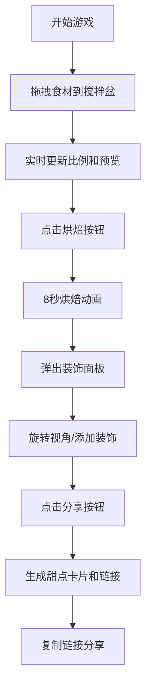

## 1. 产品概述

「星辰烘焙坊」是一个在浏览器中运行的魔法甜点工坊模拟器，玩家通过拖拽星辰食材、烘焙魔法甜点、装饰并生成可分享卡片的完整互动体验。

- 核心玩法：拖拽食材 → 混合配比 → 烘焙动画 → 装饰点缀 → 生成分享卡片
- 目标用户：喜欢创意互动、3D视觉效果和分享体验的年轻用户
- 产品价值：提供沉浸式的魔法烘焙体验，结合精美的视觉效果和社交分享功能

## 2. 核心功能

### 2.1 用户角色

| 角色 | 注册方式 | 核心权限 |
|------|----------|----------|
| 游客用户 | 无需注册 | 完整体验所有功能，生成并分享甜点卡片 |

### 2.2 功能模块

1. **食材拖拽与混合系统**：四种星辰食材拖拽交互、粒子特效、比例显示、实时预览
2. **烘焙动画系统**：烤箱内部视角、3D模型动画、温度粒子、体积膨胀、纹理变化
3. **装饰系统**：3D视角旋转、点击添加装饰物、糖针和彩虹酱效果
4. **卡片生成系统**：高分辨率截图、属性评分、分享链接、文案生成

### 2.3 页面详情

| 页面名称 | 模块名称 | 功能描述 |
|-----------|-------------|---------------------|
| 主界面 | 食材面板 | 四种食材图标带动态粒子背景，支持拖拽到搅拌盆 |
| 主界面 | 搅拌盆区域 | 中央搅拌盆，接收拖拽食材，显示混合粒子和色彩漩涡 |
| 主界面 | 比例环形条 | 盆底四色环形进度条实时显示食材占比 |
| 主界面 | 甜点预览窗口 | 3D模型颜色和纹理随比例实时变化 |
| 烘焙界面 | 烤箱内部视角 | 暗色环境中甜点旋转、膨胀、变色的8秒动画 |
| 装饰界面 | 装饰面板 | 毛玻璃半透明层，支持拖拽旋转视角、点击添加装饰 |
| 分享界面 | 甜点卡片 | 高分辨率卡片，显示属性星级评分和可复制链接 |

## 3. 核心流程

玩家进入游戏后，从左侧食材面板拖拽发光莓果、星屑面粉、月光奶油、彗星糖霜到中央搅拌盆，盆底环形进度条实时显示各食材占比，预览窗口同步更新3D模型颜色。点击烘焙按钮后进入烤箱视角，甜点在8秒内完成膨胀、变色、发光动画。动画结束后弹出装饰面板，玩家可旋转视角并添加星星糖针和彩虹酱。最后点击分享按钮，生成带属性评分的甜点卡片和可复制链接。

## 4. 用户界面设计

### 4.1 设计风格

- **主题**：深色太空魔法主题
- **背景**：深紫到暗蓝的径向渐变（#1A0530 到 #0B0B2A）
- **UI元素**：圆角毛玻璃质感（背景模糊12px，半透明白色边框）
- **交互效果**：悬停时发光脉冲 + 轻微放大（阴影0→12px，缩放1.05倍，0.2秒过渡）
- **粒子效果**：持续流动的星光粒子（1-4px，白到蓝渐变，20px/秒飘动）
- **字体**：标题使用优雅的展示字体，正文使用清晰易读的无衬线字体

### 4.2 页面设计概述

| 页面名称 | 模块名称 | UI元素 |
|-----------|-------------|-------------|
| 主界面 | 食材面板 | 四个毛玻璃卡片，每个带独特粒子背景，悬停发光效果 |
| 主界面 | 搅拌盆区域 | 中央圆形3D搅拌盆，周围环绕星光粒子，内部混合漩涡动画 |
| 主界面 | 环形进度条 | 盆底四色环形条，平滑过渡动画 |
| 主界面 | 预览窗口 | 右侧3D甜点预览，实时材质更新 |
| 烘焙界面 | 烤箱视角 | 暗色金属质感烤箱内部，顶部加热管发光，底部热气粒子 |
| 装饰界面 | 装饰面板 | 毛玻璃半透明覆盖层，左侧装饰库，中央3D甜点 |
| 分享界面 | 甜点卡片 | 大号居中发光卡片，两侧悬浮按钮，属性星级显示 |

### 4.3 响应式

- **桌面优先**：支持1024px到1920px宽度
- **窄屏适配**：卡片缩小但保持宽高比，按钮从两侧移至卡片下方
- **触控优化**：拖拽和点击操作支持触控设备

### 4.4 3D场景指导

- **环境**：烘焙阶段使用暗色HDRI环境，点缀远处星光
- **光照**：主光源（暖色调模拟烤箱加热）+ 环境光 + 发光材质自发光
- **相机**：搅拌阶段固定视角，烘焙阶段缓慢环绕，装饰阶段可交互旋转
- **后期处理**：泛光效果增强发光感，轻微色彩分级营造魔法氛围
- **动画**：甜点旋转、膨胀、材质渐变、粒子上浮
- **性能**：烘焙动画60FPS，粒子数量≤200，装饰切换≤100ms
