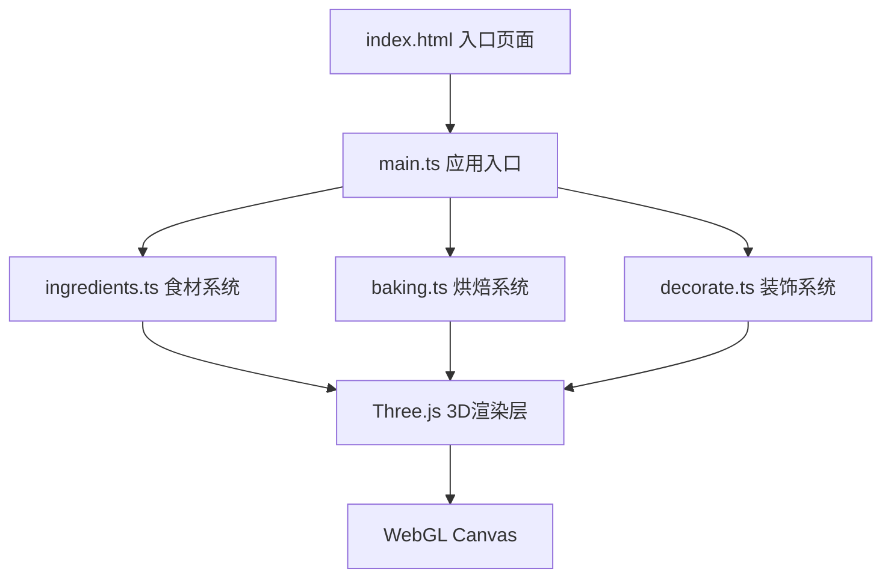

## 1. 架构设计



## 2. 技术描述

- **前端框架**：原生 TypeScript + Three.js（无React/Vue，按用户要求直接操作Canvas）
- **构建工具**：Vite 5.x（支持HMR热更新）
- **3D引擎**：Three.js r160+
- **类型定义**：@types/three
- **唯一ID生成**：cuid
- **语言**：TypeScript 5.x（严格模式，ES2020目标）

## 3. 目录结构

```
.
├── index.html              # 入口页面，内联全局样式
├── package.json            # 依赖和脚本
├── vite.config.js          # Vite配置
├── tsconfig.json           # TypeScript配置
└── src/
    ├── main.ts             # 应用入口，场景初始化，模块连接
    ├── ingredients.ts      # 食材数据定义，拖拽交互逻辑
    ├── baking.ts           # 烘焙动画控制，温度/体积/纹理管理
    └── decorate.ts         # 装饰系统，视角控制，截图生成
```

## 4. 核心数据结构

### 4.1 食材类型定义

```typescript
enum IngredientType {
  GLOWING_BERRY = 'glowing_berry',
  STARDUST_FLOUR = 'stardust_flour',
  MOONLIGHT_CREAM = 'moonlight_cream',
  COMET_FROSTING = 'comet_frosting'
}

interface Ingredient {
  type: IngredientType;
  name: string;
  color: string;
  glowColor: string;
  particleConfig: ParticleConfig;
  tasteContribution: number;    // 甜度贡献
  fluffContribution: number;    // 蓬松度贡献
  glowContribution: number;     // 发光强度贡献
}

interface ParticleConfig {
  color: string;
  size: number;
  count: number;
  speed: number;
  spread: number;
}
```

### 4.2 甜点属性

```typescript
interface DessertProperties {
  sweetness: number;      // 0-100
  fluffiness: number;     // 0-100
  glowIntensity: number;  // 0-100
  ingredients: Record<IngredientType, number>; // 各食材数量
}

interface Decoration {
  id: string;
  type: 'star_sprinkle' | 'rainbow_sauce';
  color: string;
  position: { x: number; y: number; z: number };
  rotation: { x: number; y: number; z: number };
}
```

## 5. 核心模块职责

### 5.1 ingredients.ts

- 定义四种星辰食材的完整数据
- 实现HTML5拖拽API交互逻辑
- 管理搅拌盆内粒子效果系统
- 计算实时食材比例和甜点属性
- 渲染盆底四色环形进度条（Canvas 2D）

### 5.2 baking.ts

- 烘焙状态机管理（IDLE → PREHEATING → BAKING → FINISHED）
- 8秒烘焙动画时间线控制
- 温度上升粒子系统（≤200个粒子）
- 3D模型体积膨胀（1.0 → 1.5倍）
- 材质颜色渐变（灰白 → 金黄/紫色）
- 法线贴图动态变化模拟裂纹和糖霜纹路

### 5.3 decorate.ts

- 装饰物数据管理（星星糖针、彩虹酱）
- 鼠标拖拽旋转视角控制（OrbitControls）
- 点击添加装饰物逻辑（射线检测）
- 高分辨率截图生成（Canvas → Blob → DataURL）
- 分享文案和链接生成（cuid生成唯一ID）

### 5.4 main.ts

- Three.js场景、相机、渲染器初始化
- 全局星光粒子系统
- 各模块间事件总线连接
- UI状态切换（混合 → 烘焙 → 装饰 → 分享）
- 动画循环（requestAnimationFrame）
- 响应式布局处理

## 6. 性能优化策略

1. **粒子池化**：所有粒子对象复用，避免频繁GC
2. **材质共享**：相同类型装饰物共享材质
3. **帧率控制**：烘焙动画固定60FPS，使用Clock.deltaTime
4. **视锥剔除**：离屏物体自动剔除渲染
5. **几何体简化**：装饰物使用低多边形模型
6. **事件节流**：拖拽和旋转事件使用requestAnimationFrame节流
