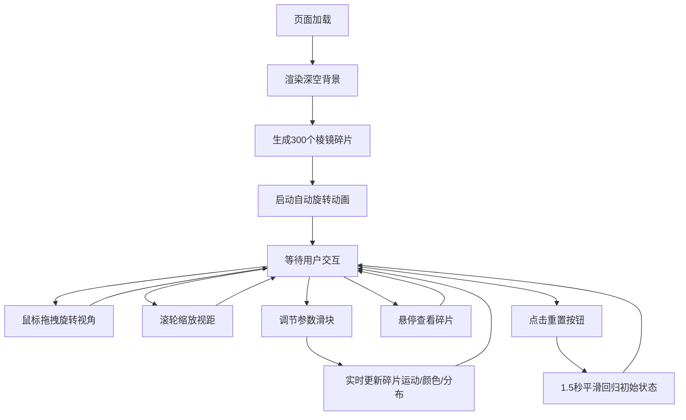

## 1. 产品概述

「涡光棱镜」是一个基于 WebGL 的交互式三维可视化应用，通过数千个动态彩色棱镜碎片构建万花筒效果，让用户在浏览器中实时操控视觉参数，获得沉浸式的艺术体验。

- 主要用途：作为视觉艺术装置、创意工具或教育演示，展示三维空间中的对称美学与色彩变换
- 目标用户：设计师、艺术家、教育工作者以及对三维可视化感兴趣的普通用户
- 产品价值：提供零门槛、高性能的实时三维交互体验，将复杂的数学变换转化为直观的视觉美感

## 2. 核心功能

### 2.1 用户角色

| 角色 | 注册方式 | 核心权限 |
|------|----------|----------|
| 访客用户 | 无需注册，直接访问 | 使用全部交互与参数调节功能 |

### 2.2 功能模块

1. **三维场景渲染**：万花筒棱镜碎片生成、实时矩阵变换、着色器渲染
2. **视角交互控制**：鼠标拖拽旋转、滚轮缩放、阻尼惯性、视角回弹
3. **参数调节面板**：旋转速度、对称轴数量、颜色偏移量三个滑块控制
4. **悬停信息系统**：碎片高亮发光、信息标签跟随显示
5. **重置系统**：一键平滑恢复初始视角与参数

### 2.3 页面详情

| 页面名称 | 模块名称 | 功能描述 |
|----------|----------|----------|
| 主页（单页） | 三维场景 | 全屏径向渐变背景，立方体空间内300个旋转棱镜碎片构成万花筒结构 |
| 主页（单页） | 控制面板 | 左侧半透明磨砂玻璃面板，含三个参数滑块与实时数值标签 |
| 主页（单页） | 重置按钮 | 右下角浮动圆形按钮，点击时图标旋转，触发视角与参数重置 |
| 主页（单页） | 悬停反馈 | 碎片悬停时白色外发光高亮，显示碎片信息标签 |

## 3. 核心流程

用户进入页面后，自动加载深空渐变背景与万花筒结构，随后可自由交互：
1. 鼠标拖拽旋转三维视角（水平360度、垂直±60度）
2. 滚轮缩放视距（2-10单位）
3. 调节左侧滑块改变旋转速度、对称轴数量、颜色偏移
4. 悬停碎片查看详细信息
5. 点击右下角按钮重置全部状态

## 4. 用户界面设计

### 4.1 设计风格

- **主色调**：深空黑 `#0A0A1A` → 暗紫 `#2D1B4E` 径向渐变背景
- **强调色**：亮蓝 `#4D96FF`（UI元素、滑块激活色）、白色 `#FFFFFF`（高亮发光）
- **碎片色盘**：暖色 `#FF6B6B / #FFB347 / #FFD93D` + 冷色 `#6BCB77 / #4D96FF / #9B59B6`
- **面板样式**：半透明磨砂玻璃 `rgba(20,20,40,0.7)`，1px 细线边框 `#4D96FF`，圆角 12px，内阴影
- **按钮样式**：圆形 48x48px，半透明背景，SVG 旋转箭头图标
- **字体**：无衬线现代字体，标题较大，数值标签使用等宽风格
- **图标风格**：简约几何 SVG 线条图标

### 4.2 页面设计概述

| 页面名称 | 模块名称 | UI 元素 |
|----------|----------|---------|
| 主页 | 背景 | 全屏径向渐变（深空黑→暗紫），无额外装饰 |
| 主页 | 控制面板 | 左侧 220px 宽垂直面板，距左 20px，垂直居中，三个带数值标签的滑块 |
| 主页 | 重置按钮 | 右下角距边 20px，圆形 48px，半透明浮层，悬停微放大，点击旋转动画 |
| 主页 | 悬停标签 | 跟随鼠标的小浮层，显示旋转角度、颜色十六进制、对称组编号 |

### 4.3 响应式

- 桌面端（≥768px）：标准布局，左侧固定面板，右下角按钮
- 移动端（<768px）：整体缩放 80%，面板置顶横向堆叠，按钮跟随视口调整位置
- 触控优化：支持触摸滑动旋转、捏合缩放

### 4.4 3D 场景指导

- **环境与氛围**：纯深色调背景，无 HDRI，强调自发光碎片的对比感
- **光照设置**：环境光 + 两盏方向光（冷+暖）营造棱镜的通透感和边缘高光
- **相机设置**：PerspectiveCamera，初始位置原点前方 5 单位，朝向原点，视距范围 2-10
- **运动与交互**：整体绕 Y 轴公转（8秒/圈顺时针），碎片绕各自中心轴自转（4秒/圈随机方向），视角变化 0.3 秒阻尼惯性，允许轻微过冲回弹
- **后处理**：OutlinePass 实现悬停碎片白色外发光（强度 0.5）
- **性能**：60FPS 稳定运行，碎片超 500 时 LOD 降级（远处碎片简化为四边形），参数响应 <100ms
